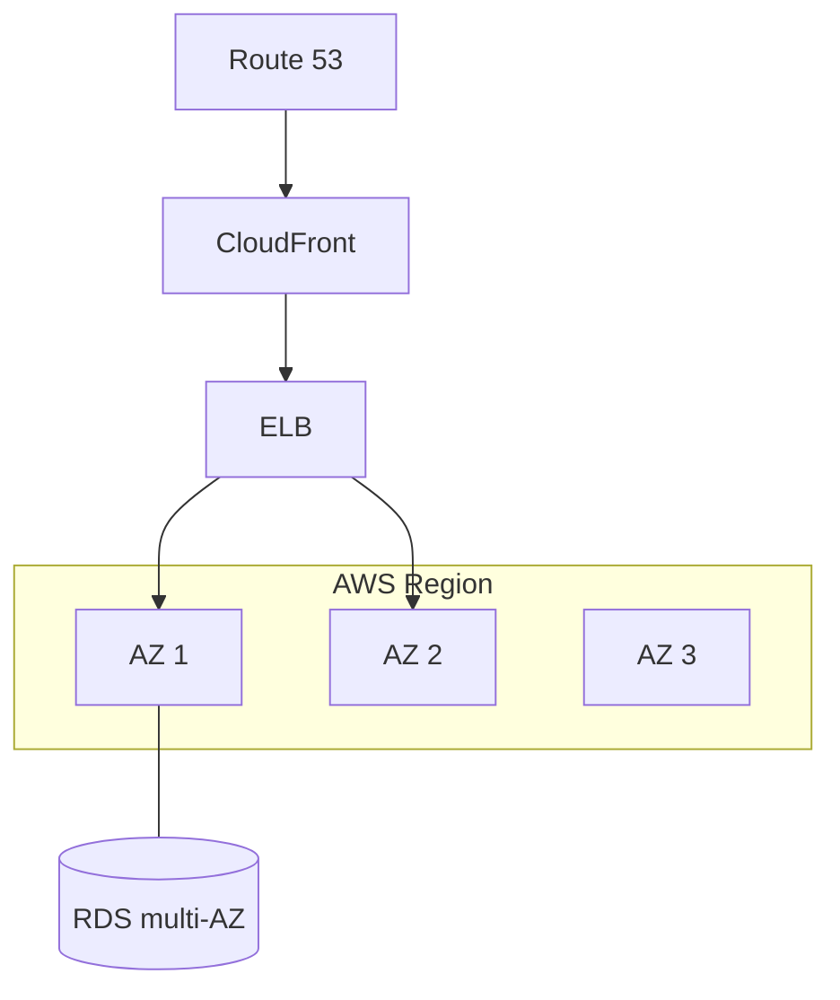

# AWS Fundamentals

## Concept

- **AWS** (and equivalently GCP/Azure) provides the building blocks of cloud infrastructure as on-demand services. Knowing the core categories and the canonical service in each is enough to reason about most cloud designs.
- The essential categories:
  - **Compute** — EC2 (VMs), Lambda (serverless, topic 3), ECS/EKS (containers, topic 2), Fargate (serverless containers).
  - **Storage** — S3 (object storage, Phase 3 topic 24), EBS (block storage for EC2), EFS (file).
  - **Database** — RDS/Aurora (managed relational), DynamoDB (managed NoSQL), ElastiCache (managed Redis/Memcached).
  - **Networking** — VPC (isolated network), ELB (load balancing), Route 53 (DNS), CloudFront (CDN), API Gateway.
  - **Messaging** — SQS (queues), SNS (pub/sub), Kinesis (streaming), EventBridge (events).
  - **Identity & security** — IAM (permissions), KMS (key management), Secrets Manager.
  - **Observability** — CloudWatch (metrics/logs/alarms), X-Ray (tracing).
- The foundational structure: **Regions** (geographic areas) contain multiple **Availability Zones (AZs)** — isolated data centers — which is the basis of high availability (topic 10).

## Problem It Solves

- Provides **on-demand, managed infrastructure** so teams rent scalable compute/storage/database/networking instead of buying and operating hardware.
- **Managed services** offload operational burden (patching, backups, failover, scaling) — e.g., RDS handles DB replication/backups so you don't.
- The **Region/AZ** model provides the physical foundation for high availability, fault isolation, and disaster recovery (topics 10, 11, 20).
- A common vocabulary for designing cloud systems in interviews and practice.

## Trade-offs

- **Managed convenience vs. cost & lock-in** — managed services save ops effort but cost more than self-hosting and tie you to the provider's APIs (DynamoDB, proprietary services are hard to port).
- **Breadth vs. complexity** — AWS has 200+ services with overlapping options; choosing well requires judgment, and misconfiguration (especially IAM and security groups) is a top cause of breaches.
- **Cost management** — pay-per-use can spiral without governance (idle resources, egress fees, over-provisioning) — needs cost optimization (topic 19) and FinOps discipline.
- **Shared responsibility** — the cloud secures the infrastructure; *you* secure your configuration, data, and access (IAM least privilege) — a common source of incidents.
- **Region/AZ design is on you** — single-AZ deployments aren't highly available; you must architect across AZs/regions (topics 10, 20).

## Examples

- **Standard 3-tier web app**
  - Route 53 → CloudFront → ALB → EC2/ECS across multiple AZs → RDS (multi-AZ) + ElastiCache, with S3 for assets and CloudWatch for monitoring.
- **Serverless stack**
  - API Gateway → Lambda → DynamoDB → S3, with SQS for async work — fully managed, auto-scaling (topic 3).
- **Multi-AZ HA**
  - RDS in multi-AZ mode keeps a synchronous standby in another AZ; an AZ failure triggers automatic failover (topic 10).
- **Least-privilege IAM**
  - Each service gets a narrowly-scoped IAM role (only the S3 bucket and DynamoDB table it needs), limiting breach blast radius.
- **Interview framing**
  - You don't need to memorize all of AWS — map the design's needs to the right category/service (compute, storage, DB, messaging, networking) and reason about Region/AZ placement for HA. Mentioning managed-service trade-offs (cost, lock-in) and least-privilege IAM shows cloud maturity.
