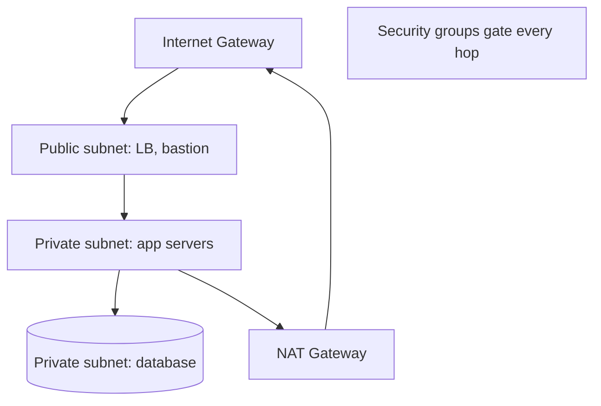

# Cloud Networking

## Concept

- **Cloud networking** is how you build isolated, secure, controlled networks for your cloud resources. The central construct is the **VPC (Virtual Private Cloud)** - your own logically-isolated network within the cloud, with private IP ranges you control.
- Core components:
  - **Subnets**: segments of the VPC, **public** (routable to the internet) or **private** (no direct internet access). Typically one set per Availability Zone for HA.
  - **Route tables**: control traffic flow between subnets and to gateways.
  - **Internet Gateway / NAT Gateway**: IGW gives public subnets internet access; NAT lets private subnets reach the internet *outbound* without being publicly reachable.
  - **Security Groups** (stateful, instance-level firewall) and **NACLs** (stateless, subnet-level) - control allowed traffic.
  - **Load balancers** (Phase 3 topic 5), **VPC peering / Transit Gateway / PrivateLink** - connect VPCs and services privately.
  - **VPN / Direct Connect**: link cloud to on-prem.

## Problem It Solves

- **Isolation & segmentation**: keeps your resources in a private network, separating tiers (public LB → private app → private DB) so the database is never directly exposed to the internet.
- **Defense in depth**: layered controls (subnets, security groups, NACLs) limit what can talk to what, shrinking the attack surface (foundational to zero-trust thinking).
- **Controlled connectivity**: private links between services/VPCs/on-prem without traversing the public internet.
- **HA foundation**: spreading subnets across AZs underpins multi-AZ high availability (topic 10).

## Trade-offs

- **Security vs. complexity**: proper network segmentation is powerful but intricate; misconfigured security groups/NACLs are a top cause of both outages (blocked traffic) and breaches (overly-open rules like `0.0.0.0/0`).
- **Public vs. private**: private subnets are safer but need NAT/bastion/PrivateLink for outbound and admin access, adding cost and components.
- **NAT cost**: NAT gateways and cross-AZ/cross-region data transfer incur real (often surprising) charges; egress is a frequent cost driver (topic 19).
- **Peering sprawl**: many VPCs peered pairwise become unmanageable; a hub (Transit Gateway) scales better but adds a central dependency.
- **Stateful vs. stateless rules**: security groups (stateful) are easier to reason about; NACLs (stateless) require explicit return-traffic rules and trip people up.

## Examples

- **3-tier segmentation**
  - Public subnet holds only the load balancer and a bastion; the app tier sits in private subnets reachable only from the LB; the database is in private subnets reachable only from the app tier - enforced by security groups per hop.
- **Private outbound**
  - App servers in private subnets reach external APIs via a NAT gateway (outbound only), so they're never inbound-reachable from the internet.
- **PrivateLink**
  - A service is exposed to another VPC privately via PrivateLink, avoiding the public internet entirely.
- **Least-privilege security groups**
  - The DB security group allows port 5432 *only* from the app tier's security group - not a CIDR range - so only app servers can connect.
- **Interview framing**
  - When a design's security/topology comes up, describe a VPC with public/private subnet segmentation across AZs, security groups gating each tier (DB private, reachable only from app), and NAT for private outbound. Calling out least-privilege security-group references (not open CIDRs) and egress/NAT cost shows production network sense.
