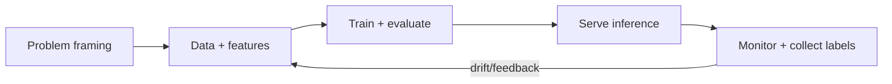

# ML System Design Overview

## Concept

- **ML system design** is the architecture around a model — the data, training, serving, and feedback infrastructure — not the model math itself. In production, **the model is ~5% of the system**; the other 95% is data pipelines, feature engineering, serving, monitoring, and feedback loops.
- The end-to-end ML lifecycle:
  - **Problem framing** — translate a business goal into an ML task (classification/ranking/generation), define the target metric, and decide if ML is even the right tool.
  - **Data** — collection, labeling, pipelines, feature engineering (topics 2, 16).
  - **Training** — experimentation, training infrastructure, evaluation (topics 3, 4, 26).
  - **Serving** — deploying the model for batch or real-time inference (topic 5).
  - **Monitoring & feedback** — track quality/drift, gather labels, retrain (topics 12, 14).
- A defining property absent from normal software: ML systems depend on **data that changes**, so they **degrade over time** (drift) and need continuous retraining — they're never "done."

## Problem It Solves

- Provides the framework for designing **production** ML — getting a model reliably into users' hands and keeping it accurate — rather than just achieving offline accuracy in a notebook (which rarely survives contact with production).
- Surfaces the concerns that actually determine success: data quality and freshness, training/serving consistency, latency/cost of inference, monitoring for drift, and a feedback loop for continuous improvement.
- Frames the interview/design question correctly: most "design an ML system" answers are really about data and serving infrastructure, not the algorithm.

## Trade-offs

- **ML vs. heuristics** — ML adds data, training, and maintenance burden; for many problems a simple rule/heuristic is cheaper and good enough. Use ML only when the problem has patterns too complex for rules and enough data to learn from.
- **Online vs. batch inference** — real-time serving (topic 5) gives fresh predictions at the cost of latency-critical infrastructure; batch precomputation is cheaper and simpler when predictions can be precomputed.
- **Model complexity vs. operability** — bigger/fancier models can score higher offline but cost more to serve, are slower, and harder to debug; the best *production* model balances accuracy with latency, cost, and maintainability.
- **Build vs. buy / use an API** — train your own vs. call a hosted model (especially for LLMs); trade control/cost/privacy against speed-to-market.
- **Training/serving skew** — the classic failure: features computed differently in training vs. serving cause silent accuracy loss (solved by feature stores, topic 16).

## Examples

- **Recommendation system**
  - The "model" is a fraction of the work; the system is feature pipelines, a feature store, candidate generation + ranking serving, A/B testing (topic 13), and a feedback loop from clicks — the design is mostly data/serving infrastructure.
- **Drift in practice**
  - A fraud model trained last year degrades as fraud patterns evolve; monitoring detects the drop and triggers retraining (topics 12, 14) — the system must be built for this from day one.
- **Heuristic first**
  - A startup ships a rules-based ranker initially, collecting data, then replaces it with ML once there's enough signal — avoiding premature ML complexity.
- **Interview framing**
  - For any "design an ML system" prompt, structure the answer around the lifecycle (problem framing → data/features → training/eval → serving → monitoring/feedback), and emphasize that the hard parts are data and serving infrastructure, training/serving consistency, and the retraining loop — not the model architecture. Asking "is ML even the right tool?" first is strong senior signal.
