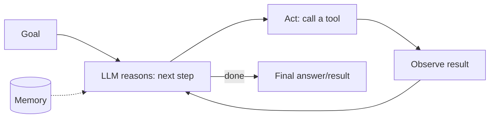

# AI Agent Architecture

## Concept

- An **AI agent** is an LLM-driven system that **pursues a goal by taking actions** — it doesn't just generate text, it **reasons, decides which tools to use, acts, observes results, and iterates** until the task is done. The LLM is the "reasoning engine"; tools and memory extend what it can do.
- The canonical loop is **think → act → observe** (e.g., the ReAct pattern):
  1. **Reason** — the LLM decides what to do next given the goal and context.
  2. **Act** — it calls a **tool** (search, API, code execution, database query — topic 20).
  3. **Observe** — the tool's result is fed back into context.
  4. Repeat until the goal is met or a stop condition triggers.
- Components: the **LLM (planner/reasoner)**, **tools** (topic 20), **memory** (short-term context + long-term store, topic 21), and an **orchestration loop** controlling iteration, stopping, and error handling.

## Problem It Solves

- Lets LLMs **accomplish multi-step tasks** that a single prompt can't: tasks requiring external information (search, databases), actions (API calls, code), and iteration (try, observe, adjust) — research, coding, workflow automation, customer support that takes actions.
- **Tools overcome LLM limitations** — the model gets current data, performs exact computation, and acts on the world, rather than hallucinating answers from frozen training knowledge.
- Enables dynamic, adaptive problem-solving where the steps aren't known in advance.

## Trade-offs

- **Autonomy vs. reliability/control** — more agent autonomy (open-ended loops, many tools) means more capability but also more unpredictability, errors compounding across steps, and harder debugging. **Constrain agents** to the minimum autonomy the task needs; many "agent" problems are better as a fixed workflow (orchestration, Phase 3 topic 38) with one or two LLM steps.
- **Error compounding** — each step can err, and errors accumulate over a long loop; needs validation, retries, and guardrails at each step.
- **Cost & latency** — agentic loops make many LLM calls (each reasoning step + tool round trips), so they're slow and expensive; bound iterations and cache where possible (topic 24).
- **Looping / non-termination** — agents can get stuck repeating actions or fail to recognize completion; need step limits, loop detection, and clear stop conditions.
- **Reliability of tool use** — the model must call tools correctly (right tool, valid arguments) — fragile without good tool schemas and validation (topic 20).
- **Safety** — agents that take real actions (send emails, modify data, spend money) need strict guardrails, permissions, and often human approval for high-stakes actions (topic 25).

## Examples

- **Research agent**
  - Given "summarize the latest on X," the agent searches the web (tool), reads results (observe), decides it needs more (reason), searches again, then synthesizes — iterating until it has enough.
- **Coding agent**
  - Reads a codebase (tools), proposes a change, runs tests (tool), observes failures, and fixes — the think-act-observe loop applied to software.
- **Workflow vs. agent**
  - A task with known fixed steps (extract → validate → store) is better as a deterministic pipeline with LLM steps, not an open-ended agent — cheaper, more reliable, easier to debug.
- **Bounded autonomy**
  - A support agent can look up orders and issue refunds *up to a limit* automatically, but escalates higher-value actions to a human (guardrails, topic 25).
- **Interview framing**
  - Describe agents as a think→act→observe loop with an LLM planner, tools, memory, and orchestration — then emphasize **constraining autonomy**: bound iterations, validate tool calls, add guardrails on real-world actions, and prefer a fixed workflow when steps are known. Knowing that more autonomy means less reliability (and choosing the minimum needed) is the mature 2025 agent-design signal. (Tools, memory, and multi-agent are topics 20–22.)
