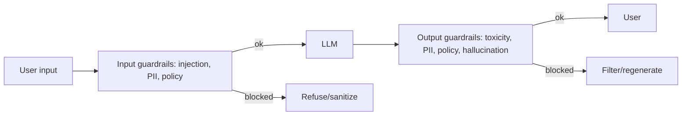

# Guardrails and Content Moderation

## Concept

- **Guardrails** are the safety controls around an LLM/AI system that constrain what goes **in** and what comes **out**, ensuring the system behaves safely, stays on-policy, and resists abuse. They wrap the model because the model itself can't be fully trusted to self-police.
- The layers:
  - **Input guardrails** — validate/filter user input *before* the model: detect **prompt injection/jailbreaks**, off-topic or disallowed requests, PII, and abuse. Reject or sanitize.
  - **Output guardrails** — check model output *before* it reaches the user: filter toxic/unsafe content, block PII leakage, enforce format/policy, detect hallucinations (topic 25), and verify the response is on-policy.
  - **Action guardrails** — for agents (topic 10): restrict which tools/actions are allowed, require approval for high-stakes actions, and enforce permissions.
- Implementation mixes: rules/regex/blocklists, dedicated classifier models (toxicity, safety, PII detectors), an **LLM-as-judge** checking another LLM's output, and allow/deny policies.

## Problem It Solves

- Makes AI systems **safe to deploy** to real users: prevents harmful, toxic, off-policy, or privacy-violating outputs, and resists adversarial misuse (jailbreaks, prompt injection) — the controls without which an LLM product is a liability.
- Protects against **brand/legal/safety risk** — an unguarded model can be manipulated into harmful content or leak data; guardrails are the defense.
- For agents, action guardrails prevent the model from taking harmful or unauthorized real-world actions.

## Trade-offs

- **Safety vs. helpfulness (over-blocking)** — aggressive guardrails cause false positives that refuse legitimate requests, frustrating users and making the product feel useless; too loose lets harmful content through. Calibrating this balance is the central, ongoing tension.
- **Latency & cost** — each guardrail check (classifier, LLM-judge) adds latency and cost to every request; layering many checks compounds it. Use cheap/fast checks first, expensive ones selectively.
- **Adversarial arms race** — jailbreaks and injection techniques evolve constantly; guardrails need continuous updating and red-teaming, and no defense is perfect.
- **LLM-as-judge reliability** — using an LLM to check another LLM is flexible but itself fallible and adds cost; combine with deterministic checks where possible.
- **Prompt injection is hard** — especially in RAG/agents where untrusted retrieved content or tool output can carry injected instructions; treating all external content as untrusted is essential and still imperfect.

## Examples

- **Input + output filtering**
  - A customer-facing chatbot runs input through a prompt-injection + policy classifier, and output through a toxicity + PII + on-policy check; flagged content is blocked or regenerated.
- **LLM-as-judge**
  - A second model evaluates whether the primary model's answer is grounded in the retrieved sources (RAG, topic 7) and on-policy, blocking ungrounded or unsafe responses (topic 25).
- **Agent action guardrail**
  - An agent may read data freely but any write/refund/email action requires passing a permission check and, above a threshold, human approval (topic 10).
- **PII redaction**
  - User inputs and outputs are scanned for PII, which is redacted before logging and before responses, supporting privacy compliance.
- **Interview framing**
  - For any user-facing AI system, include guardrails at input (injection, PII, policy), output (toxicity, PII, hallucination, policy), and — for agents — actions. Emphasize the **safety-vs-helpfulness calibration** (over-blocking hurts UX), the latency/cost of checks, prompt injection as an unsolved arms race, and continuous red-teaming. Treating safety as a layered, evolving system is the responsible-AI signal.
