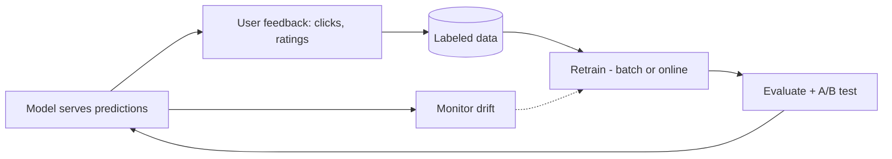

# Feedback Loops and Online Learning

## Concept

- A **feedback loop** captures signals about how a deployed model is performing in the real world and feeds them back to improve it. ML systems degrade over time (data/concept **drift**), so a feedback loop is what keeps them accurate — it closes the lifecycle (topic 1).
- Feedback sources:
  - **Implicit feedback** — user behavior as labels: clicks, purchases, dwell time, skips, thumbs up/down. Abundant and cheap but noisy and biased.
  - **Explicit feedback** — ratings, corrections, human review/annotation. Higher quality, sparse, costly.
- Learning cadences:
  - **Batch retraining** — periodically retrain on accumulated data (most common; daily/weekly). Simple and stable.
  - **Online / incremental learning** — update the model continuously from streaming feedback. Fresh but complex and riskier.
- The loop must also **monitor for drift** (topic 14) and trigger retraining when quality drops.

## Problem It Solves

- **Combats model decay** — real-world data shifts (user behavior, fraud patterns, trends change), so a static model silently gets worse; the feedback loop continuously refreshes it to stay accurate.
- **Turns usage into training data** — implicit signals (clicks/purchases) provide cheap, abundant labels at scale, powering recommendation/ranking/search improvement without manual annotation.
- Enables the system to **adapt and improve over time** rather than degrade — the defining property of a well-designed ML system.

## Trade-offs

- **Implicit vs. explicit feedback** — implicit is cheap and plentiful but **biased** (you only get feedback on what you *showed* — the feedback/exposure bias) and noisy; explicit is accurate but sparse and expensive. Most systems use implicit, carefully debiased.
- **Feedback loops can reinforce bias (degenerate loops)** — a model that recommends X gets clicks on X, learns to recommend X more — a self-reinforcing **filter bubble / popularity bias** that narrows over time and can amplify harm. This is a serious, often-overlooked danger requiring exploration (showing diverse items) and monitoring.
- **Online learning vs. stability/safety** — continuous updates give freshness but risk instability, are hard to evaluate before they affect users, and are vulnerable to **feedback poisoning** (adversaries gaming signals to corrupt the model). Batch retraining with evaluation gates is safer and usually preferred.
- **Delayed/attributed feedback** — the true label may arrive much later (a purchase days after a recommendation) or be hard to attribute, complicating the loop.
- **Evaluation before rollout** — retrained models must be A/B tested (topic 13) and evaluated (topic 26) before full deployment, or a bad update degrades production.

## Examples

- **Recommendation loop**
  - Clicks/purchases become implicit labels; the model retrains nightly on them, is A/B tested, and rolled out if it improves engagement — continuously adapting to user behavior.
- **Drift-triggered retraining**
  - A fraud model's precision drops (monitoring, topic 14) as fraud patterns shift; this triggers retraining on recent labeled data.
- **Degenerate loop mitigation**
  - A recsys adds exploration (occasionally showing diverse/novel items) to avoid the popularity feedback bubble and gather unbiased signal.
- **Human-in-the-loop**
  - For an LLM product, thumbs-down responses are routed to human review, producing high-quality correction data for fine-tuning or eval sets (topic 26).
- **Interview framing**
  - Design the feedback loop explicitly: capture implicit + explicit signals, retrain (batch by default; online only when freshness justifies the risk), monitor drift to trigger retraining, and **gate retrained models behind A/B tests and evals**. Calling out feedback bias and **degenerate/reinforcing loops** (and exploration to counter them) is the insight that separates a thoughtful ML-systems answer from a naive one.
