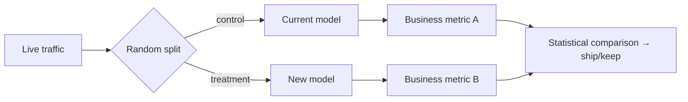

# A/B Testing Models

## Concept

- **A/B testing models** is how you measure whether a new model (or prompt, or ranking change) actually improves real outcomes **in production**, by comparing it against the current one on **live traffic** — because offline metrics (accuracy, eval scores) don't reliably predict real-world business impact.
- The method: split users/requests into groups, serve the **control** (current model) to one and the **treatment** (new model) to another, and compare a **business metric** (conversion, engagement, revenue, retention) with statistical rigor.
- Related rollout/testing techniques:
  - **Shadow / dark launch** — run the new model on real traffic but don't show its output; compare predictions offline (safe, no user impact).
  - **Canary** — serve the new model to a small % and monitor before ramping (Phase 6 topic 25).
  - **Interleaving** — for ranking, mix results from both models in one list and see which gets more clicks (more sensitive, less traffic needed).
  - **Multi-armed bandits** — dynamically shift traffic toward the better-performing variant to reduce regret.

## Problem It Solves

- **Bridges the offline–online gap** — a model with better offline metrics frequently *fails* to improve (or even hurts) real business metrics; only a live A/B test reveals true impact. This is the single most important guardrail before fully shipping a model change.
- **De-risks model rollout** — you discover a regression on a small slice of traffic with real users, not after a full launch.
- Provides **causal evidence** (not just correlation) that the change caused the improvement, justifying the rollout.

## Trade-offs

- **Offline metrics vs. online reality** — offline eval (topic 26) is fast and cheap but an imperfect proxy; online A/B is the truth but slow (needs time + traffic for significance) and exposes real users to the new model. Use offline to gate *what's worth testing*, online to decide *what ships*.
- **Statistical rigor vs. speed** — reaching significance requires enough traffic and time; stopping early (peeking) or running too many tests inflates false positives. Needs proper sample sizing and significance handling.
- **Metric choice & guardrails** — optimizing one metric (clicks) can harm another (long-term retention, revenue); A/B tests need guardrail metrics to catch the model winning locally while hurting globally.
- **Bandits vs. fixed A/B** — bandits reduce regret by shifting traffic to winners faster but complicate clean statistical analysis and long-term measurement.
- **Network/interference effects** — in social/marketplace systems, treatment and control can affect each other, violating independence (needs cluster/geo-based experiments).
- **Delayed effects** — some impacts (retention, churn) take weeks to manifest; short tests miss them.

## Examples

- **Recsys model launch**
  - A new ranking model beats the old on offline NDCG; it's A/B tested on 5% of users measuring engagement *and* guardrail metrics (revenue, retention). It ships only if it wins without harming guardrails.
- **Shadow then canary then A/B**
  - The new model first runs in shadow (predictions logged, compared offline), then a canary (small % live), then a full A/B test — progressive de-risking.
- **Interleaving for search**
  - Two rankers' results are interleaved in one result list; clicks attribute to each ranker — detecting the better one with far less traffic than split testing.
- **Bandit for a promo**
  - A multi-armed bandit shifts traffic toward the higher-converting model variant automatically, minimizing lost conversions during the test.
- **Interview framing**
  - When rolling out a model/prompt change, insist on online A/B testing against a *business* metric (not just offline scores), with proper statistical rigor and guardrail metrics, preceded by shadow/canary for safety. Stating clearly that **offline metrics don't reliably predict online impact** — so the A/B test is the real decision gate — is the production-ML maturity signal.
