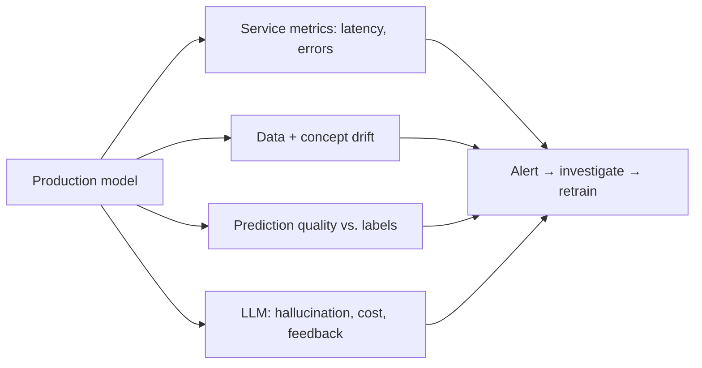

# AI Observability

## Concept

- **AI/ML observability** is monitoring ML and LLM systems in production to detect quality degradation — which is **harder than normal software monitoring** because an ML system can be "up" (no errors, low latency) while silently producing *wrong* predictions. You must monitor **quality**, not just availability.
- What to monitor, beyond standard service metrics (latency, errors, throughput — Phase 6 topics 12–13):
  - **Data drift** — the distribution of input features shifts from training data (e.g., new user behavior); the model sees inputs it wasn't trained for.
  - **Concept drift** — the relationship between inputs and the correct output changes (e.g., what constitutes fraud evolves), so the model's learned mapping is now wrong.
  - **Prediction drift** — the distribution of the model's outputs shifts (a signal something changed).
  - **Model quality** — accuracy/precision against ground truth *when labels arrive* (often delayed).
  - **For LLMs specifically** — output quality, hallucination/groundedness rate, toxicity/guardrail hits, token usage/cost, latency, user feedback (thumbs), and prompt/response logging for debugging and evals.

## Problem It Solves

- Catches the **silent failure mode** unique to ML: the system runs fine technically but its predictions degrade (drift) — invisible to normal monitoring. AI observability surfaces *quality* decay so you can retrain (topic 12) before it harms users/business.
- Provides the **drift signals** that trigger retraining and the **quality/cost/safety metrics** needed to operate LLM products responsibly.
- Enables debugging (logged prompts/responses/traces) and continuous evaluation in production.

## Trade-offs

- **Delayed/absent ground truth** — you often can't measure accuracy in real time because true labels arrive late (a purchase days later) or never (no one tells you the answer was wrong). So you rely on **proxy signals** (drift, distribution shifts, user feedback) which are indirect and can mislead. This is the core difficulty of ML monitoring.
- **Drift detection sensitivity** — too sensitive and you get false alarms (and needless retraining); too lax and you miss real degradation. Tuning drift thresholds is non-trivial.
- **LLM quality is hard to quantify** — "is this answer good?" has no simple metric; you combine automated evals (LLM-as-judge, topic 26), user feedback, and sampling for human review — all imperfect and costly.
- **Logging cost & privacy** — logging all prompts/responses for debugging/evals is valuable but expensive and privacy-sensitive (PII in prompts); needs sampling and redaction.
- **Cost monitoring matters for LLMs** — token usage can spike unexpectedly (long contexts, agent loops); cost is a first-class metric to observe (topic 15).

## Examples

- **Drift detection**
  - A monitoring tool (Evidently, Arize, WhyLabs, Fiddler) flags that an input feature's distribution diverged from training — a drift alert prompting investigation and possible retraining before accuracy visibly drops.
- **LLM quality dashboard**
  - An LLM app tracks per-request groundedness (LLM-judge vs. retrieved sources), guardrail-block rate, thumbs up/down, token cost, and latency — revealing a hallucination-rate spike after a prompt change.
- **Delayed-label accuracy**
  - A loan-default model's true outcomes arrive months later; in the meantime, drift and prediction-distribution monitoring serve as early proxies for degradation.
- **Trace logging**
  - Full prompt/retrieval/response traces (sampled, PII-redacted) are logged so a bad answer can be debugged and added to the eval set (topic 26).
- **Interview framing**
  - For operating ML/LLM systems, stress that you must monitor **quality, not just uptime**: data/concept/prediction drift, model accuracy against (delayed) labels, and — for LLMs — hallucination rate, guardrail hits, cost, and user feedback. Naming the **delayed-ground-truth problem** (relying on drift/proxy signals) and drift-triggered retraining is exactly the ML-observability depth that distinguishes it from ordinary monitoring.
