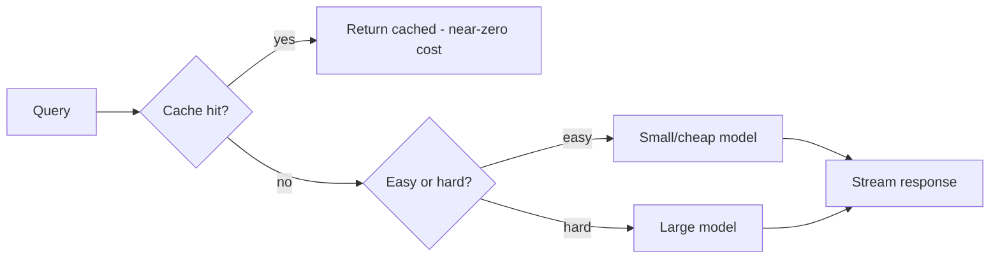

# Cost and Latency Trade-offs in AI Systems

## Concept

- AI systems - especially LLMs - are **expensive and slow** relative to traditional software, so **cost and latency are first-class design constraints**, not afterthoughts. A feature that's accurate but too costly or slow doesn't ship.
- The major levers (most are about *not* using the biggest model for everything):
  - **Model selection / cascading (routing)**: use the smallest/cheapest model that meets quality; route easy queries to small models and only escalate hard ones to large models.
  - **Caching**: semantic/exact caching of responses and embeddings (topic 24) avoids recomputation.
  - **Prompt/context efficiency**: shorter prompts and trimmed context (topic 19) cut token cost and latency (LLM cost scales with tokens).
  - **Streaming**: stream tokens (SSE, Phase 5 topic 15) to cut *perceived* latency even if total time is unchanged.
  - **Inference optimization**: quantization, batching, KV-cache management (topic 6).
  - **Batch vs. real-time**: precompute offline where possible (topic 5).
  - **Self-host vs. API**: API is simple per-token; self-hosting can be cheaper at scale but you own the infra.

## Problem It Solves

- Makes AI features **economically viable and responsive** at scale - LLM token costs and latency can make a naive design unaffordable or unusably slow; these techniques bring cost/latency into acceptable range without (much) sacrificing quality.
- Lets you serve far more users for the same budget (caching, small-model routing) and meet interactive latency SLOs (streaming, optimization, smaller models).

## Trade-offs

- **Quality vs. cost/latency (the central tension)**: bigger models are better but slower/costlier; smaller/quantized models and aggressive caching save money but may reduce quality. The art is finding the **minimum capability that meets the quality bar** for each query type, not maxing quality everywhere.
- **Caching vs. freshness/correctness**: semantic caching can serve a cached answer to a *similar* query that actually needed a different answer (false cache hit); tune similarity thresholds and scope carefully (topic 24).
- **Routing/cascading complexity**: model routing saves cost but adds a routing decision (itself possibly a model call) and complexity; mis-routing a hard query to a small model hurts quality.
- **Context length vs. cost**: stuffing more context (RAG chunks, history) improves grounding but increases token cost/latency and risks "lost in the middle"; trim deliberately (topic 19).
- **Latency vs. throughput**: batching cuts cost/raises throughput but adds latency (topic 6); interactive vs. batch workloads optimize differently.
- **Measure before optimizing**: instrument token usage and latency per feature (topic 14) to optimize the actual cost drivers, not guesses.

## Examples

- **Model cascade**
  - A support bot answers FAQs with a small cheap model and escalates only complex/ambiguous queries to a large model - cutting average cost dramatically while keeping quality where it matters.
- **Semantic cache**
  - Common/similar questions hit a semantic cache (topic 24), returning instant near-zero-cost answers and avoiding repeated LLM calls.
- **Context trimming**
  - A RAG system retrieves 20 chunks but passes only the top 5 re-ranked ones, cutting token cost and improving focus (topics 7, 19).
- **Streaming for UX**
  - Even a 4-second generation feels responsive because tokens stream immediately (low time-to-first-token), improving perceived latency at no extra cost.
- **Interview framing**
  - Treat cost/latency as design constraints: route to the smallest sufficient model (cascading), cache aggressively (semantic + embedding), trim context, stream output, and optimize inference (quantization/batching). Framing it as "minimum capability that meets the quality bar per query," with measurement to target real cost drivers, is the cost-aware LLM-systems signal that's increasingly central in 2025 interviews.
