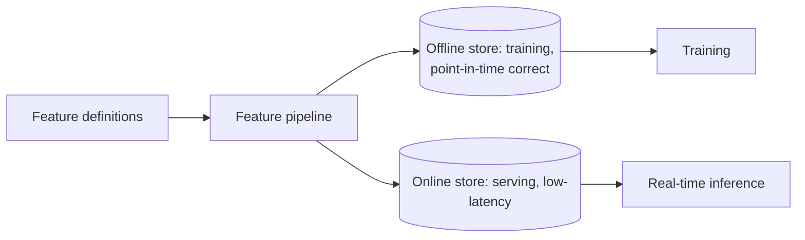

# Feature Stores

## Concept

- A **feature store** is a centralized system for **defining, storing, serving, and sharing ML features** consistently across training and serving. It's the backbone of reproducible, production-grade ML feature management (extending data pipelines, topic 2).
- It solves the dual-access problem with two coordinated stores:
  - **Offline store** — historical feature values (in a warehouse/lake) for **training** and batch scoring, supporting **point-in-time correct** joins (the feature value *as it was* at each training example's timestamp, avoiding label leakage).
  - **Online store** — the latest feature values in a low-latency store (Redis/DynamoDB) for **real-time serving**.
- Crucially, both are populated from the **same feature definitions**, guaranteeing the feature computed at training equals the one at serving — eliminating **training/serving skew** (the #1 silent ML production bug).
- It also provides **feature sharing/reuse** (teams discover and reuse features via a registry) and **point-in-time correctness**.

## Problem It Solves

- **Eliminates training/serving skew** — by serving both training and inference from one feature definition, it prevents the common, costly bug where features computed differently offline vs. online silently degrade the model.
- **Point-in-time correctness** — prevents data leakage in training by giving each example the feature values that existed *at that moment*, not future values.
- **Feature reuse & governance** — teams share, discover, and reuse vetted features instead of each re-deriving them (reducing duplication and inconsistency).
- **Low-latency online serving** — provides fresh features to real-time models within tight latency budgets.

## Trade-offs

- **Value vs. infrastructure overhead** — a feature store is significant infrastructure (offline + online stores, pipelines, registry, sync); for a small team with one model, it's often over-engineering — direct pipelines suffice. It pays off with **multiple models/teams** sharing features.
- **Online/offline consistency** — keeping the online store fresh and consistent with the offline definitions requires reliable pipelines (and handling streaming vs. batch features, topic 2); sync lag or divergence reintroduces skew.
- **Freshness vs. cost** — real-time features (streaming) are fresh but costly to compute/serve continuously; batch features are cheap but stale. The store must support both, and you choose per feature.
- **Point-in-time joins are complex** — computing historically-correct training data is non-trivial and a key reason to use a store rather than hand-rolling.
- **Build vs. buy** — managed (Tecton, SageMaker Feature Store, Vertex) vs. open-source (Feast) vs. build; trade cost/lock-in against effort.

## Examples

- **Fraud model**
  - Features like "transactions in last 1h" and "avg amount last 30d" are defined once; the online store serves them at sub-10ms for real-time scoring, while the offline store provides point-in-time-correct history for training — same definitions, no skew.
- **Feature reuse**
  - A "user lifetime value" feature built by one team is discovered in the registry and reused by the recommendations team, avoiding a divergent re-implementation.
- **Streaming + batch features**
  - Recent-activity features update via streaming (Phase 4 topic 24); long-term aggregates update via nightly batch — both surfaced through the same store.
- **Feast**
  - An open-source feature store materializes features from a warehouse to Redis for online serving and provides point-in-time retrieval for training.
- **Interview framing**
  - When an ML design has real-time features or multiple models, propose a feature store and lead with its core value: **eliminating training/serving skew** via shared definitions, plus point-in-time correctness and feature reuse. Noting it's infrastructure worth it at multi-model scale (not for one model) shows you apply it with judgment.
