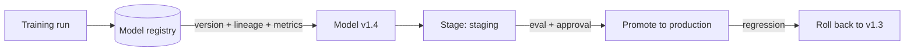

# Model Registry & Versioning

## Concept

- A **model registry** is the central system of record for trained models - a versioned catalog that tracks every model, its lineage, metadata, evaluation results, and lifecycle stage. It's the bridge between training (topic 3) and serving (topic 5), and a pillar of **MLOps**.
- What it stores and manages per model version:
  - **The artifact**: the serialized model weights/binary.
  - **Lineage**: which data, code, hyperparameters, and training run produced it (reproducibility).
  - **Metadata & metrics**: eval scores, dataset versions, framework, signatures.
  - **Lifecycle stage**: e.g., `staging` → `production` → `archived`, with approvals/gates.
- **Model versioning** treats models like deployable software artifacts: every model is versioned and immutable, so you can **promote, roll back, audit, and reproduce** exactly which model is/was in production.

## Problem It Solves

- **Reproducibility & governance**: answers "exactly which model is in production, what produced it, and how did it score?" - essential for debugging, audits, and compliance (especially regulated domains).
- **Safe promotion & rollback**: models are promoted through stages with evaluation gates and can be **instantly rolled back** to a known-good version when a new one regresses (mirrors deployment strategies, Phase 6 topic 25).
- **Decouples training from serving**: serving pulls "the current production model" from the registry; training pushes new candidates - a clean handoff.
- **Lineage for trust**: links a model to its data/code/config so results are explainable and reproducible (vs. a mystery binary in someone's notebook).

## Trade-offs

- **Discipline vs. overhead**: a registry adds process (versioning, metadata, promotion gates); for a single experimental model it's overhead, but for production ML it's essential - the cost of *not* having it is unreproducible, untraceable models.
- **What to version is bigger than the model**: true reproducibility requires versioning the **model + data + code + config** together; versioning only the weights leaves you unable to reproduce or explain them. This is harder than software versioning because data is huge and mutable (tools: DVC, MLflow, data versioning).
- **Storage cost**: keeping every model version (large artifacts) plus datasets is expensive; needs retention/archival policies (Phase 3 topic 34).
- **Promotion gates vs. velocity**: strict eval/approval gates before production are safer but slow rollout; automate the gates (eval pipelines, topic 26) to keep velocity.
- **Stage semantics must be enforced**: "production" stage is only meaningful if serving actually pulls from it and promotion is controlled.

## Examples

- **MLflow Model Registry**
  - Each training run logs metrics and registers a model version; a version is promoted from `staging` to `production` after passing evals; serving loads the current `production` version; rollback re-promotes the previous one.
- **Audit & reproduce**
  - A regulator asks why a model made a decision; the registry's lineage links the exact model version to its training data, code, and config, enabling reproduction and explanation.
- **Rollback on regression**
  - A new model is promoted, A/B testing (topic 13) shows a regression, and the registry rolls serving back to the prior production version in one step.
- **Full lineage**
  - Model v1.4 records: dataset v2024-06 (DVC hash), training commit `abc123`, hyperparameters, and eval scores - fully reproducible.
- **Interview framing**
  - For productionizing ML, include a model registry with versioning, lineage (data + code + config, not just weights), staged promotion behind eval gates, and instant rollback. Emphasizing that reproducibility requires versioning *data and code alongside the model*, and tying promotion to eval pipelines (topic 26), shows real MLOps maturity.
