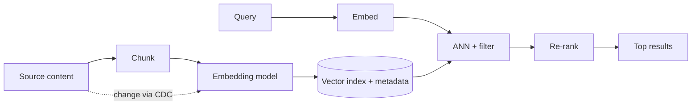

# Embedding Pipelines & Vector Search Architecture

## Concept

- This topic covers the **production pipeline** that produces and maintains the embeddings a vector database (topic 8) searches — the often-overlooked half of RAG/semantic-search systems. The vector DB *stores and searches*; this pipeline *creates and keeps the vectors current*.
- **Embedding pipeline** stages:
  - **Chunking** — split source content into appropriately-sized pieces (the chunk strategy strongly affects retrieval quality — topic 7).
  - **Embedding** — run each chunk through an **embedding model** to produce a vector.
  - **Indexing** — write vectors + metadata into the vector store.
  - **Freshness/sync** — re-embed and re-index when source content changes (incremental updates, often via CDC, Phase 4 topic 25).
- **Vector search architecture** concerns at serving time: query embedding, ANN search (HNSW/IVF, topic 8), **metadata filtering**, **hybrid search** (vector + keyword), and **re-ranking** (a cross-encoder reorders top candidates for precision).

## Problem It Solves

- Makes semantic search/RAG **production-grade** rather than a one-off script: it keeps the index **fresh** as content changes, applies a **consistent** embedding/chunking strategy, and scales ingestion to large/growing corpora.
- The **serving architecture** (hybrid search + re-ranking + filtering) is what lifts retrieval quality from "vector similarity sometimes works" to reliably returning the right results — the dominant lever in RAG quality (topic 7).
- Centralizes the embedding-model dependency so changes (re-embedding) are managed, not chaotic.

## Trade-offs

- **Embedding model choice & coupling** — the embedding model determines retrieval quality and is **coupled to the index**: changing the model (or its version) requires **re-embedding the entire corpus** and rebuilding the index — a costly, disruptive migration. Choose deliberately and plan for re-embedding.
- **Chunking strategy** — fixed-size vs. semantic chunking, chunk size, and overlap materially affect what can be retrieved; there's no universally right setting — it needs tuning and evaluation (topic 26).
- **Freshness vs. cost** — re-embedding on every change keeps the index current but costs compute (embedding calls) and index churn; batch re-embedding is cheaper but staler. Match to how fast content changes.
- **Hybrid + re-rank: quality vs. latency/cost** — adding keyword search and a cross-encoder re-ranker substantially improves relevance but adds latency and compute; re-ranking the top 50→5 is a common cost/quality balance.
- **Metadata filtering complexity** — combining ANN with structured filters (pre- vs. post-filter) affects both correctness and performance (topic 8).
- **Scale of ingestion** — embedding millions of chunks is a real batch/streaming data-engineering job (Phase 6 topic 17), not a trivial step.

## Examples

- **Incremental freshness via CDC**
  - When a document is edited, a CDC event (Phase 4 topic 25) triggers re-chunking and re-embedding of just that document, keeping the index current without a full rebuild.
- **Hybrid + re-rank serving**
  - A query runs vector ANN *and* BM25 keyword search (Phase 3 topic 23), the union is re-ranked by a cross-encoder, and the top 5 feed the RAG prompt — far better relevance than vector-only.
- **Embedding model migration**
  - Upgrading to a better embedding model requires re-embedding the whole corpus and rebuilding the index — planned as a migration with a parallel index and cutover.
- **Chunking tuning**
  - Evaluation (topic 26) shows 256-token chunks with 50-token overlap retrieve better than 1000-token chunks for this content — a tuned, measured decision.
- **Interview framing**
  - For RAG/semantic search, separate the *pipeline* (chunk → embed → index, kept fresh via CDC) from the *vector DB* (topic 8), and on the serving side propose hybrid search + re-ranking + metadata filtering. Flagging that the **embedding model is coupled to the index** (changing it means re-embedding everything) and that chunking/re-ranking are the main quality levers shows you understand the full retrieval system, not just "use a vector DB."
