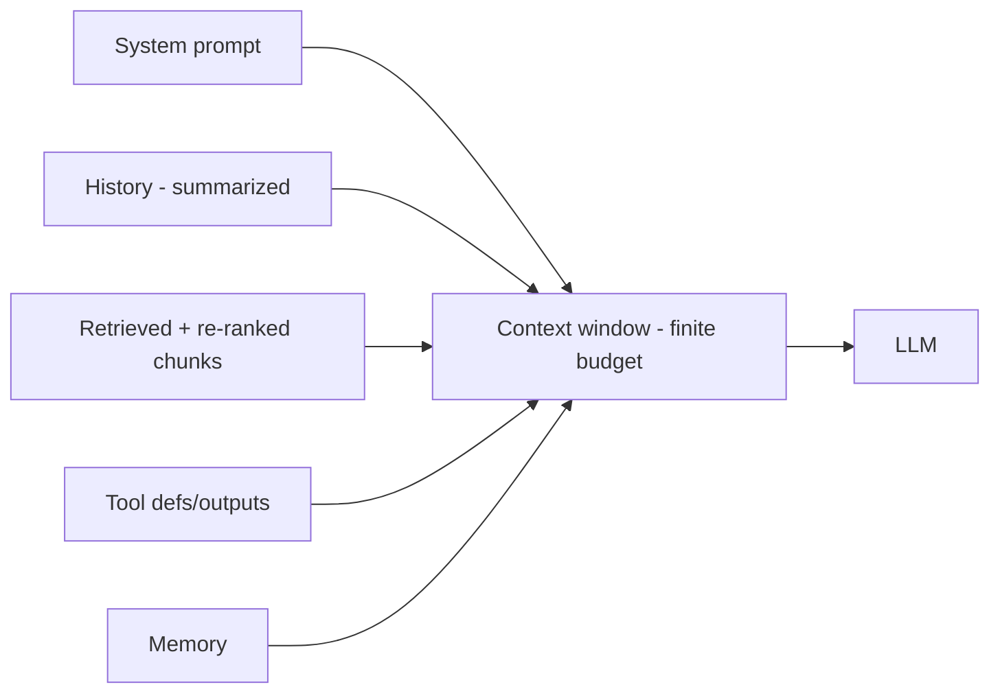

# Context Engineering

## Concept

- **Context engineering** is the discipline of deciding **what information to put into an LLM's limited context window, and how to structure it**, to maximize answer quality while controlling cost and latency. As systems grew from single prompts to RAG and agents, *managing the context* became the central engineering problem - broader than prompt wording (topic 9).
- The context window is a **finite, contended budget** filled by: the system prompt, conversation history, retrieved documents (RAG, topic 7), tool definitions and tool outputs (topic 20), memory (topic 21), and the user query. Context engineering allocates this budget well.
- Core techniques:
  - **Selection/retrieval**: include only the most relevant chunks (good retrieval + re-ranking, topic 18).
  - **Compression/summarization**: summarize history or documents to fit more signal in fewer tokens.
  - **Ordering**: place the most important content where the model attends best (mitigating "lost in the middle").
  - **Pruning/windowing**: drop or summarize old conversation turns; keep a rolling window + summary.
  - **Structuring**: clear delimiters, sections, and formats so the model parses context reliably.

## Problem It Solves

- **Quality**: LLMs perform best with the *right* context, not the *most* context. Irrelevant or excessive content dilutes attention, causes "lost in the middle" (models ignore mid-context information), and degrades answers. Context engineering curates what the model sees.
- **Cost & latency**: LLM cost and latency scale with tokens (topic 15); trimming context to what's needed directly cuts both. Long contexts also strain KV-cache memory (topic 6).
- **Enables long-running interactions**: managing/compressing history lets conversations and agent loops continue beyond the raw window limit.

## Trade-offs

- **More context vs. better context**: naively stuffing everything in (now that windows are large) seems easy but hurts quality (dilution, lost-in-the-middle), cost, and latency. Curating less, more relevant context usually beats more. This counterintuitive point is the heart of the discipline.
- **Compression vs. fidelity**: summarizing history/documents saves tokens but loses detail; an over-aggressive summary drops information the model later needs. Balance per use case.
- **Large context windows aren't a free pass**: even with 100k - 1M token windows, filling them is costly (tokens) and quality/attention degrade over long contexts; bigger windows reduce but don't remove the need to engineer context.
- **Retrieval dependency**: context quality depends on retrieval quality (topic 18); bad retrieval puts the wrong things in context regardless of how well you structure it.
- **Dynamic allocation**: in agents, tool outputs and intermediate results accumulate and must be pruned/summarized or they blow the budget (topic 21) - needs active management, not a static template.

## Examples

- **Rolling summary**
  - A long chat keeps the last few turns verbatim plus a running summary of earlier turns, preserving continuity within the budget instead of either truncating or paying for the full history.
- **Re-ranked, trimmed RAG context**
  - Retrieve 30 chunks, re-rank, and include only the top 5 - fewer tokens, higher relevance, better answer than dumping all 30 (topics 7, 18).
- **Ordering for attention**
  - Place the most critical instruction/content near the start and end of the context (where models attend best) rather than buried in the middle.
- **Agent context pruning**
  - An agent's loop summarizes or drops old tool outputs once used, so a long task doesn't overflow the window (topic 21).
- **Interview framing**
  - When LLM context comes up, frame it as **engineering a finite budget**: retrieve/select the most relevant content, compress history, order for attention, and prune aggressively - because **better context beats more context** (dilution, lost-in-the-middle, cost). Noting that large context windows don't eliminate this need is the current, sophisticated signal.
