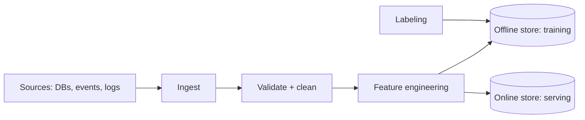

# Data Pipelines for ML

## Concept

- **ML data pipelines** prepare data for training and serving: ingesting raw data, cleaning/validating it, transforming it into **features**, and making those features available to both training (offline, in bulk) and serving (online, low-latency). They're the foundation of every ML system ("garbage in, garbage out").
- Distinct stages:
  - **Ingestion** — collect from operational DBs, event streams (Phase 4), logs, third-party sources (via batch or CDC/streaming).
  - **Validation & cleaning** — schema checks, handling missing/outlier values, deduplication; **data quality gates** so bad data doesn't poison the model.
  - **Feature engineering / transformation** — derive model inputs (aggregations, encodings, embeddings) — often the highest-leverage ML work.
  - **Labeling** — produce ground-truth labels (human annotation, weak supervision, or implicit feedback like clicks).
  - **Storage** — training data in a warehouse/lake; features in a **feature store** (topic 16) for online/offline parity.
- This is ML-specific data engineering (building on Phase 6 topic 17): the same batch/streaming, ETL/ELT, and orchestration concepts, applied to features and labels.

## Problem It Solves

- Turns messy raw data into clean, consistent, model-ready features — the single biggest determinant of ML model quality.
- **Ensures training/serving consistency** — the same feature definitions feed both offline training and online serving, preventing **training/serving skew** (the top cause of "great offline, bad in production").
- Automates and makes **reproducible** the data prep that would otherwise be ad-hoc notebooks, enabling reliable retraining.
- Provides **fresh** features for serving (real-time signals) and bulk features for training.

## Trade-offs

- **Batch vs. streaming features** — batch features (computed periodically) are simple and cheap but stale; streaming features (real-time, Phase 4 topic 24) are fresh but complex. Some features need real-time freshness (recent activity), others don't (long-term averages).
- **Training/serving skew is the central risk** — if features are computed by different code/logic in training (batch SQL) vs. serving (live service), they diverge and silently degrade the model. Feature stores (topic 16) exist to solve exactly this.
- **Data quality vs. throughput** — rigorous validation catches bad data but adds latency/complexity; skipping it lets garbage corrupt the model silently. Quality gates and monitoring are non-negotiable for production ML.
- **Labeling cost & quality** — high-quality human labels are expensive and slow; implicit/weak labels are cheap but noisy. Label quality caps model quality.
- **Feature freshness vs. cost** — recomputing features constantly is expensive; match freshness to what the model actually needs.

## Examples

- **Online + offline features**
  - A recommendation model uses batch features (user's 30-day purchase history) plus real-time features (items viewed in this session); both are computed by shared definitions and served from a feature store to avoid skew.
- **Data validation gate**
  - A pipeline (e.g., TensorFlow Data Validation / Great Expectations) checks incoming data's schema and distributions; an anomaly (a feature suddenly all-null due to an upstream bug) blocks the bad batch before it corrupts training.
- **CDC-fed features**
  - Change Data Capture (Phase 4 topic 25) streams operational data changes into the feature pipeline so features stay fresh without heavy queries on the production DB.
- **Implicit labels**
  - Clicks/purchases serve as implicit labels for a ranking model via the feedback loop (topic 12), avoiding manual annotation.
- **Interview framing**
  - For ML data pipelines, cover ingestion → validation → feature engineering → labeling → online/offline storage, and put **training/serving skew** front and center (solved by a feature store). Stressing data-quality gates and the batch-vs-streaming feature freshness trade-off shows you know that data infrastructure, not the model, makes or breaks production ML.
