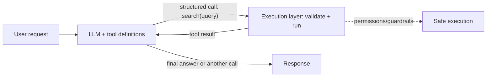

# Tool-Calling Architecture

## Concept

- **Tool calling** (function calling) lets an LLM **invoke external functions/APIs** to get information or take actions it can't do itself — turning a text generator into a system that can search, query databases, run code, call APIs, and act. It's the mechanism that powers agents (topic 10).
- How it works:
  - You provide the model a set of **tool definitions** — each with a name, description, and a **structured parameter schema** (typically JSON Schema).
  - Given a user request, the model decides whether/which tool to call and emits a **structured call** with arguments (it doesn't execute — it *requests*).
  - **Your code executes** the tool, then feeds the **result back** into the model's context, which continues reasoning (possibly calling more tools) until it produces a final answer.
- The architecture around this: schema design, an **execution layer** (a tool registry/dispatcher that validates and runs calls), error handling, and security/permissions for what tools can do.

## Problem It Solves

- **Overcomes the LLM's fundamental limits** — frozen training knowledge, no real-time data, no exact computation, no ability to act. Tools give it current information (search/DB), precise computation (calculator/code), and the ability to *do* things (API calls) — drastically reducing hallucination on factual/computational tasks and enabling real workflows.
- Provides a **structured, reliable interface** between the probabilistic model and deterministic systems (APIs, databases), with validation.
- Is the foundational primitive for agents (topic 10), RAG-as-a-tool, and LLM integration with real systems.

## Trade-offs

- **Capability vs. reliability of tool selection** — the model must pick the right tool and produce **valid arguments**; it can hallucinate tool calls, malform arguments, or choose wrong. Good **tool descriptions + strict schemas + argument validation** (reject/repair invalid calls) are essential, and reliability drops as the number of tools grows (too many tools confuse the model — keep the set focused).
- **Security is critical** — tools let the model affect the world; a tool that executes code, queries a DB, or calls an API is an attack surface (especially with prompt injection, topic 25). Tools must run with **least privilege**, validate inputs, and gate high-stakes actions behind permissions/human approval.
- **Latency & cost** — each tool call is a round trip plus another LLM call to process the result; multi-tool flows are slow and expensive (compounds in agents, topic 10).
- **Error handling** — tools fail (timeouts, bad inputs, API errors); the system must feed errors back gracefully so the model can recover or report, not crash or loop.
- **Determinism gap** — the model decides *when* to call tools non-deterministically; for known workflows, an explicit orchestration (Phase 3 topic 38) is more reliable than trusting the model to choose.

## Examples

- **Structured function calling**
  - The model is given a `get_weather(city: string)` tool; asked "weather in Paris?", it emits `get_weather("Paris")`; your code calls the API and returns the result for the model to phrase — grounded, not hallucinated.
- **Validated execution layer**
  - A dispatcher validates the model's tool call against the JSON schema, rejects/repairs malformed arguments, runs the tool with least-privilege credentials, and returns structured results or errors.
- **RAG as a tool**
  - Retrieval is exposed as a `search_docs(query)` tool the model calls when it needs knowledge — agentic RAG (topics 7, 10).
- **Guarded action**
  - A `issue_refund(order, amount)` tool is allowed only up to a limit and logs every call; larger refunds require human approval (guardrails, topic 25).
- **Interview framing**
  - Describe tool calling as the LLM emitting validated structured calls that *your* execution layer runs and feeds back, overcoming the model's knowledge/computation/action limits. Stress **schema design + argument validation**, keeping the tool set focused, and **security (least privilege, injection, gated actions)** — the reliability and safety of tool execution is where production systems live or die.
