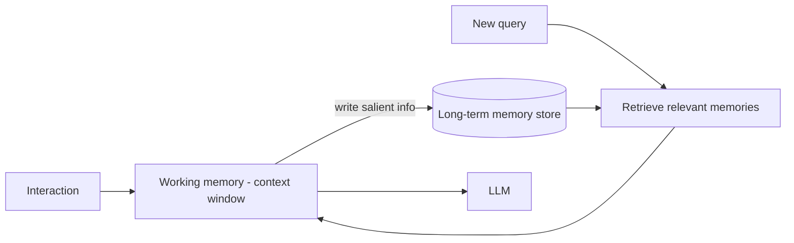

# Agent Memory & Long-Term Memory

## Concept

- **Memory** gives an LLM agent (topic 10) the ability to retain and recall information **beyond the current context window**, enabling continuity across a long task and across separate sessions. Without memory, every interaction is stateless and forgetful.
- The memory hierarchy:
  - **Short-term / working memory**: the current context window: the ongoing conversation and recent tool results. Limited and managed by context engineering (topic 19).
  - **Long-term memory**: durable storage *outside* the context, retrieved when relevant:
    - **Episodic**: records of past interactions/events ("last week the user asked about X").
    - **Semantic**: facts/knowledge learned about the user or domain ("the user prefers concise answers," "their company uses Postgres").
    - **Procedural**: learned skills/workflows.
- Long-term memory is typically implemented as **retrieval over a store** (often a vector DB, topic 8): the agent writes salient information to memory, and **retrieves** relevant memories into context when needed - essentially RAG over the agent's own history.

## Problem It Solves

- **Continuity & personalization**: lets an agent remember user preferences, past decisions, and prior context across sessions, so it doesn't repeatedly ask the same things or lose the thread - essential for assistants, long-running tasks, and personalized experiences.
- **Beyond the context window**: durable memory + retrieval lets the agent operate over far more information than fits in context, and over time spans longer than one conversation.
- Enables agents to **learn from experience** (store outcomes, recall what worked) rather than starting fresh each time.

## Trade-offs

- **What to remember (the core hard problem)**: storing everything is noisy, expensive, and pollutes retrieval; storing too little loses important context. Deciding **what's salient enough to persist** (and summarizing it) is genuinely hard and largely unsolved - naive "remember everything" memory degrades over time.
- **Retrieval quality**: memory is only useful if the *right* memories are retrieved at the *right* time; this inherits all of RAG's retrieval-quality challenges (topics 7, 18). Irrelevant retrieved memories waste context and mislead.
- **Memory consistency & staleness**: facts change (the user's preference updates); memory needs updating/invalidation, or the agent acts on outdated beliefs. Conflicting memories must be reconciled.
- **Cost & context budget**: retrieved memories consume context tokens (topic 19) and the memory store adds infrastructure; balance against value.
- **Privacy**: persisting user information long-term raises serious privacy/compliance concerns (consent, retention, deletion - Phase 3 topic 34); memory of PII must be governed.

## Examples

- **Personalized assistant**
  - The agent writes "user prefers Python and concise answers" to semantic memory; in a later session it retrieves this and tailors responses without being told again.
- **Summarized episodic memory**
  - After each session, the agent summarizes key events and stores the summary (not the raw transcript) in memory, keeping it compact and retrievable.
- **Memory as RAG**
  - Past interactions are embedded and stored in a vector DB; a new query retrieves the most relevant past memories into context - the same machinery as RAG (topics 7, 18).
- **Memory update**
  - The user changes a preference; the agent updates/overrides the stored memory rather than accumulating contradictory facts.
- **Interview framing**
  - Describe the memory hierarchy (working vs. long-term: episodic/semantic/procedural) and implement long-term memory as **retrieval over a store** (RAG over the agent's history). Emphasize the unsolved-hard-part - **deciding what's salient to remember and summarizing it** - plus memory staleness/consistency and privacy/retention. That nuance is exactly the frontier-of-2025 agent-design signal.
