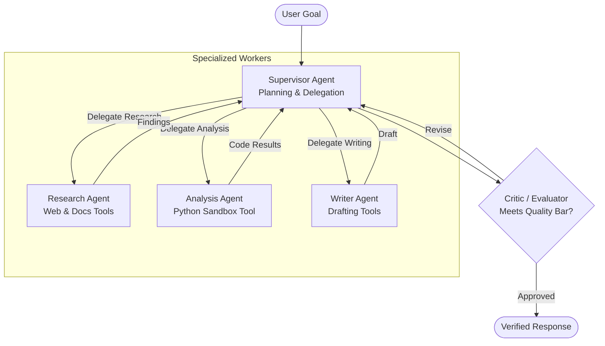

# Multi-Agent Systems

## Concept

- A **Multi-Agent System (MAS)** decomposes complex, ambiguous, or multi-step goals across **multiple specialized LLM agents** rather than relying on a single monolithic prompt or agent.
- A single agent attempting to handle retrieval, code execution, planning, data synthesis, and verification suffers from context window degradation, role confusion, and compounding reasoning errors. Decomposing into specialized agents provides:
  - **Role specialization**: Each agent has a focused system prompt, restricted tool subset, and tailored persona (e.g., Researcher, Planner, Coder, Critic/Reviewer).
  - **Context isolation**: Sub-agents operate in their own context windows, shielding downstream reasoning from messy intermediate tool outputs.
  - **Consensus & verification**: Independent agents can audit each other's outputs before finalizing actions.
- Common Multi-Agent Orchestration Topologies:
  1. **Supervisor / Orchestrator-Workers**: A central manager agent breaks down goals, assigns discrete tasks to worker agents, collects results, and synthesizes the final output.
  2. **Hierarchical Teams**: Multi-tiered hierarchy where high-level managers delegate to sub-team leads, who direct individual specialized workers.
  3. **Sequential Pipeline / State Machine**: Agents pass intermediate artifacts along a deterministic workflow graph (e.g., Researcher $\rightarrow$ Writer $\rightarrow$ Fact-Checker).
  4. **Swarm / Collaborative Chat**: Decentralized agents interact in an event loop, using handoffs or message passing to transition control dynamically.

## Problem It Solves

- **Context Bloat & Token Degradation**: Monolithic agents quickly fill their context with tool schemas, raw documents, and error traces. Multi-agent architectures compartmentalize context per task.
- **Complex Enterprise Workflows**: Solves tasks requiring diverse tool ecosystems with conflicting requirements (e.g., security-hardened read-only agents vs. sandboxed execution agents).
- **Compounding Errors**: Prevents an early hallucination or malformed tool call from irreversibly corrupting a multi-step execution path.

## Trade-offs

- **Cost & Latency Multiplication**:
  - Every agent handoff requires an LLM inference call. A multi-agent loop can easily execute 15-50 round-trips for a single user prompt, drastically increasing token costs and response times (often 30s - 2 minutes).
- **Runaway Loops & Deadlocks**:
  - Agents can get stuck in infinite clarification loops (e.g., Agent A asks Agent B for details, Agent B requests clarification from Agent A). Systems must enforce hard iteration caps, timeout budgets, and supervisor overrides.
- **State Management & Synchronization**:
  - Deciding what state to pass during handoffs is challenging. Passing full transcripts defeats context isolation; passing sparse summaries risks omitting critical facts.
- **Overkill for Deterministic Tasks**:
  - Using autonomous multi-agent handoffs for standard business processes (e.g., payment processing or ETL) is anti-pattern; traditional deterministic workflow orchestrators (Temporal, Airflow, Step Functions - Phase 3 topic 38) are far more reliable and cost-effective.

## Examples

- **Code Generation with Generator-Critic Pair**
  - A *Coder Agent* produces Python code given user specifications.
  - A *Reviewer Agent* (prompted strictly with security standards and test cases) runs the code in an isolated Docker sandbox. If tests fail, it returns the error stack trace to the Coder Agent with specific feedback. The loop terminates once tests pass or iteration limit (e.g., 3) is reached.
- **Dynamic Handoffs in Customer Support**
  - A *Triage Agent* greets the user and identifies intent. If billing is detected, it invokes a `handoff_to_billing_agent()` tool. The billing agent receives the customer ID, queries account databases, and issues refunds within policy limits.
- **Stateful Workflow with LangGraph / CrewAI**
  - Defining explicit state graphs where edges between agent nodes are governed by conditional routers (e.g., `if state['review_score'] > 0.8: return FINISH; else: return REVISE`).
- **Interview Framing**
  - Distinguish between **autonomous collaboration** and **deterministic orchestration**. Recommend multi-agent systems for high-uncertainty exploration, research, or code generation with verification loops. Emphasize production guardrails: **max-iteration bounds, token budgets, structured handoff schemas, and distributed tracing (OpenTelemetry)** to track multi-agent cascades.
