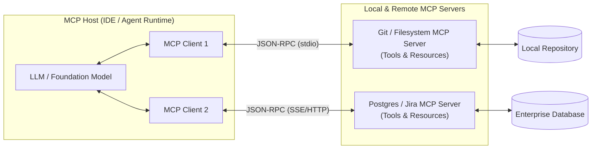

# Model Context Protocol (MCP) Architecture

## Concept

- The **Model Context Protocol (MCP)** is an open, standardized protocol (introduced by Anthropic) designed to securely connect LLM applications and AI agents to external tools, local files, databases, and enterprise services.
- Before MCP, every agent framework, IDE, and model provider implemented bespoke tool-calling integrations, creating an $M \times N$ fragmentation problem ($M$ clients $\times$ $N$ services). MCP standardizes this into an $M + N$ open client-server architecture, acting as the **"USB-C for AI applications"** or the **Language Server Protocol (LSP) for LLMs**.
- MCP Architecture Primitives:
  1. **MCP Host**: The application coordinating the LLM interaction (e.g., Claude Desktop, Antigravity IDE, Cursor, an enterprise agent runner).
  2. **MCP Client**: A component inside the host that establishes and maintains a 1:1 connection with an MCP server.
  3. **MCP Server**: A lightweight, standalone process exposing capabilities to the client via the standard JSON-RPC 2.0 protocol over `stdio` (local subprocess) or `SSE / HTTP` (remote web services).
- Three Core Capabilities Exposed by Servers:
  - **Tools**: Callable executable functions with JSON Schema parameter definitions (e.g., `execute_sql`, `search_github_issues`).
  - **Resources**: Read-only contextual data representations resembling REST endpoints or file paths (e.g., `postgres://db/schema`, `file:///logs/app.log`).
  - **Prompts**: Pre-configured prompt templates and slash-commands managed server-side.



## Problem It Solves

- **Ecosystem Fragmentation**: Eliminates writing custom glue code for every agent tool. Any MCP server works out of the box with any MCP-compliant host.
- **Security & Privilege Isolation**: Servers run in distinct processes or containers outside the main application runtime. Security boundaries (filesystem access, database credentials) are enforced at the process boundary.
- **Context Discoverability & Dynamic Tooling**: Clients can query servers at runtime (`tools/list`, `resources/list`) to dynamically populate system context and available tools without hardcoding schemas in prompts.

## Trade-offs

- **Process Overhead & IPC Latency**:
  - Running multiple local MCP servers introduces subprocess management overhead, memory footprint per server runtime (Node.js/Python), and inter-process communication (IPC) latency for tool calls.
- **Tool Selection Saturation**:
  - Connecting many MCP servers can expose dozens of tools to the LLM. Exceeding 30–50 tools degrades model selection accuracy and consumes significant context tokens on tool schemas. Hosts must implement dynamic tool filtering or routing.
- **Security in Remote Deployments**:
  - Local `stdio` servers inherit the host user's permissions, but remote HTTP/SSE MCP servers require robust authentication (OAuth 2.0, mTLS), tenant isolation, and strict egress filtering.

## Examples

- **Standard Tool Definition & Invocation Protocol**
  - Host requests available tools:
    ```json
    // Client -> Server: tools/list
    { "jsonrpc": "2.0", "id": 1, "method": "tools/list" }
    ```
  - Server advertises schema:
    ```json
    // Server -> Client: tool response
    {
      "name": "query_database",
      "description": "Execute a read-only SQL query against the warehouse",
      "inputSchema": {
        "type": "object",
        "properties": { "sql": { "type": "string" } },
        "required": ["sql"]
      }
    }
    ```
- **Enterprise Data Access with Resources**
  - An MCP server connects to AWS CloudWatch. Instead of forcing the model to write complex API queries, it exposes `resources://cloudwatch/production/error_logs`. The LLM client reads the resource directly as context.
- **Sandboxed Execution**
  - An untrusted code-execution MCP server runs in an isolated Docker container with zero network access, exposing only an `eval_python` tool to the host application.
- **Interview Framing**
  - Frame MCP as the modern industry architectural standard for agent-to-tool and agent-to-context connectivity. Contrast the old bespoke tool-wrapper pattern with the clean separation of Host, Client, and Server. Emphasize **security boundaries (least privilege, sandboxed transports)** and the operational need for **dynamic tool subsetting** when integrating enterprise MCP servers at scale.
