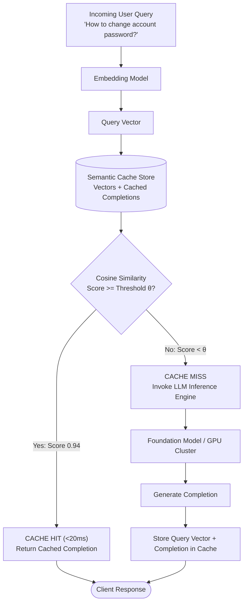

# Semantic Caching

## Concept

- **Semantic Caching** is an intelligent caching architecture for LLM applications that stores prompt queries and generated completions in a vector database, serving future semantically equivalent queries directly from cache without invoking the underlying foundation model.
- Traditional HTTP/key-value caches (Redis/Memcached) rely on **exact string hashing** (e.g., `SHA256(prompt)`). If a user asks *"How do I reset my password?"* and another asks *"Steps to reset password"*, an exact cache misses both. Semantic caching embeds the incoming query and performs an Approximate Nearest Neighbor (ANN) vector search against previously cached queries using a cosine similarity threshold $\theta$ (typically $0.88 \le \theta \le 0.96$).
- The Two Levels of Caching in Modern AI Systems:
  1. **Application-Level Semantic Cache (GPTCache / Redis VL)**: Caches full text completions based on semantic query similarity. Reduces latency from 1,500ms down to <15ms and drops API token costs to zero.
  2. **Inference-Level KV-Cache Reuse (vLLM PagedAttention / Prefix Caching)**: At the GPU serving engine layer, caches Key-Value tensors across shared prompt prefixes (system instructions, few-shot examples, large document contexts), bypassing prefill compute for recurring context tokens.



## Problem It Solves

- **Prohibitive LLM Operating Costs**: High-volume customer support, FAQ systems, and conversational search frequently observe 30–60% query redundancy. Serving from cache eliminates LLM per-token billing for those queries.
- **Tail Latency Mitigation**: Replaces high-variance generation latency (1–5 seconds depending on output token count) with deterministic sub-20ms vector lookups.
- **Throttling & Rate-Limit Protection**: Shields downstream GPU clusters or third-party APIs from traffic spikes during flash events.

## Trade-offs

- **Semantic Drift & False Positive Hits (Threshold Tuning)**:
  - Setting the similarity threshold $\theta$ too low (e.g., 0.80) produces incorrect answers (e.g., *"How do I cancel my subscription?"* hits the cache for *"How do I renew my subscription?"*). Setting it too high (0.98) degrades hit rates toward exact caching.
- **Cache Invalidation Complexity**:
  - LLM outputs become stale when underlying domain facts change. In traditional caches, keys can be purged by ID; in semantic caches, finding and invalidating all vectors related to an updated topic requires cluster-wide metadata tagging or namespace partitions.
- **Dynamic / Personalized Context Interference**:
  - If prompts include user-specific variables (`user_id`, timestamps, session history), the embedding vector shifts, reducing cache hit rates unless the architecture isolates the static intent from dynamic parameters.
- **Vector Search Overhead**:
  - At scale (millions of cached queries), embedding generation (5–20ms) plus ANN vector lookup adds slight latency to true cache misses before hitting the LLM.

## Examples

- **Pre-Filtering & Scoped Semantic Caching**
  - Query embeddings are partitioned by tenant, model version, and user permission tier.
  - Queries are normalized (lowercased, whitespace stripped, PII masked) before vector lookup:
    ```python
    # Pseudo-architecture of a semantic cache lookup
    query_vector = embed_model.encode(user_prompt)
    match = cache_db.find_nearest(
        vector=query_vector,
        filter={"model": "gpt-4o", "tenant_id": "cust_123"},
        threshold=0.92
    )

    if match:
        return match.completion, "HIT"
    else:
        completion = call_llm(user_prompt)
        cache_db.insert(query_vector, completion, ttl=86400)
        return completion, "MISS"
    ```
- **KV-Cache Prefix Sharing in vLLM**
  - An enterprise agent with a 4,000-token system prompt and API schema documentation serves 100 concurrent users. Automatic prefix caching retains the KV-cache of those 4,000 tokens in GPU memory, cutting prefill latency by 85%.
- **Interview Framing**
  - Discuss caching on both architectural planes: **Application-Level Semantic Caching** (embeddings + vector similarity) for external cost and latency reduction, and **Engine-Level Prefix Caching** (KV-cache reuse via PagedAttention) for GPU throughput optimization. Highlight the production pitfalls: **tuning similarity thresholds ($\theta \approx 0.90\text{--}0.94$), metadata filtering to avoid cross-tenant data leaks, and invalidation strategies**.
