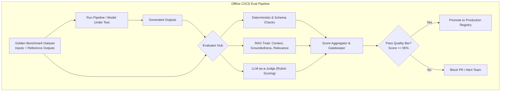

# Evaluation Pipelines

## Concept

- **Evaluation Pipelines (Evals)** are the core CI/CD and observability harness for AI/LLM systems. Unlike traditional software where unit tests assert deterministic inputs against exact boolean assertions (`assert add(2, 2) == 4`), LLMs produce non-deterministic, probabilistic, natural-language outputs that require statistical, rubric-based, and semantic evaluation.
- An eval pipeline tests prompts, RAG retrieval pipelines, model checkpoints, fine-tuned weights, and agent tool loops across two key operational environments:
  1. **Offline Evaluation (Pre-Deployment CI/CD)**:
     - Run against a curated **Golden Dataset** (hundreds or thousands of diverse, representative test cases with reference outputs).
     - Gates model promotions, prompt refactors, chunking updates, or fine-tuning runs before production deployment.
  2. **Online Evaluation (Production Monitoring & Observability)**:
     - Continuously samples live production interactions, running automated evaluators, user feedback collection (thumbs up/down, edit rates), and human-in-the-loop audit queues to detect data drift, quality regression, or adversarial attacks.
- Evaluation Paradigms:
  - **Deterministic & Heuristic**: Exact match, regex validation, JSON schema conformance, latency/cost bounds.
  - **Traditional NLP Metrics**: ROUGE, BLEU, METEOR (useful for rigid translation/summarization, poor for reasoning or open-ended dialogue).
  - **Semantic Embeddings**: BERTScore, cosine similarity between generated text and reference ground truth.
  - **LLM-as-a-Judge**: Using a larger, frontier foundation model (e.g., GPT-4o, Claude 3.5 Sonnet) prompted with detailed rubrics to grade smaller or cheaper production models.



## Problem It Solves

- Prevents **regression blindness**: changing a system prompt or updating an embedding model might improve one benchmark query while quietly breaking 20% of edge cases. Evals turn prompt engineering into an empirical, measurable engineering discipline.
- Solves the **"vibe check" anti-pattern**: replaces ad-hoc manual testing by developers with automated, reproducible statistical confidence scores.
- Enables safe, continuous migration to cheaper, faster models (e.g., distilling a GPT-4 pipeline down to a fine-tuned open-source 8B model).

## Trade-offs

- **LLM-as-a-Judge Biases**:
  - **Position Bias**: In pairwise comparisons, judges often prefer the first response presented.
  - **Verbosity Bias**: Judges consistently favor longer, more elaborate responses even when concise answers are superior.
  - **Self-Enhancement Bias**: Models often rate completions generated by their own family higher than competitors.
  - *Mitigation*: Swap presentation orders, strip model identifiers, provide few-shot calibration examples, and use clear negative-marking rubrics.
- **Eval Flakiness & Cost**:
  - Running 1,000 eval cases through GPT-4 on every git commit costs real money ($5 - $50 per test run) and takes minutes. Teams run tiered evals: fast deterministic smoke tests on PRs, full LLM-judged suites nightly.
- **Golden Dataset Curation Bottleneck**:
  - Creating and maintaining realistic, diverse golden datasets is labor-intensive. Stale datasets lead to "overfitting" prompts to artificial benchmark cases rather than real user behavior.

## Examples

- **The RAG Triad Evaluation Framework (TruLens / Ragas)**
  - **Context Relevance**: Does the retrieved context contain *only* information relevant to the question? (Checks retrieval precision).
  - **Groundedness / Faithfulness**: Is the final answer logically entailed *exclusively* by the retrieved context? (Detects factual hallucinations, topic 25).
  - **Answer Relevance**: Does the answer directly address the user's initial prompt? (Detects evasive or off-topic responses).
- **Calibrated LLM-as-a-Judge Prompt with Rubric**
  ```markdown
  You are an expert evaluator assessing customer service assistant quality.
  Evaluate the Model Output against the Reference Ground Truth on a 1-5 scale based on the rubric:
  - 1: Factually incorrect or policy violation.
  - 3: Factually accurate but includes unrequested speculation or poor tone.
  - 5: Completely factually accurate, concise, empathetic, and strictly follows guidelines.

  Output your response in JSON:
  {
    "reasoning": "<step-by-step critique>",
    "score": <integer 1-5>
  }
  ```
- **Automated CI/CD Gating (GitHub Actions)**
  - A pull request modifies `system_prompt.txt`. A GitHub Action executes the offline eval suite against 200 golden cases. If the aggregate Groundedness score drops below 0.95 or latency increases by >20%, the PR is blocked from merging.
- **Interview Framing**
  - Treat Evaluation Pipelines as the **single most critical operational asset** of production AI system design. In any LLM or RAG interview, conclude your architecture with the eval harness: **curating golden datasets, separating offline CI/CD gating from online production sampling, implementing the RAG Triad, and actively controlling for LLM judge biases (pairwise order swapping, verbosity penalties)**.
