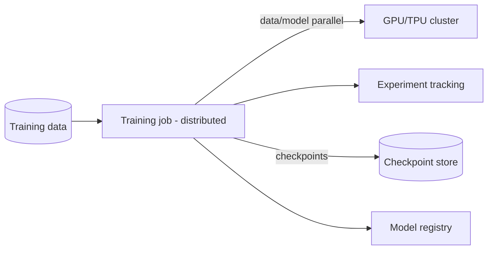

# Model Training Infrastructure

## Concept

- **Training infrastructure** is the compute, orchestration, and tooling that turns data + code into trained models reproducibly and at scale. It spans a single experiment on one GPU up to distributed training of large models across hundreds of accelerators.
- Key components:
  - **Compute**: GPUs/TPUs, often in clusters; scheduling and sharing them efficiently is a core concern (expensive, scarce).
  - **Distributed training**: for large models/data: **data parallelism** (replicate the model, split the data across workers, sync gradients) and **model parallelism / sharding** (split the model itself across devices when it doesn't fit on one) - e.g., FSDP, DeepSpeed, Megatron.
  - **Experiment tracking**: log hyperparameters, metrics, and artifacts for every run (MLflow, Weights & Biases) so experiments are comparable and reproducible.
  - **Orchestration & pipelines**: automate data prep → train → evaluate → register as repeatable workflows (Kubeflow, SageMaker, Metaflow).
  - **Reproducibility**: version data, code, and config so a model can be re-created.
  - **Checkpointing**: save state periodically so long runs survive failures/preemption (essential on spot instances).

## Problem It Solves

- Makes training **scalable** (handle large models/datasets that don't fit on one machine via distributed training), **efficient** (share scarce expensive GPUs across teams), and **reproducible** (track and version everything so results can be reproduced and compared).
- Automates the path from data to a registered, deployable model, replacing fragile manual notebook workflows.
- Enables long, expensive training runs to survive failures and preemption via checkpointing.

## Trade-offs

- **Distributed training complexity vs. necessity**: data/model parallelism adds significant complexity (gradient sync, communication overhead, sharding); only needed when the model/data won't fit or train fast enough on one node. Single-GPU is far simpler - don't distribute prematurely.
- **GPU cost & utilization**: accelerators are very expensive and often under-utilized; efficient scheduling, spot instances (with checkpointing), and right-sizing matter enormously for cost (ties to cost optimization, Phase 6 topic 19).
- **Communication bottleneck**: in distributed training, syncing gradients across workers can dominate; network/interconnect (and techniques like gradient compression) become the limit at scale.
- **Reproducibility vs. velocity**: rigorous versioning of data/code/config enables reproducibility and debugging but adds discipline overhead; skipping it makes results irreproducible and models unexplainable.
- **Build vs. managed**: managed training platforms (SageMaker, Vertex) reduce ops burden at higher cost and some lock-in vs. self-managed clusters.

## Examples

- **Data-parallel training**
  - A model is replicated across 8 GPUs; each processes a shard of the batch and gradients are all-reduced to keep replicas in sync - near-linear speedup until communication dominates.
- **Sharded large-model training**
  - A model too big for one GPU is sharded (FSDP/DeepSpeed ZeRO) so parameters/optimizer state are split across devices.
- **Spot + checkpointing**
  - Training runs on cheap preemptible GPUs, checkpointing every N steps; an interruption resumes from the last checkpoint, cutting cost ~70% (topic Phase 6/19).
- **Experiment tracking**
  - Every run logs hyperparameters and validation metrics to W&B/MLflow; the best run's artifact is promoted to the model registry (topic 17).
- **Interview framing**
  - For training infrastructure, cover compute/scheduling, distributed training (data vs. model parallelism, and *only when needed*), experiment tracking, reproducibility (version data/code/config), checkpointing, and orchestration. Emphasizing GPU cost/utilization and that you distribute only when a single node can't cope shows pragmatic ML-infra judgment.
