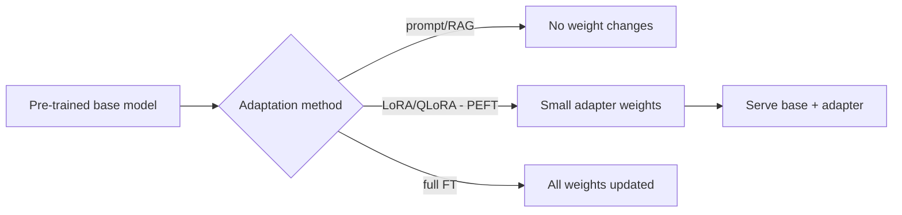

# Fine-Tuning Infrastructure

## Concept

- **Fine-tuning** adapts a pre-trained model (especially an LLM or foundation model) to a specific task, domain, or style by further training it on a smaller, targeted dataset - leveraging the base model's general knowledge instead of training from scratch.
- The spectrum of adaptation, from cheapest to most involved:
  - **Prompting / in-context learning**: no training; just instructions/examples in the prompt (topic 9). Cheapest, most flexible.
  - **RAG**: inject retrieved knowledge at inference (topic 7); good for *knowledge*, not *behavior*.
  - **PEFT (Parameter-Efficient Fine-Tuning)**: e.g., **LoRA/QLoRA**: train small adapter weights while freezing the base model. Drastically cheaper than full fine-tuning (tiny fraction of parameters), and you can swap adapters per task.
  - **Full fine-tuning**: update all model weights. Most powerful but most expensive and storage-heavy.
  - **RLHF / preference tuning (DPO)**: align the model to human preferences.
- Fine-tuning teaches **behavior, format, and style** (and narrow domain skills); it's generally *not* the right tool for injecting frequently-changing facts (use RAG for that).

## Problem It Solves

- Gets a model to reliably do a **specific task/format/tone** that prompting alone can't achieve consistently - e.g., a consistent structured output, a specialized domain style, or a narrow classification - at lower inference cost than a huge prompt.
- **PEFT/LoRA** makes adaptation affordable: fine-tune a large model on modest hardware by training a tiny set of adapter parameters, and serve many task-specific adapters over one shared base.
- Reduces reliance on long, expensive prompts by baking behavior into weights.

## Trade-offs

- **Fine-tuning vs. RAG vs. prompting (the key decision)**: prompting/RAG are cheaper, faster to iterate, and keep knowledge *current* (no retraining to update facts); fine-tuning changes *behavior/style* but bakes in knowledge that goes stale and requires retraining to update. **Use RAG for knowledge, fine-tuning for behavior** - confusing the two is a common, costly mistake.
- **PEFT vs. full fine-tuning**: LoRA/QLoRA is far cheaper (compute, storage, swappable adapters) and usually sufficient; full fine-tuning is more powerful but costly and produces a full model copy per task.
- **Cost & data needs**: fine-tuning needs a quality curated dataset and compute; poor data makes it worse, not better. Quality > quantity.
- **Maintenance**: a fine-tuned model must be re-tuned as the base model upgrades or requirements change; it's an ongoing commitment, not one-and-done.
- **Catastrophic forgetting / overfitting**: over-fine-tuning can degrade the base model's general abilities or overfit the small dataset.
- **Evaluation is essential**: you need evals (topic 26) to know fine-tuning actually helped and didn't regress other behaviors.

## Examples

- **LoRA adapters per task**
  - One base LLM serves multiple products via different LoRA adapters (support tone, code style, summarization format) - swapped at inference, far cheaper than separate full models.
- **RAG vs. fine-tune decision**
  - "The model should answer from our latest docs" → **RAG** (docs change). "The model should always reply in our brand voice and a fixed JSON schema" → **fine-tune** (behavior).
- **QLoRA on modest hardware**
  - Quantized base + LoRA adapters let a large model be fine-tuned on a single GPU, democratizing adaptation.
- **Preference tuning**
  - DPO/RLHF aligns outputs to human-rated preferences for helpfulness/safety, evaluated against a held-out preference set.
- **Interview framing**
  - When adaptation comes up, lead with the decision tree: prompt → RAG → PEFT (LoRA) → full fine-tune → preference tuning, choosing the cheapest that works. The crisp rule "**RAG for knowledge, fine-tuning for behavior/style**," plus PEFT/LoRA for cost-efficiency and the need for evals, is exactly the modern, cost-aware LLM-systems signal.
