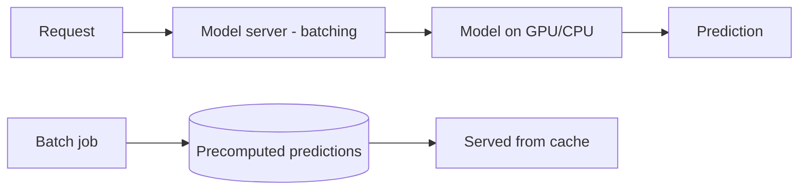

# Model Serving and Inference

## Concept

- **Model serving** is deploying a trained model so applications can get **predictions (inference)** from it, reliably and at the required latency, throughput, and cost. It's where ML meets production engineering.
- The serving patterns:
  - **Online (real-time) inference**: a request gets a prediction synchronously (an API call), low-latency. For interactive features (recommendations, fraud checks, search ranking).
  - **Batch inference**: precompute predictions for many inputs offline on a schedule, store the results, serve from a cache/DB. Cheaper and simpler when predictions don't need to be on-demand.
  - **Streaming inference**: predictions on a continuous event stream (Phase 4 topic 24).
- Key serving infrastructure concerns:
  - **Latency & throughput**: meet the SLO; use **batching** (group requests to maximize GPU utilization) and hardware acceleration.
  - **Scaling**: autoscale inference replicas with load (Phase 6 topic 24), often GPU-aware.
  - **Model versioning & rollout**: deploy new model versions safely (canary/shadow - topic 13, Phase 6 topic 25) with rollback.
  - **Optimization**: quantization, distillation, compilation (ONNX, TensorRT) to cut latency/cost.

## Problem It Solves

- Bridges the gap between a trained model and a product feature: makes predictions available with the **latency, throughput, availability, and cost** production requires - the part that determines whether ML actually ships.
- **Batching and acceleration** maximize expensive GPU utilization, cutting per-prediction cost.
- **Versioning and safe rollout** let you update models without breaking the product, and roll back a bad model fast.

## Trade-offs

- **Online vs. batch**: online gives fresh, on-demand predictions but needs low-latency, always-on, scalable (often GPU) infrastructure; batch is far cheaper and simpler but predictions are stale and only for inputs known in advance. Choose by whether predictions must be real-time.
- **Latency vs. throughput (batching)**: batching requests boosts GPU throughput/cost-efficiency but adds latency (waiting to fill a batch); tune batch size/timeout to the latency SLO.
- **Model size/accuracy vs. cost/latency**: bigger models score higher but cost more and are slower to serve; optimization (quantization, distillation) trades a little accuracy for big latency/cost wins. The best *served* model isn't always the most accurate one.
- **GPU vs. CPU**: GPUs are fast for big models but expensive and need careful utilization; small models may serve fine (and cheaper) on CPU.
- **Training/serving skew**: features at serving time must match training (topic 2/16), or accuracy silently drops.
- **Cold starts & autoscaling lag**: loading large models is slow; scaling GPU inference to spikes needs warm pools/headroom.

## Examples

- **Real-time ranking**
  - A search/recsys model serves ranking predictions per query within a tight latency budget, using request batching and GPU acceleration, autoscaled on QPS.
- **Batch precompute**
  - Daily, a batch job scores every user's recommendations and writes them to a cache; the app serves precomputed results instantly - cheap and simple where daily freshness suffices.
- **Shadow deployment**
  - A new model version runs in shadow (receives real traffic, predictions logged but not served) to compare against production before a canary rollout (topic 13).
- **Optimization**
  - A model is quantized to int8 and compiled with TensorRT, halving latency and cost with negligible accuracy loss.
- **Interview framing**
  - For serving, choose online vs. batch by freshness need, then address latency SLO via batching + acceleration + model optimization, autoscaling for load, safe versioned rollout (shadow/canary), and training/serving consistency. Noting that the best served model balances accuracy against latency/cost - not max accuracy - is the production-ML signal. (LLM-specific serving is topic 6.)
