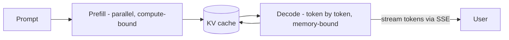

# LLM Inference Architecture

## Concept

- **LLM inference** has unique mechanics that make it different from serving a normal ML model (topic 5), and understanding them is key to building cost- and latency-efficient LLM systems.
- How generation works:
  - **Autoregressive, token-by-token**: the model generates one token at a time, each conditioned on all previous tokens. Output latency scales with output length.
  - **Two phases**: **prefill** (process the whole input prompt in parallel - compute-bound) and **decode** (generate output tokens one at a time - memory-bandwidth-bound). They have different performance characteristics.
  - **KV cache**: the model caches the key/value tensors of all prior tokens so it doesn't recompute them each step. This cache is large and grows with sequence length; **managing KV-cache memory is the central scaling challenge** of LLM serving.
- Serving optimizations: **continuous (in-flight) batching** (add/remove requests from a batch dynamically as they finish, vs. static batching), **PagedAttention** (vLLM - manage KV cache like virtual-memory pages to reduce waste), **quantization**, **speculative decoding** (a small draft model proposes tokens a big model verifies), and **streaming** tokens to the user (via SSE, Phase 5 topic 15).

## Problem It Solves

- LLMs are **expensive and slow** to serve (huge models, sequential generation, large memory footprint); this architecture knowledge is what makes serving them economically viable at scale.
- **Continuous batching + PagedAttention** dramatically raise GPU throughput and utilization (often several-fold over naive serving), cutting cost per token.
- **Streaming** improves perceived latency - users see tokens appear immediately (low time-to-first-token) instead of waiting for the full response.
- KV-cache and memory management determine how many concurrent requests / how long a context you can serve on given hardware.

## Trade-offs

- **Throughput vs. latency**: continuous batching maximizes throughput/cost-efficiency but individual request latency varies with batch pressure; interactive use prioritizes low time-to-first-token, batch jobs prioritize total throughput.
- **KV-cache memory vs. concurrency/context**: the KV cache dominates GPU memory and grows with context length × concurrent requests; long contexts and many users compete for it. PagedAttention reduces fragmentation/waste but the fundamental memory pressure remains - long-context serving is expensive.
- **Model size vs. cost/latency**: bigger models are better but far costlier/slower; use the smallest model that meets quality (and route easy queries to small models - model cascading), or quantize.
- **Quantization vs. quality**: int8/int4 quantization cuts memory and speeds inference with some quality risk; evaluate (topic 26) before shipping.
- **Speculative decoding**: speeds generation but adds a draft model and complexity; gains depend on acceptance rate.
- **Self-host vs. API**: hosted LLM APIs remove all this complexity at per-token cost and less control/privacy; self-hosting gives control/cost-at-scale but you own the serving challenges above.

## Examples

- **vLLM serving**
  - vLLM uses PagedAttention + continuous batching to serve an open LLM with high throughput and good GPU utilization - the de facto open-source LLM server.
- **Streaming UX**
  - The app streams tokens to the browser via SSE (Phase 5 topic 15) so the user sees the answer forming immediately (low TTFT), even though total generation takes seconds.
- **Model cascade / routing**
  - Easy queries go to a small/cheap model; only hard ones escalate to the large model, cutting average cost (ties to cost/latency, topic 15, and semantic caching, topic 24).
- **Long-context cost**
  - A 100k-token context request consumes large KV-cache memory, limiting concurrency - informing the decision to compress context (topic 19) rather than stuff everything in.
- **Interview framing**
  - For serving LLMs, demonstrate the mechanics: autoregressive token-by-token generation, prefill vs. decode, the **KV cache as the memory bottleneck**, and optimizations (continuous batching, PagedAttention/vLLM, quantization, speculative decoding) plus token streaming for UX. Citing KV-cache memory as the scaling constraint and small-model routing for cost is exactly the 2025-era LLM-infra depth.
