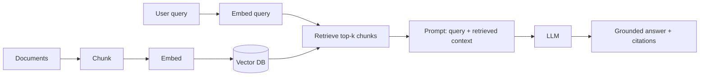

# RAG: Retrieval-Augmented Generation

## Concept

- **RAG** augments an LLM's generation with **external knowledge retrieved at query time**. Instead of relying solely on what the model memorized during training, the system **retrieves relevant documents** from a knowledge base and includes them in the prompt as context, so the model answers grounded in that retrieved information.
- The pipeline has two phases:
  - **Indexing (offline)** — documents are **chunked**, each chunk is **embedded** into a vector (topic 18), and stored in a **vector database** (topic 8).
  - **Retrieval + generation (online)** — the user query is embedded, the most **similar chunks** are retrieved (vector/semantic search, often combined with keyword search), and those chunks are inserted into the LLM prompt to generate a grounded answer (ideally with citations).
- RAG is the dominant pattern for giving LLMs access to private, current, or domain-specific knowledge without (re)training.

## Problem It Solves

- **Current & private knowledge** — gives the LLM access to your latest, proprietary data without retraining; update knowledge by updating the index, not the model (the key advantage over fine-tuning for *facts*).
- **Reduces hallucination** — grounding answers in retrieved source text makes the model far less likely to fabricate, and enables **citations** so users can verify (ties to hallucination mitigation, topic 25).
- **Cost-effective** — cheaper and faster to iterate than fine-tuning, and avoids stuffing all knowledge into the model.
- **Access control** — retrieval can respect per-user permissions, returning only documents a user is allowed to see.

## Trade-offs

- **Retrieval quality is the bottleneck** — RAG is only as good as what it retrieves; if retrieval misses the relevant chunk or returns noise, the answer is wrong or unfounded. **"Garbage retrieved, garbage generated."** Most RAG quality work is *retrieval* work.
- **Chunking strategy matters a lot** — chunk too large and you dilute relevance / blow context budget; too small and you lose context. Chunk size, overlap, and boundaries (semantic vs. fixed) materially affect quality.
- **Embedding/semantic gap** — pure vector similarity can miss exact-keyword matches; **hybrid search** (vector + BM25 keyword, Phase 3 topic 23) and **re-ranking** (a cross-encoder reorders top candidates) substantially improve relevance at added cost/latency.
- **Context window & cost** — more retrieved chunks = better recall but bigger prompts (more cost/latency and risk of "lost in the middle" where models ignore mid-context content) — context engineering (topic 19) manages this.
- **Stale index** — the index must be kept in sync with source documents (re-embed on change, via pipelines/CDC).
- **Evaluation is hard** — you must evaluate both retrieval (did it fetch the right chunks?) and generation (did it answer faithfully?) — needs an eval pipeline (topic 26).

## Examples

- **Enterprise Q&A / chatbot**
  - Company docs are chunked, embedded, and indexed; a user question retrieves the top-k relevant chunks (with permission filtering) and the LLM answers grounded in them with citations.
- **Hybrid + re-rank**
  - Retrieve via vector *and* keyword search, merge, then re-rank the top 50 with a cross-encoder to pick the best 5 for the prompt — markedly better relevance than vector-only.
- **Citation grounding**
  - The answer includes links to the source chunks, letting users verify and reducing trust issues from hallucination (topic 25).
- **Index freshness via CDC**
  - When a source document changes, a pipeline (Phase 4 topic 25) re-chunks and re-embeds it so the index stays current.
- **Interview framing**
  - For giving an LLM private/current knowledge, propose RAG and explain both phases (chunk+embed+index, then retrieve+generate). Emphasize that **retrieval quality dominates** — chunking strategy, hybrid search + re-ranking, and evaluating retrieval separately from generation — and that RAG (not fine-tuning) is the answer for changing facts, with citations for grounding. That retrieval-centric framing is the strong modern signal.
