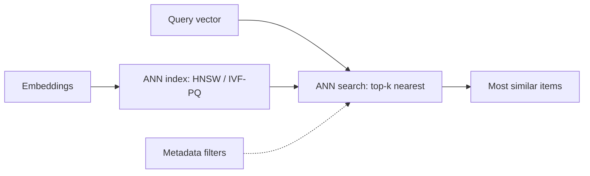

# Vector Databases

## Concept

- A **vector database** stores and searches high-dimensional **embedding vectors** by **similarity** (nearest-neighbor), rather than by exact-match keys. It answers "find the items whose vectors are closest to this query vector" — the retrieval engine behind RAG (topic 7), semantic search, recommendations, and deduplication.
- The core operation is **Approximate Nearest Neighbor (ANN)** search: exact nearest-neighbor over millions/billions of high-dimensional vectors is too slow (curse of dimensionality), so vector DBs use **approximate** index structures that trade a little recall for massive speed:
  - **HNSW (Hierarchical Navigable Small World)** — a multi-layer graph; fast and high-recall, memory-heavy. The most common.
  - **IVF (Inverted File)** — cluster vectors, search only nearby clusters.
  - **PQ (Product Quantization)** — compress vectors to shrink memory, at some accuracy cost. Often combined (IVF-PQ).
- Distance metrics: cosine similarity, dot product, or Euclidean — chosen to match how the embeddings were trained.

## Problem It Solves

- Enables **semantic similarity search** at scale — finding conceptually related items (not just keyword matches) — which is impossible with a normal database index.
- Makes RAG retrieval, semantic search, recommendation candidate generation, image/audio similarity, and near-duplicate detection fast enough for production over huge corpora.
- ANN indexes turn an O(N) brute-force similarity scan into sub-linear search, the difference between feasible and infeasible at scale.

## Trade-offs

- **Recall vs. speed/memory (the core ANN trade-off)** — approximate search is fast but may miss some true nearest neighbors; index parameters (HNSW's `M`/`efSearch`, IVF's `nprobe`) tune recall vs. latency. Higher recall costs more compute/memory.
- **Memory cost** — HNSW keeps vectors + graph in RAM, which is expensive at billions of vectors; PQ compression reduces memory at an accuracy cost. Vector storage is a real cost driver.
- **Index build vs. update** — building/rebuilding large ANN indexes is expensive; frequent updates (insertions/deletions) degrade some index types, requiring periodic rebuilds.
- **Metadata filtering** — combining vector search with structured filters ("similar docs *from 2024 in English*") is non-trivial (pre- vs. post-filtering trade-offs) and a common production need.
- **Dedicated DB vs. extension** — purpose-built vector DBs (Pinecone, Weaviate, Qdrant, Milvus) vs. adding vectors to an existing store (pgvector in Postgres, Elasticsearch). For modest scale, pgvector avoids running a separate system; at huge scale, dedicated DBs scale better.
- **Embedding model coupling** — the index is tied to the embedding model; changing the model means re-embedding everything (topic 18).

## Examples

- **RAG retrieval**
  - Document chunk embeddings live in a vector DB; a query embedding does HNSW top-k search with a metadata filter for the user's allowed documents (topic 7).
- **pgvector for modest scale**
  - A team adds the `pgvector` extension to their existing Postgres for semantic search over tens of thousands of items — no separate system to operate.
- **Recommendations**
  - Item embeddings enable "find similar items" candidate generation via ANN, feeding a ranking model.
- **Tuning recall**
  - Raising HNSW `efSearch` improves recall for a RAG system that was missing relevant chunks, at slightly higher latency.
- **Interview framing**
  - When semantic search/RAG retrieval comes up, propose a vector DB and explain ANN (HNSW/IVF-PQ) and the **recall-vs-speed/memory trade-off**, metadata filtering, and the choice between pgvector (modest scale, fewer moving parts) and a dedicated vector DB (huge scale). Noting that the index is coupled to the embedding model (re-embed on change) shows end-to-end understanding. (The embedding *pipeline* is topic 18.)
