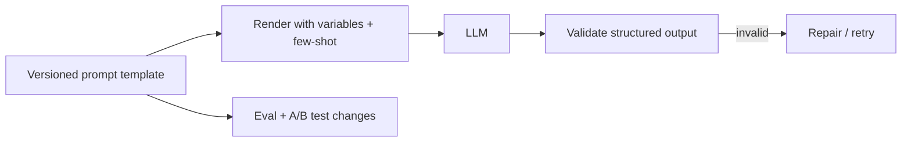

# Prompt Engineering at Scale

## Concept

- **Prompt engineering** is designing the inputs to an LLM to reliably get the desired output. "At scale" means treating prompts as **production software artifacts** — versioned, tested, monitored, and managed — not ad-hoc strings scattered through code.
- Core techniques:
  - **Clear instructions + role/system prompts** — set behavior, constraints, and output format explicitly.
  - **Few-shot examples** — include examples of the desired input→output to steer behavior (in-context learning).
  - **Chain-of-thought / reasoning** — ask the model to reason step by step for complex tasks.
  - **Structured output** — request JSON/schemas and validate them (with retries on invalid output).
  - **Decomposition** — break complex tasks into multiple focused prompts/steps rather than one giant prompt.
- At scale, you add engineering practices: a **prompt template/management system** (versioned, parameterized), **evaluation** of prompt changes (topic 26), **A/B testing** of prompts (topic 13), and treating prompts as code (review, CI, rollback).

## Problem It Solves

- Gets **reliable, consistent** behavior from a non-deterministic model — the difference between a demo that works once and a production feature that works for millions of varied inputs.
- Treating prompts as managed artifacts means changes are **tested and reversible** (a prompt tweak can break things as badly as a code bug), and improvements are **measurable** (evals/A-B), not guesswork.
- Often the cheapest, fastest way to improve an LLM feature — try prompting before reaching for RAG or fine-tuning (topic 4).

## Trade-offs

- **Prompting vs. RAG vs. fine-tuning** — prompting is cheapest and most flexible but has limits; complex behavior may need few-shot/decomposition, current knowledge needs RAG (topic 7), and consistent style/format may justify fine-tuning (topic 4). Start with prompting.
- **Prompt length vs. cost/latency/quality** — longer prompts (many examples, big instructions) cost more tokens, add latency, and can hit "lost in the middle"; balance richness against the context budget (topic 19). More context isn't always better.
- **Brittleness & non-determinism** — small prompt wording changes can shift behavior unpredictably, and the same prompt can give different outputs; this is why **evaluation** (topic 26) and structured-output validation are essential — you can't eyeball your way to reliability at scale.
- **Prompt injection risk** — user input concatenated into prompts can hijack the model (topic 25 / guardrails); untrusted input must be handled carefully.
- **Versioning & drift** — prompts tuned for one model version may degrade when the underlying model updates; manage prompts per model and re-evaluate on model changes.

## Examples

- **Versioned prompt + eval gate**
  - Prompts live in a template store with versions; a change is evaluated against a test set (topic 26) and A/B tested (topic 13) before rollout, with rollback if quality drops — prompts as code.
- **Structured output with repair**
  - The prompt requests JSON matching a schema; output is validated, and on failure the system retries (or runs a repair prompt) — reliable structured results from a probabilistic model.
- **Task decomposition**
  - Instead of one mega-prompt, a complex workflow chains focused prompts (extract → reason → format), each easier to get right and evaluate (ties to agents, topic 10).
- **Few-shot for format consistency**
  - Including 3 examples of the exact desired output format makes the model match it far more reliably than instructions alone.
- **Interview framing**
  - For LLM features, treat prompt engineering as production engineering: versioned templates, structured-output validation with retries, decomposition over mega-prompts, and **evaluation/A-B testing of prompt changes** (not vibes). Placing prompting first in the prompt→RAG→fine-tune ladder, and flagging prompt-injection and model-version drift, is the disciplined modern answer.
