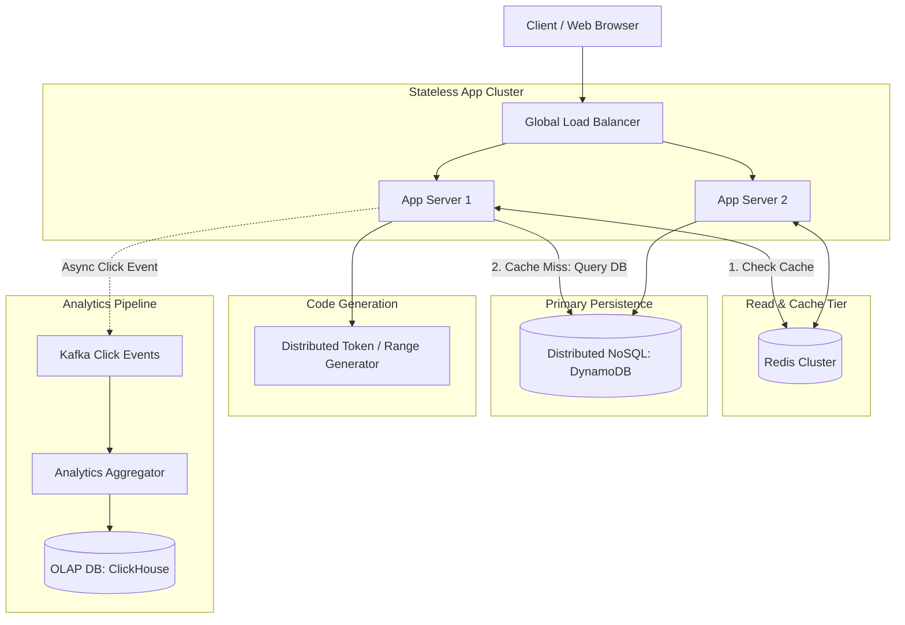

# Design a URL Shortener (TinyURL)

## Step 1: Clarify Requirements

### Functional Requirements
- **URL Shortening**: Given a long URL (e.g., `https://example.com/long/path/to/resource`), the system returns a unique short URL alias (e.g., `https://tiny.url/7aBc9D`).
- **Redirection**: When a client accesses the short URL, the service quickly redirects them to the original long URL with HTTP 301 or 302.
- **Custom Aliases**: Users can optionally supply a custom short alias (e.g., `https://tiny.url/my-promo`).
- **Expiration (TTL)**: Links can optionally expire after a specified duration.
- **Analytics (Telemetry)**: Record click metrics (click count, country, referrer, device type) asynchronously.

### Non-Functional Requirements
- **Ultra-Low Latency**: Redirection reads must complete in <10 ms. Shortening writes must complete in <100 ms.
- **High Availability**: 99.99% uptime. Link redirection must remain functional even if background analytics or creation services fail.
- **Read-Heavy Workload**: Typical URL shortening services observe a 100:1 read-to-write ratio.
- **Non-Guessable Codes**: Short codes must not be predictable sequential integers to prevent scraping attacks.

---

## Step 2: Capacity Estimation

### Traffic (QPS)
- **New URLs created**: 100 million URLs per month.
- **Write QPS**:
  $$\text{Write QPS} = \frac{100\text{M}}{30 \times 86{,}400} \approx 40\text{ writes/sec}$$
  Peak write QPS ($\times 2$) $\approx 80\text{ writes/sec}$.
- **Read QPS** (100:1 ratio):
  $$\text{Read QPS} = 40 \times 100 = 4{,}000\text{ reads/sec}$$
  Peak read QPS ($\times 2$) $\approx 8{,}000\text{ reads/sec}$.

### Storage Estimation (5 Years)
- Total records: $100\text{M/month} \times 12 \times 5 = 6\text{ billion URLs}$.
- Average size per record:
  - `short_code`: 7 bytes
  - `original_url`: ~500 bytes
  - Metadata (created_at, expires_at, user_id): ~50 bytes
  - Total per record $\approx 600$ bytes.
- Total 5-year storage:
  $$6\text{B} \times 600\text{ bytes} \approx 3.6\text{ TB}$$

### Memory & Cache Estimation (Pareto 80/20 Rule)
- 20% of the URLs generate 80% of daily redirect traffic.
- Daily requests: $4{,}000 \times 86{,}400 \approx 345\text{ million reads/day}$.
- Cached entries per day: $345\text{M} \times 0.20 \approx 69\text{ million URLs}$.
- Cache memory required:
  $$69\text{M} \times 600\text{ bytes} \approx 41.4\text{ GB RAM}$$
  Easily fits inside a single Redis replica cluster.

---

## Step 3: API Design

### 1. Create Short URL
- **Endpoint**: `POST /api/v1/urls`
- **Request**:
  ```json
  {
    "original_url": "https://example.com/very/long/article?ref=social&track=123",
    "custom_alias": "custom-alias", // optional
    "ttl_days": 365                // optional
  }
  ```
- **Response**: `HTTP 201 Created`
  ```json
  {
    "short_url": "https://tiny.url/7aBc9D",
    "original_url": "https://example.com/very/long/article?ref=social&track=123",
    "expires_at": "2027-09-03T12:00:00Z"
  }
  ```

### 2. Redirect Short URL
- **Endpoint**: `GET /{short_code}`
- **Response**:
  - `HTTP 302 Found` (or `307 Temporary Redirect`): Forces the browser to hit the shortener each time so click analytics can be accurately recorded.
  - `Location: https://example.com/very/long/article?ref=social&track=123`
  - *(Note: `HTTP 301 Moved Permanently` allows client browsers to cache the target locally, reducing server load but completely blinding the system to subsequent click analytics).*

---

## Step 4: Data Model & Storage Choice

The storage layer must handle key-value point lookups by `short_code` with extreme efficiency:

### Database Choice: Distributed Key-Value / Wide-Column Store (DynamoDB / Cassandra)
- **Why NoSQL**: No relational joins are required. Queries are strictly primary key lookups (`get(short_code)` and `put(short_code, url)`).
- **Scale**: Easily partitions horizontally across storage nodes using consistent hashing on `short_code`.

### Physical Schema
```sql
-- Table: url_mappings
CREATE TABLE url_mappings (
    short_code VARCHAR(16) PRIMARY KEY,
    original_url TEXT NOT NULL,
    user_id UUID,
    created_at TIMESTAMP WITH TIME ZONE DEFAULT NOW(),
    expires_at TIMESTAMP WITH TIME ZONE
);

CREATE INDEX idx_user_urls ON url_mappings(user_id, created_at DESC);
```

---

## Step 5: High-Level Architecture



### End-to-End Workflow:
1. **Shorten Request (`POST`)**:
   - Request reaches App Server.
   - App Server requests an unused unique integer range/ID from the Token/Range Generator.
   - Converts the unique integer to a Base62 string (e.g., `125193` $\rightarrow$ `7aBc9D`).
   - Writes the record to DynamoDB and populates the Redis cache.
   - Returns short URL to client.
2. **Redirect Request (`GET /{short_code}`)**:
   - Request hits App Server via Edge CDN.
   - Checks Redis cache.
   - If cache hit: returns `302 Found` with `Location` header immediately (<5ms).
   - If cache miss: queries DynamoDB, populates Redis, and returns `302 Found`.
   - Asynchronously emits an event to Kafka for click stream tracking without blocking the redirect response.

---

## Step 6: Deep Dive & Scaling Bottlenecks

### 1. Short Code Generation: Hash vs. Base62 Counter
There are two primary approaches for generating 7-character short codes:

- **Approach A: MD5 / SHA-256 Hash + Truncation**:
  - Compute `hash(long_url)` and take the first 7 characters in Base62.
  - *Problem*: **Collisions**. If two different URLs produce the same 7 characters, you must append a salt and re-hash. This requires checking the database on every single write, causing lock contention and high latency.
- **Approach B: Counter-Based Base62 Encoding (Preferred)**:
  - Base62 characters: `[0-9, a-z, A-Z]` ($10 + 26 + 26 = 62$).
  - A 7-character Base62 string provides:
    $$62^7 \approx 3.52\text{ trillion unique combinations}$$
    More than enough for billions of URLs over decades.
  - A centralized **Token / Range Service** (using Apache ZooKeeper or Redis) allocates contiguous ranges of 1,000,000 integers to individual application server instances (e.g., Server 1 takes IDs 1 to 1,000,000; Server 2 takes 1,000,001 to 2,000,000).
  - Each server increments its local counter in memory with zero network coordination:
    ```python
    BASE62 = "0123456789abcdefghijklmnopqrstuvwxyzABCDEFGHIJKLMNOPQRSTUVWXYZ"

    def encode_base62(num: int) -> str:
        if num == 0:
            return BASE62[0]
        chars = []
        while num > 0:
            chars.append(BASE62[num % 62])
            num //= 62
        return "".join(reversed(chars))
    ```

### 2. Caching & Eviction
- Use Redis configured with an **LRU (Least Recently Used)** eviction policy.
- Top viral URLs remain hot in memory. Cold links naturally drop from memory and are queried from disk.

### 3. Expiration Cleanup (Passive vs. Active)
- **Passive Deletion**: When a user accesses an expired link, the server checks `expires_at`. If expired, delete the key from cache and database and return `404 Not Found`.
- **Active Sweeper**: Periodically run a scheduled batch background job (e.g., nightly Spark job) to clean up expired records that are never clicked again.
