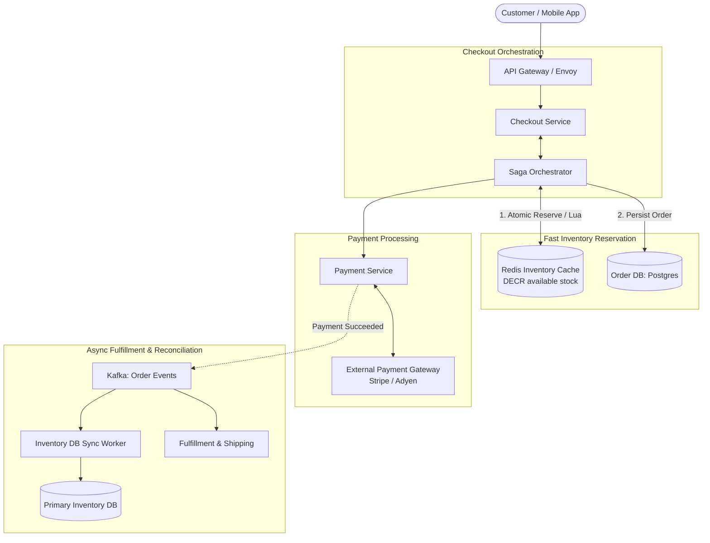

# Design an E-Commerce Checkout System (Amazon / Shopify)

## Step 1: Clarify Requirements

### Functional Requirements
- **Cart Checkout & Price Calculation**: Validate cart contents, compute line-item totals, shipping fees, discounts, and taxes.
- **Inventory Reservation**: Temporarily reserve product inventory when the customer enters checkout to prevent overselling during high-demand flash sales.
- **Order Placement & State Machine**: Manage the transition: `PENDING_PAYMENT` $\rightarrow$ `PAID` $\rightarrow$ `FULFILLED` (or `CANCELLED` / `EXPIRED`).
- **Payment Processing**: Integrate with external payment gateways (Stripe, PayPal, Adyen) securely and reliably.
- **Inventory Release on Timeout**: If the customer fails to complete payment within a 15-minute reservation window, automatically release the reserved stock back to the available inventory pool.

### Non-Functional Requirements
- **Zero Overselling Guarantee**: Under extreme concurrency (e.g., 50,000 users buying 500 limited-edition sneakers in 2 seconds), the system must never sell more items than exist in stock.
- **Strict Idempotency**: Network retries or rapid double-clicks on the "Place Order" button must never charge the customer twice or create duplicate orders.
- **High Availability**: 99.99% uptime during Black Friday / Cyber Monday flash sales.
- **Eventual Consistency across Microservices**: Use the Saga pattern for cross-service transactions (Order, Inventory, Payment, Shipping) rather than slow, blocking Two-Phase Commit (2PC).

---

## Step 2: Capacity Estimation

### Normal vs. Flash Sale Traffic
- **Normal Operations**:
  - 10 million orders per day $\rightarrow$ ~115 checkouts/sec (Peak: 500 checkouts/sec).
- **Flash Sale Event (Black Friday / Limited Drops)**:
  - 100,000 items released at 12:00:00 PM.
  - 1 million concurrent users hit the checkout endpoint simultaneously.
  - Peak Ingress Checkout QPS:
    $$\text{Peak QPS} \approx 50{,}000\text{ requests/sec}$$
  - Database row-level locks on a single inventory row would saturate CPU and cause connection pool exhaustion within 500 ms. An in-memory atomic reservation layer is mandatory.

---

## Step 3: API Design

### 1. Reserve Inventory & Create Checkout Session
- **Endpoint**: `POST /api/v1/checkout/sessions`
- **Headers**: `Idempotency-Key: uuid-v4-client-nonce`
- **Request**:
  ```json
  {
    "user_id": "usr_99812",
    "cart_items": [
      { "item_id": "sku_sneaker_42", "quantity": 1 }
    ]
  }
  ```
- **Response**: `HTTP 201 Created`
  ```json
  {
    "checkout_id": "chk_001928",
    "status": "INVENTORY_RESERVED",
    "reserved_until": "2026-09-03T12:15:00Z",
    "total_amount_cents": 15000
  }
  ```

### 2. Confirm Payment & Complete Order
- **Endpoint**: `POST /api/v1/checkout/sessions/{checkout_id}/pay`
- **Headers**: `Idempotency-Key: uuid-v4-payment-nonce`
- **Request**:
  ```json
  {
    "payment_method_id": "pm_card_visa_4242"
  }
  ```
- **Response**: `HTTP 200 OK` with order details and receipt.

---

## Step 4: Data Model & Schema

```sql
-- Table: inventory (PostgreSQL / Aurora with strict ACID constraints)
CREATE TABLE inventory (
    sku_id VARCHAR(64) PRIMARY KEY,
    total_stock INT NOT NULL CHECK (total_stock >= 0),
    reserved_stock INT NOT NULL DEFAULT 0 CHECK (reserved_stock >= 0),
    available_stock INT GENERATED ALWAYS AS (total_stock - reserved_stock) STORED,
    CONSTRAINT check_stock_bounds CHECK (reserved_stock <= total_stock)
);

-- Table: orders
CREATE TABLE orders (
    order_id UUID PRIMARY KEY,
    user_id UUID NOT NULL,
    status VARCHAR(32) NOT NULL, -- PENDING_PAYMENT, PAID, CANCELLED, FULFILLED
    total_amount_cents BIGINT NOT NULL,
    idempotency_key VARCHAR(128) UNIQUE NOT NULL,
    created_at TIMESTAMP WITH TIME ZONE DEFAULT NOW(),
    expires_at TIMESTAMP WITH TIME ZONE NOT NULL
);

-- Table: order_items
CREATE TABLE order_items (
    order_id UUID REFERENCES orders(order_id),
    sku_id VARCHAR(64) NOT NULL,
    quantity INT NOT NULL,
    unit_price_cents BIGINT NOT NULL,
    PRIMARY KEY (order_id, sku_id)
);
```

---

## Step 5: High-Level Architecture



### End-to-End Checkout Flow (Saga Pattern):
1. **Initiate Checkout**: Customer clicks "Place Order" with an `Idempotency-Key`.
2. **Step 1 (Inventory Reservation)**:
   - The Saga Orchestrator executes an atomic Lua script on **Redis** to decrement available stock.
   - If stock $\le 0$, the request fails immediately with `"OUT_OF_STOCK"` in <5 ms without hitting the relational database.
   - If successful, stock is reserved for 15 minutes.
3. **Step 2 (Create Order)**:
   - Creates an order record in `OrderDB` with status `PENDING_PAYMENT` and `expires_at = NOW() + 15 mins`.
4. **Step 3 (Charge Payment)**:
   - Calls the `Payment Service`, which charges the customer's card via Stripe/Adyen using a unique transaction idempotency key.
5. **Step 4 (Completion or Compensation)**:
   - **Happy Path**: Payment succeeds. Order status transitions to `PAID`. An event is emitted to Kafka to commit the inventory permanently in the primary database and trigger fulfillment.
   - **Failure / Timeout Path (Compensating Transaction)**: If payment is declined or the 15-minute reservation timer expires, the orchestrator triggers a compensating transaction that increments the Redis inventory counter back up, releasing the stock to other shoppers.

---

## Step 6: Deep Dive: Flash Sales & Concurrency

### 1. Preventing Overselling: Atomic Redis Lua Script
Relational database queries using `SELECT available_stock FOR UPDATE` create severe row lock contention under 50,000 QPS.
Instead, maintain stock counters in Redis and execute the reservation atomically via a single-threaded Lua script:

```lua
-- KEYS[1]: inventory:sku_123
-- ARGV[1]: requested_quantity (e.g., 1)

local current_stock = redis.call('GET', KEYS[1])
if not current_stock or tonumber(current_stock) < tonumber(ARGV[1]) then
    return 0 -- Failed: Out of stock
else
    redis.call('DECRBY', KEYS[1], ARGV[1])
    return 1 -- Success: Inventory reserved
end
```
Because Redis executes Lua scripts as a single atomic unit, zero race conditions can occur, and overselling is mathematically impossible.

### 2. Handling Inventory Expiration (15-Minute TTL)
Customers frequently abandon checkout sessions without completing payment:
- **Delayed Message Queues (RabbitMQ Dead-Letter Exchange / SQS Delayed Delivery)**:
  - When inventory is reserved, publish a delayed message to an `OrderTimeoutQueue` with a 15-minute delay.
  - When the message expires, the timeout worker checks `OrderDB`:
    - If status is `PENDING_PAYMENT`, cancel the order and increment the Redis stock counter by the reserved quantity.
    - If status is already `PAID`, ignore the message.

### 3. Distributed Idempotency
- When a customer clicks "Submit Payment" twice during a network delay, both requests carry the same client-generated `Idempotency-Key`.
- The Checkout Service executes:
  `SET lock:checkout:{idempotency_key} "PROCESSING" NX EX 30`
- If the key already exists in Redis, the second request is rejected or waits for the initial transaction to complete, guaranteeing the customer is never charged twice.
