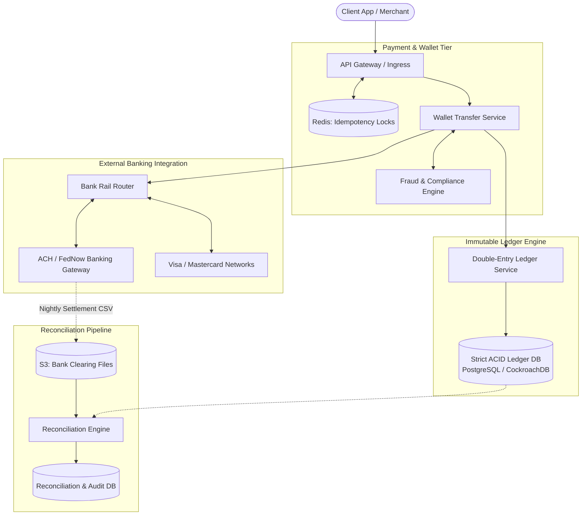

# Design a Payment System & Digital Wallet (Stripe / PayPal)

## Step 1: Clarify Requirements

### Functional Requirements
- **Digital Wallet Management**: Users maintain stored-value balances in multiple currencies (USD, EUR, GBP).
- **Peer-to-Peer (P2P) Transfers**: Instant fund transfers between two internal wallet accounts with atomic balance updates.
- **Deposits & Withdrawals (Payouts)**: Move funds into and out of the wallet ecosystem via external banking rails (ACH, SEPA, FedNow, credit card acquiring).
- **Double-Entry Bookkeeping**: Every financial movement must be recorded as balanced debits and credits in an immutable, append-only ledger.
- **Reconciliation**: Automated end-of-day reconciliation matching internal ledger transactions against external bank clearing and settlement files.

### Non-Functional Requirements
- **Zero Loss / Strong Consistency**: Exactly-once financial semantics. Money can never be created out of thin air, duplicated, or lost under any failure condition.
- **High Availability**: 99.999% availability for wallet balance reads and authorization checks.
- **Strict Idempotency**: Network retries between clients, internal services, or banking partners must never trigger duplicate transfers.
- **Full Auditability**: Immutable audit trail compliance (SOX, PCI-DSS) where financial records can never be modified or deleted.

---

## Step 2: Capacity Estimation

### Transaction Volume
- **Total Registered Accounts**: 100 million users.
- **Daily Financial Transactions**: 50 million transfers and payment events per day.
- **Average QPS**:
  $$\text{Average QPS} = \frac{50\text{M}}{86{,}400} \approx 580\text{ transactions/sec}$$
  $$\text{Peak Burst QPS } (\times 5) \approx 3{,}000\text{ transactions/sec}$$
- Peak throughput is moderate compared to social networks, but each transaction requires strict serializable ACID isolation and cryptographic verification.

### Storage Estimation (10 Years)
- In a double-entry ledger, every transaction generates at least **2 ledger entry rows** (one debit, one credit).
- Daily ledger entries: $50\text{M} \times 2 = 100\text{ million entries/day}$.
- Size per ledger entry: ~250 bytes.
- Annual storage:
  $$100\text{M} \times 250\text{ bytes} \times 365 \approx 9.12\text{ TB/year}$$
  10-Year Storage: ~91 TB. Easily accommodated in a distributed relational database (CockroachDB / Google Cloud Spanner / PostgreSQL with sharding).

---

## Step 3: API Design

### Transfer Funds Between Wallets
- **Endpoint**: `POST /api/v1/wallet/transfers`
- **Headers**:
  - `Idempotency-Key`: `uuid-transfer-client-token` (mandatory)
- **Request**:
  ```json
  {
    "source_account_id": "acc_usr_1001",
    "destination_account_id": "acc_usr_2002",
    "amount_cents": 5000, // $50.00 represented as integer to avoid floating-point errors
    "currency": "USD",
    "description": "Dinner split"
  }
  ```
- **Response**: `HTTP 201 Created`
  ```json
  {
    "transaction_id": "txn_88491029",
    "status": "SETTLED",
    "amount_cents": 5000,
    "currency": "USD",
    "created_at": "2026-09-03T12:00:00Z"
  }
  ```

---

## Step 4: Data Model: Double-Entry Ledger Schema

In professional financial systems, **balances are never stored as single mutable columns that are updated in place** (`UPDATE accounts SET balance = balance + 50`). Doing so destroys the audit trail and invites race condition vulnerabilities.
Instead, all money movements are recorded as **immutable debit and credit pairs**. The current balance is simply the cumulative sum of all historical ledger entries.

```sql
-- Table: accounts
CREATE TABLE accounts (
    account_id UUID PRIMARY KEY,
    owner_id UUID NOT NULL,
    account_type VARCHAR(24) NOT NULL, -- CUSTOMER_WALLET, MERCHANT_SETTLEMENT, PLATFORM_FEE, BANK_CLEARING
    currency VARCHAR(3) NOT NULL,
    status VARCHAR(16) NOT NULL, -- ACTIVE, FROZEN, CLOSED
    created_at TIMESTAMP WITH TIME ZONE DEFAULT NOW()
);

-- Table: transactions (Header record)
CREATE TABLE transactions (
    transaction_id UUID PRIMARY KEY,
    idempotency_key VARCHAR(128) UNIQUE NOT NULL,
    transaction_type VARCHAR(32) NOT NULL, -- P2P_TRANSFER, DEPOSIT, PAYOUT, FEE
    status VARCHAR(16) NOT NULL,           -- PENDING, POSTED, FAILED
    created_at TIMESTAMP WITH TIME ZONE DEFAULT NOW()
);

-- Table: ledger_entries (Immutable Double-Entry Lines)
CREATE TABLE ledger_entries (
    entry_id UUID PRIMARY KEY,
    transaction_id UUID NOT NULL REFERENCES transactions(transaction_id),
    account_id UUID NOT NULL REFERENCES accounts(account_id),
    amount_cents BIGINT NOT NULL, -- Always positive integer
    direction VARCHAR(6) NOT NULL, -- 'DEBIT' or 'CREDIT'
    created_at TIMESTAMP WITH TIME ZONE DEFAULT NOW()
);
CREATE INDEX idx_ledger_account ON ledger_entries(account_id, created_at DESC);
```

### The Invariant:
For every `transaction_id`, the sum of all DEBIT entries must strictly equal the sum of all CREDIT entries:
$$\sum \text{Debits} = \sum \text{Credits}$$

---

## Step 5: High-Level Architecture



### End-to-End P2P Transfer Walkthrough:
1. **Idempotency Gate**:
   - The API Gateway checks the `Idempotency-Key` against Redis using `SET lock:{key} PROCESSING NX EX 60`.
   - If the key exists, the request returns the cached result or a 409 Conflict.
2. **Fraud & Risk Verification**:
   - The `Fraud Engine` validates AML (Anti-Money Laundering) rules, account sanctions, and velocity limits.
3. **Atomic Ledger Execution**:
   - The `Ledger Service` opens an ACID transaction in `LedgerDB`:
     1. Inserts the header record into `transactions`.
     2. Verifies the sender's current balance: $\sum \text{Credits} - \sum \text{Debits} \ge 5000$.
     3. Inserts a **DEBIT** entry of $50.00 for the sender's wallet account.
     4. Inserts a **CREDIT** entry of $50.00 for the recipient's wallet account.
     5. Commits the transaction atomically.
4. **Instant Response**: Returns `HTTP 201 Created` with the posted transaction details in <100 ms.

---

## Step 6: Deep Dive: Financial Consistency & Reconciliation

### 1. The Dangers of Floating-Point Math
- **Never use `FLOAT` or `DOUBLE` for financial amounts**: In IEEE 754 floating point, `0.1 + 0.2 = 0.30000000000000004`. Over millions of calculations, rounding errors accumulate into noticeable financial discrepancies.
- **Store Amounts as Lowest Currency Denominations (Integers)**:
  - Store USD as **Cents** ($10.50 $\rightarrow$ `1050`).
  - Store JPY as **Yen** ($¥500 $\rightarrow$ `500`).
  - For micro-transactions (e.g., cryptocurrency or sub-cent ad clicks), store as fixed-point decimal with 6 to 8 digits of precision or `BIGINT` representing tenths of a cent.

### 2. Preventing Deadlocks in Concurrent Transfers
Consider two concurrent transfers occurring simultaneously:
- Transfer 1: User A sends $10 to User B.
- Transfer 2: User B sends $10 to User A.
If Transfer 1 locks Account A first, and Transfer 2 locks Account B first, a **distributed deadlock** occurs.
- **Global Lock Ordering Rule**:
  Always acquire database row locks in deterministic order sorted by `account_id`:
  ```sql
  -- Order locks deterministically to eliminate deadlock cycles
  SELECT * FROM accounts
  WHERE account_id IN (:id_A, :id_B)
  ORDER BY account_id
  FOR UPDATE;
  ```

### 3. End-of-Day Bank Reconciliation
External banking systems (ACH, Fedwire, card acquiring) are asynchronous batch processing networks:
- A bank transfer initiated at 2:00 PM may not settle until 9:00 AM the following business day.
- Every night, partner banks generate **clearing and settlement files** (such as BAI2, MT940, or ISO 20022 XML formats).
- **The Three-Way Reconciliation Worker**:
  1. Compares internal transaction logs against the bank settlement file.
  2. Flags discrepancies:
     - **Missing Transaction**: Internal system records a deposit, but the bank never received it (requires alerting).
     - **Amount Mismatch**: Internal system charged $50.00, but the bank processed $55.00 due to an unmodeled fee.
  3. Unmatched items are dispatched to a human operations queue for investigation.
