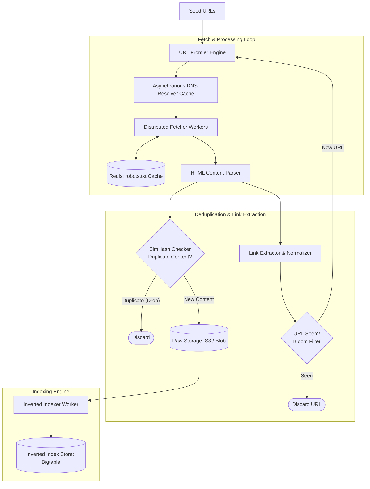

# Design a Web Crawler & Search Indexer (Googlebot / Bingbot)

## Step 1: Clarify Requirements

### Functional Requirements
- **Web Crawling**: Given a set of seed URLs, download web pages, extract hyperlinks, and traverse the web recursively.
- **Content Parsing & Inverted Indexing**: Extract text content and build an inverted index mapping search terms to document locations for rapid retrieval.
- **Politeness & Rate Limiting**: Strictly respect webmaster `robots.txt` rules and avoid saturating target web servers with excessive request rates.
- **URL Deduplication & Canonicalization**: Normalize URLs and avoid downloading duplicate or near-duplicate web pages.
- **Freshness & Recrawling**: Periodically re-crawl high-value pages based on their update frequency to keep search indices fresh.

### Non-Functional Requirements
- **Massive Scalability**: Crawl 1 billion web pages per month.
- **High Throughput & Concurrency**: Sustain hundreds of concurrent fetches per second without stalling.
- **Fault Tolerance**: Worker nodes or target host network timeouts must never crash the crawler. State must persist across restarts.
- **Spider Trap Resilience**: Detect and avoid infinite calendar loops and dynamic query parameter traps.

---

## Step 2: Capacity Estimation

### Volume & Throughput
- **Monthly Crawl Volume**: 1 billion web pages per month.
- **Average Download Rate**:
  $$\text{Average Crawl Speed} = \frac{1\text{B pages}}{30 \times 86{,}400} \approx 386\text{ pages/sec}$$
  $$\text{Peak Crawl Speed } (\times 2.5) \approx 1{,}000\text{ pages/sec}$$
- **Ingress Bandwidth**:
  - Average web page size (HTML + metadata): ~100 KB.
  - Average Ingress Bandwidth:
    $$386\text{ pages/sec} \times 100\text{ KB} \approx 38.6\text{ MB/sec } (310\text{ Mbps})$$
  - Peak Ingress Bandwidth: ~775 Mbps.

### Storage Estimation (5 Years)
- Storing raw compressed HTML text:
  $$1\text{B pages/month} \times 100\text{ KB} \approx 100\text{ TB/month } (1.2\text{ PB/year})$$
  5-Year Storage: ~6 PB in distributed Object Storage (S3 / Ceph).
- URL Frontier & Metadata Storage:
  - 10 billion discovered URLs: 10B $\times$ 100 bytes $\approx$ 1 TB metadata in Cassandra / Bigtable.

---

## Step 3: API & Internal Contracts

### URL Frontier Internal Task
```json
{
  "url": "https://en.wikipedia.org/wiki/Distributed_computing",
  "priority_score": 85,
  "depth": 3,
  "last_crawled_at": null,
  "domain": "en.wikipedia.org",
  "checksum": "a1b2c3d4e5f6"
}
```

### Inverted Index Posting Entry
```json
{
  "term": "distributed",
  "document_frequency": 42019,
  "postings": [
    { "doc_id": 104928, "term_frequency": 14, "positions": [3, 28, 49, 112] },
    { "doc_id": 104955, "term_frequency": 5, "positions": [12, 88] }
  ]
}
```

---

## Step 4: Data Model & Storage Choice

```sql
-- Table: crawled_documents (Metadata in Cassandra / Wide-Column Store)
CREATE TABLE crawled_documents (
    doc_id BIGINT PRIMARY KEY,
    url TEXT,
    url_hash VARCHAR(64) UNIQUE, -- SHA-256 for fast deduplication lookup
    content_simhash BIGINT,       -- 64-bit SimHash for near-duplicate detection
    http_status INT,
    raw_storage_path TEXT,        -- S3 URL
    crawled_at TIMESTAMP,
    etag VARCHAR(64)
);

-- Table: inverted_index (Distributed Key-Value: Bigtable / HBase)
CREATE TABLE inverted_index (
    term VARCHAR(128) PRIMARY KEY,
    postings_blob BLOB -- Serialized list of (doc_id, term_frequency, positions)
);
```

---

## Step 5: High-Level Architecture



### End-to-End Crawling Workflow:
1. **URL Frontier Pull**: The `URL Frontier Engine` yields candidate URLs respecting priority and per-domain politeness delay.
2. **DNS & Robots.txt**:
   - The worker looks up IP addresses in an **Asynchronous DNS Resolver Cache** to eliminate external DNS lookup latency (50-200 ms per request).
   - Checks `robots.txt` cached in Redis. If disallowed, the URL is dropped.
3. **Download & Content Deduplication**:
   - The fetcher downloads HTML via HTTP GET.
   - Computes a 64-bit **SimHash** of the text. If the Hamming distance to an existing document is $\le 3$, it is identified as a near-duplicate and discarded.
4. **Link Extraction & Bloom Filter**:
   - Extracts all hyperlinks (`<a href="...">`), converts relative paths to absolute canonical URLs.
   - Tests URLs against an in-memory **Bloom Filter** holding billions of bits. If unseen, the URL is enqueued to the URL Frontier.
5. **Inverted Indexing**:
   - The text is tokenized, stemmed (e.g., `"running"` $\rightarrow$ `"run"`), stripped of stop words, and appended to the distributed inverted index.

---

## Step 6: Deep Dive: The URL Frontier & Spider Traps

### 1. The URL Frontier: Balancing Priority & Politeness
A naive FIFO queue causes two catastrophic failure modes:
- **Denial of Service (DoS)**: Downloading 500 links from `example.com` simultaneously crashes the target web server, triggering IP bans.
- **Priority Inversion**: Crawlers spend all bandwidth fetching junk URLs rather than important news and high-PageRank domains.

#### Production Solution: The Two-Tier Queue System
```text
[Input URLs]
     │
     ▼
┌─────────────────────────────────┐
│ Priority Queues (F1, F2, F3...) │  <-- Prioritized by PageRank / domain authority
└────────────────┬────────────────┘
                 │
                 ▼
┌─────────────────────────────────┐
│ Politeness Queues (B1, B2, B3)  │  <-- Exactly 1 queue per target hostname
└────────────────┬────────────────┘
                 │ (Wait politeness delay, e.g. 1s per host)
                 ▼
         [Fetcher Fleet]
```
- **Front Queues (Prioritizer)**: Distribute URLs by importance score (e.g., PageRank or historical freshness).
- **Back Queues (Politeness)**: Every unique host (`wikipedia.org`, `github.com`) has a dedicated sub-queue and a `last_fetch_timestamp`. Workers only poll a queue if:
  $$\text{Current Time} - \text{Last Fetch Time} \ge 1.0\text{ second}$$

### 2. Spider Traps & Cycle Detection
- **Infinite URL Traps**: Web servers that dynamically generate URLs (e.g., `/calendar?year=2026&month=9&day=3` linking infinitely forward in time).
- **Mitigation Strategies**:
  1. **Maximum Path Depth**: Reject URLs with path nesting deeper than 8 levels (`/a/b/c/d/e/f/g/h/i`).
  2. **URL Length Limits**: Drop URLs exceeding 2,048 characters.
  3. **Per-Domain Quota Caps**: Cap total crawled pages per individual domain to prevent a single domain from monopolizing the crawler.

### 3. SimHash: Detecting Near-Duplicate Content
Billions of web pages have 99% identical content with minor variations (e.g., different ads, dynamic timestamps, copyright footers).
- Standard cryptographic hashes (MD5, SHA-256) exhibit the **avalanche effect**: changing a single character changes the entire hash.
- **SimHash (Locality-Sensitive Hashing)**:
  - Generates a 64-bit fingerprint where **similar documents produce similar hash bits**.
  - If the Hamming distance (count of differing bit positions) between two SimHashes is $\le 3$, the documents are near-duplicates and re-indexing is skipped.
