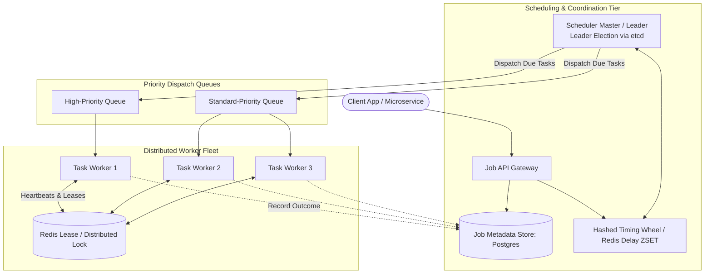

# Design a Distributed Job Scheduler (Quartz / Temporal / Airflow)

## Step 1: Clarify Requirements

### Functional Requirements
- **Delayed & One-Time Scheduling**: Schedule a task to execute at a precise future timestamp (e.g., send an email in 3 hours).
- **Recurring / Cron Scheduling**: Execute recurring tasks on standard 5-field cron schedules (e.g., nightly database backups at 02:00 UTC).
- **DAG Workflow Execution**: Support Directed Acyclic Graph (DAG) dependencies where Task C executes only after Tasks A and B succeed.
- **Priority Queueing**: High-priority tasks execute ahead of lower-priority background batch tasks.
- **At-Least-Once Execution**: Under worker or scheduler node crashes, no task is lost; failed tasks retry with exponential backoff and jitter.
- **Task Cancellation & Timeouts**: Support aborting active or queued tasks and enforce execution time limits.

### Non-Functional Requirements
- **Precision**: Task execution must start within $\le 1$ second of its scheduled timestamp.
- **High Scalability**: Schedule and execute hundreds of millions of tasks per day across a distributed cluster.
- **High Availability**: 99.99% uptime. Master scheduler failover must occur automatically with zero downtime.
- **Zero Duplicate Execution**: Prevent zombie or partitioned workers from concurrently executing the same non-idempotent task.

---

## Step 2: Capacity Estimation

### Volume & Throughput
- **Daily Task Executions**: 100 million jobs per day.
- **Average Throughput**:
  $$\text{Average QPS} = \frac{100\text{M}}{86{,}400} \approx 1{,}160\text{ tasks/sec}$$
  $$\text{Peak Burst QPS } (\times 5) \approx 5{,}800\text{ tasks/sec}$$
- Peak scheduling traffic often spikes on exact hour boundaries (e.g., `:00` minute marks).

### Storage Estimation (1 Year)
- Each task record (payload, timestamps, status, retry state): ~1 KB.
- Daily storage:
  $$100\text{M} \times 1\text{ KB} \approx 100\text{ GB/day}$$
  Annual storage: ~36.5 TB in PostgreSQL / CockroachDB, compacted and archived to S3.

---

## Step 3: API Design

### 1. Schedule a Job
- **Endpoint**: `POST /api/v1/jobs`
- **Request**:
  ```json
  {
    "task_type": "GENERATE_MONTHLY_INVOICE",
    "schedule_type": "DELAYED", // DELAYED | CRON
    "scheduled_at": "2026-09-04T02:00:00Z",
    "priority": 10,
    "max_retries": 3,
    "timeout_seconds": 300,
    "payload": {
      "user_id": "usr_99812",
      "billing_period": "2026-08"
    }
  }
  ```
- **Response**: `HTTP 201 Created` with `job_id` and initial status `SCHEDULED`.

### 2. Job Status & Cancellation
- **Endpoint**: `GET /api/v1/jobs/{job_id}`
- **Endpoint**: `POST /api/v1/jobs/{job_id}/cancel`

---

## Step 4: Data Model & Schema

```sql
-- Table: scheduled_jobs
CREATE TABLE scheduled_jobs (
    job_id UUID PRIMARY KEY,
    task_type VARCHAR(64) NOT NULL,
    status VARCHAR(24) NOT NULL, -- SCHEDULED, DISPATCHED, RUNNING, SUCCEEDED, FAILED, CANCELLED
    priority INT DEFAULT 0,
    scheduled_at TIMESTAMP WITH TIME ZONE NOT NULL,
    locked_until TIMESTAMP WITH TIME ZONE,
    locked_by_worker UUID,
    fencing_token BIGINT DEFAULT 0,
    retry_count INT DEFAULT 0,
    max_retries INT DEFAULT 3,
    payload JSONB NOT NULL,
    created_at TIMESTAMP WITH TIME ZONE DEFAULT NOW()
);
CREATE INDEX idx_scheduled_lookup ON scheduled_jobs(status, scheduled_at, priority DESC);

-- Table: job_execution_history (Audit Trail)
CREATE TABLE job_execution_history (
    execution_id UUID PRIMARY KEY,
    job_id UUID REFERENCES scheduled_jobs(job_id),
    worker_id UUID NOT NULL,
    started_at TIMESTAMP WITH TIME ZONE NOT NULL,
    completed_at TIMESTAMP WITH TIME ZONE,
    exit_status VARCHAR(16) NOT NULL,
    error_message TEXT
);
```

---

## Step 5: High-Level Architecture



### End-to-End Scheduling Lifecycle:
1. **Job Ingestion**:
   - Client submits a task via the API Gateway.
   - Metadata is saved to `JobDB` with status `SCHEDULED`.
   - The job pointer is placed into the **Delayed Execution Engine** (Redis Sorted Set indexed by UNIX timestamp or a Hierarchical Timing Wheel).
2. **Leader Tick & Dispatch**:
   - The active `Scheduler Leader` (elected via `etcd` / ZooKeeper) ticks every second.
   - Pops all jobs where `scheduled_at <= NOW()`.
   - Atomically updates status to `DISPATCHED` with an incremented `fencing_token`.
   - Pushes job IDs to prioritized message queues (RabbitMQ / Kafka).
3. **Worker Execution & Heartbeats**:
   - A task worker pulls the job from the queue and acquires an execution lease in Redis (`SET lock:job:{id} worker_uuid EX 60`).
   - While processing, the worker continuously sends heartbeat pings every 20 seconds to renew the 60-second lease.
4. **Completion or Failure**:
   - On success, the worker marks the job `SUCCEEDED` in `JobDB`.
   - If the worker crashes mid-execution, its Redis lease expires. The scheduler detects the expired lease and re-dispatches the task to another healthy worker.

---

## Step 6: Deep Dive: Delay Engines & Fencing

### 1. Delay Engine: Redis Sorted Sets vs. Hashed Timing Wheels
- **Approach A: Redis Sorted Set (`ZSET`)**:
  - Store jobs as `ZADD delayed_jobs <timestamp_ms> <job_id>`.
  - Scheduler polls: `ZRANGEBYSCORE delayed_jobs -inf <now_ms> LIMIT 0 1000`.
  - *Pros*: Simple, persistent, distributed out of the box.
  - *Cons*: Polling requires $O(\log N + M)$ scan time per tick.
- **Approach B: Hierarchical Hashed Timing Wheel (Preferred for Millions of In-Flight Jobs)**:
  - Time is structured like a clock with circular arrays of buckets (e.g., 60 seconds, 60 minutes, 24 hours).
  - Every second, the pointer advances by 1 bucket in **$O(1)$ constant time**.
  - All tasks in that bucket are dispatched instantly without searching or sorting millions of pending records.

### 2. Preventing Dual Execution: Fencing Tokens
In a distributed network, a worker may experience a long **garbage collection (GC) pause** or network partition:
1. Worker A acquires task lock and starts processing.
2. Worker A experiences a 90-second GC freeze.
3. Worker A's 60-second lease in Redis expires.
4. The scheduler assumes Worker A is dead and assigns the task to Worker B.
5. Worker A wakes up from its GC pause and attempts to write results alongside Worker B.

#### Solution: Monotonic Fencing Tokens
Every time a task is dispatched, the database increments a monotonic integer `fencing_token`:
- Worker A is issued Token 1.
- Worker B is issued Token 2.
- When committing changes or interacting with downstream databases, downstream stores validate:
  ```sql
  UPDATE resource_table
  SET data = :new_data, last_fencing_token = :my_token
  WHERE last_fencing_token < :my_token;
  ```
- Worker A's stale write with Token 1 is rejected because $1 < 2$.

### 3. DAG Dependency Resolution
For multi-step data pipelines (Task A $\rightarrow$ Task B & Task C $\rightarrow$ Task D):
- The DAG is stored as an adjacency list.
- Each node tracks its **in-degree** (number of uncompleted prerequisite parent tasks).
- When Task A completes, it decrements the in-degree of its child tasks (B and C).
- When a task's in-degree drops to 0, it is immediately enqueued for execution.
