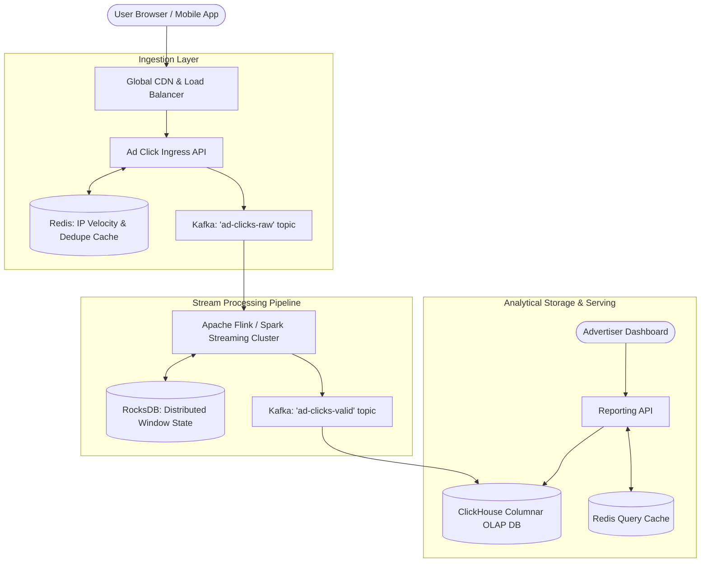

# Design an Ad Click Aggregator (Google Ads / Meta Ads)

## Step 1: Clarify Requirements

### Functional Requirements
- **Real-Time Click Tracking**: Ingest and track ad click events generated from mobile apps, web browsers, and affiliate networks.
- **Multi-Window Aggregation**: Compute aggregated metrics (total clicks, unique visitors, total spend) across multiple time granularities (1-minute, 5-minute, 1-hour, 1-day).
- **Click Fraud & Anomaly Detection**: Identify and filter out fraudulent clicks (e.g., bot farms, rapid click-jacking, duplicate clicks from the same IP within seconds) before charging advertisers.
- **Advertiser Analytics API**: Provide sub-50 ms query access for advertisers to monitor campaign performance and budget burn rates.

### Non-Functional Requirements
- **High Ingestion Throughput**: Handle tens of thousands of clicks per second with zero message loss.
- **Exactly-Once Processing**: Financial billing depends directly on click counts. Duplicate counting will trigger advertiser billing disputes.
- **Low Aggregation Latency**: Aggregated metrics must reflect in advertiser dashboards within <10 seconds of the click occurring.
- **Scalable OLAP Storage**: Efficiently store years of historical analytics data while allowing fast analytical rollups.

---

## Step 2: Capacity Estimation

### Traffic & Volume
- **Ad Impressions**: 10 billion impressions per day.
- **Ad Clicks**: 1 billion clicks per day (assuming a 10% Click-Through Rate / CTR).
- **Ingress Click QPS**:
  $$\text{Average QPS} = \frac{1\text{B clicks}}{86{,}400} \approx 11{,}600\text{ clicks/sec}$$
  $$\text{Peak Burst QPS } (\times 2.5) \approx 30{,}000\text{ clicks/sec}$$

### Storage Estimation (Raw vs. Aggregated)
- **Raw Event Ingestion**:
  - Each raw click event: ~200 bytes (ad_id, campaign_id, user_id, ip, user_agent, timestamp, cost).
  - Daily raw event storage:
    $$1\text{B} \times 200\text{ bytes} \approx 200\text{ GB/day } (73\text{ TB/year})$$
  - Stored in a raw data lake (S3 / Parquet) with a 30-day retention policy for auditing and model retraining.
- **Aggregated Analytics Storage (ClickHouse / Druid)**:
  - 10 million active ads.
  - Aggregated to 1-minute windows: $10\text{M ads} \times 1{,}440\text{ mins/day} \approx 14.4\text{ billion rows/day}$ (sparse: only active ads generate rows, ~100M actual rows/day).
  - Columnar compression yields ~10 bytes per compressed row:
    $$100\text{M rows} \times 10\text{ bytes} \approx 1\text{ GB/day (Compact)}$$

---

## Step 3: API Design

### 1. Ingest Ad Click Event
- **Endpoint**: `POST /api/v1/ads/click`
- **Request**:
  ```json
  {
    "ad_id": "ad_884910",
    "campaign_id": "cmp_2091",
    "user_id": "usr_77192",
    "timestamp": 1725364800123,
    "ip_address": "192.0.2.1",
    "bid_cost_cents": 25
  }
  ```
- **Response**: `HTTP 204 No Content` (Fire-and-forget; client redirected to advertiser landing page immediately).

### 2. Query Aggregated Metrics
- **Endpoint**: `GET /api/v1/ads/{ad_id}/metrics`
- **Query Parameters**:
  - `start_time`: `2026-09-03T12:00:00Z`
  - `end_time`: `2026-09-03T13:00:00Z`
  - `window`: `1m` // 1m | 5m | 1h | 1d
- **Response**: `HTTP 200 OK`
  ```json
  {
    "ad_id": "ad_884910",
    "window_size": "1m",
    "metrics": [
      { "timestamp": "2026-09-03T12:00:00Z", "clicks": 142, "cost_cents": 3550 },
      { "timestamp": "2026-09-03T12:01:00Z", "clicks": 158, "cost_cents": 3950 }
    ]
  }
  ```

---

## Step 4: Data Model & Storage Choice

```sql
-- OLAP Datastore: ClickHouse Columnar Table
CREATE TABLE ad_clicks_aggregated_1min (
    ad_id String,
    campaign_id String,
    window_start DateTime,
    click_count UInt64,
    cost_cents UInt64,
    unique_users AggregateFunction(uniq, String)
) ENGINE = AggregatingMergeTree()
PARTITION BY toYYYYMM(window_start)
ORDER BY (campaign_id, ad_id, window_start);
```

---

## Step 5: High-Level Architecture



### End-to-End Processing Workflow:
1. **Click Capture**:
   - User clicks an ad banner. The client is redirected to `IngestAPI`.
   - `IngestAPI` performs a fast real-time sanity check against Redis to filter out duplicate clicks from the same IP within a 5-second window.
   - Appends the raw event to Kafka and redirects the user to the destination URL.
2. **Stream Aggregation (Apache Flink)**:
   - Flink consumes the raw stream, grouping events by `ad_id` and applying a **1-minute Tumbling Window**.
   - Maintains state in an embedded RocksDB key-value store with checkpointing for fault tolerance.
3. **OLAP Persistence**:
   - Flink flushes aggregated 1-minute window summaries into **ClickHouse** using an idempotent Two-Phase Commit sink.
   - ClickHouse uses `AggregatingMergeTree` to roll up 1-minute summaries into 1-hour and 1-day aggregates in the background.
4. **Advertiser Querying**:
   - Advertiser opens campaign dashboard. `ReportingAPI` queries ClickHouse with sub-50 ms response times.

---

## Step 6: Deep Dive: Stream Windows & Exactly-Once Semantics

### 1. Windowing Mechanics: Event Time vs. Processing Time
Network delays and intermittent mobile connectivity mean clicks do not arrive in chronological order:
- **Event Time**: The timestamp when the click physically occurred on the user's phone (`12:00:01`).
- **Processing Time**: The timestamp when the streaming server consumed the message (`12:00:15`).
- If an application aggregates by processing time, network lag shifts events into the wrong billing window.
- **Handling Late-Arriving Data with Watermarks**:
  - Apache Flink uses **Event Time Watermarks**: a watermark $W(t)$ signals that the system can assume no further events with timestamp $t' \le t$ will arrive.
  - A 10-second bounded out-of-orderness watermark allows the system to capture 99.9% of delayed mobile clicks into the correct 1-minute aggregation window.

### 2. Exactly-Once Processing Semantics
How do we ensure that system restarts do not double-count clicks?
- **Kafka Offset Tracking**: Consumer offsets are committed to Kafka only after state is checkpointed.
- **Distributed State Snapshots (Chandy-Lamport Algorithm)**: Flink periodically saves consistent distributed checkpoints of internal window counters to S3.
- **Idempotent / Two-Phase Commit Sinks**:
  - ClickHouse receives writes with a deterministic batch ID.
  - If a worker crashes and replays the stream, ClickHouse recognizes the batch ID and replaces the previously written partition rather than incrementing it twice.

### 3. Click Fraud Mitigation
Click fraud is categorized into two main attack vectors:
- **Simple Volumetric Flooding**: A bot repeats requests from a single IP.
  - *Mitigation*: Sliding window counters in Redis drop any requests exceeding 10 clicks/minute from the same IP/Device ID combination.
- **Distributed Botnets**: Thousands of rotating IPs each click once to evade simple rate limits.
  - *Mitigation*: Offline machine learning models analyze behavioral telemetry (cursor trajectories, scroll depth, referrer authenticity, IP ASN classification) to identify botnet clusters and retroactively issue billing refunds to affected advertisers.
