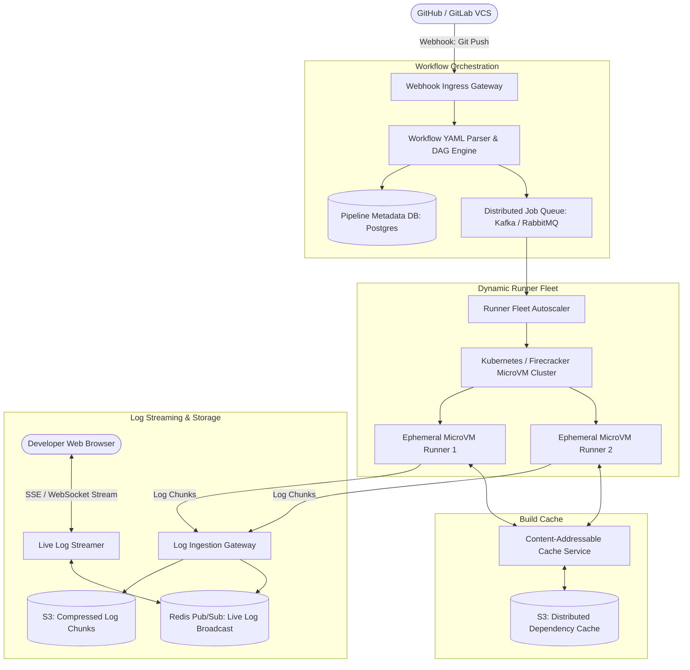

# Design a Distributed CI/CD System (GitHub Actions / GitLab CI)

## Step 1: Clarify Requirements

### Functional Requirements
- **Webhook Ingestion**: Trigger pipeline builds automatically upon Git events (`git push`, pull request open/sync).
- **DAG Workflow Parsing**: Parse user-defined YAML workflow files containing sequential and parallel execution stages (e.g., lint $\rightarrow$ test in parallel $\rightarrow$ build $\rightarrow$ deploy).
- **Ephemeral Isolated Execution**: Dynamically provision clean, isolated container or virtual machine environments to execute arbitrary user scripts.
- **Real-Time Log Streaming**: Stream stdout/stderr console logs to the developer's browser in real time with sub-second latency.
- **Artifact Caching & Sharing**: Store and cache build artifacts (`node_modules`, Docker layers, compiled binaries) between pipeline runs to accelerate build speeds.

### Non-Functional Requirements
- **Strict Security & Multi-Tenant Isolation**: Untrusted user code must never escape container sandboxes or access host server resources or neighboring tenant credentials.
- **Elastic Scalability**: Support tens of thousands of concurrent build jobs during peak developer working hours.
- **High Availability**: 99.99% uptime. System restarts must not lose queued or running pipeline states.
- **Low Job Queue Latency**: Jobs must transition from `QUEUED` to `RUNNING` within <5 seconds.

---

## Step 2: Capacity Estimation

### Build & Runner Volume
- **Active Repositories**: 100,000 active projects.
- **Daily Builds**: 1 million pipeline builds per day.
- **Average Build Duration**: 5 minutes.
- **Peak Concurrency**:
  $$\text{Concurrent Running Jobs at Peak} \approx 20{,}000\text{ parallel runner containers}$$

### Log Ingestion & Streaming Bandwidth
- Average log generation: 1,000 lines/min ($\approx 50\text{ KB/min}$ per active runner).
- Aggregate Log Ingress Throughput:
  $$20{,}000\text{ runners} \times \frac{50\text{ KB}}{60\text{ sec}} \approx 16.6\text{ MB/sec } (133\text{ Mbps})$$
- Peak log streaming to active browser sessions: ~500 Mbps.

### Storage Estimation (Artifacts & Logs)
- Build logs: 1M builds $\times$ 500 KB $\approx$ 500 GB/day (compressed into S3 cold storage).
- Build caches & artifacts: 100 TB active cache across a distributed Content-Addressable Storage (CAS) layer.

---

## Step 3: API Design

### 1. Webhook Ingress (Git Provider to CI)
- **Endpoint**: `POST /api/v1/webhooks/github`
- **Headers**:
  - `X-Hub-Signature-256`: `sha256=...` (HMAC cryptographic verification)
- **Payload**:
  ```json
  {
    "event": "push",
    "repository": "org/backend-service",
    "commit_sha": "4f9a012b",
    "ref": "refs/heads/main",
    "sender": "developer_alice"
  }
  ```

### 2. Stream Real-Time Logs (Browser Client)
- **Endpoint**: `GET /api/v1/jobs/{job_id}/logs/stream`
- **Protocol**: Server-Sent Events (SSE) or WebSockets
- **Chunk Payload**:
  ```json
  {
    "line_number": 142,
    "timestamp": 1725364802100,
    "stream": "stdout",
    "text": "Running test: auth_service_test.go ... PASSED"
  }
  ```

---

## Step 4: Data Model & Schema

```sql
-- Table: pipeline_runs (Workflow Execution Header)
CREATE TABLE pipeline_runs (
    run_id UUID PRIMARY KEY,
    repo_id UUID NOT NULL,
    commit_sha VARCHAR(40) NOT NULL,
    status VARCHAR(16) NOT NULL, -- QUEUED, RUNNING, SUCCESS, FAILURE, CANCELLED
    trigger_event VARCHAR(32) NOT NULL,
    created_at TIMESTAMP WITH TIME ZONE DEFAULT NOW(),
    finished_at TIMESTAMP WITH TIME ZONE
);

-- Table: pipeline_jobs (Individual Nodes in the DAG)
CREATE TABLE pipeline_jobs (
    job_id UUID PRIMARY KEY,
    run_id UUID REFERENCES pipeline_runs(run_id),
    job_name VARCHAR(64) NOT NULL,
    status VARCHAR(16) NOT NULL, -- QUEUED, ASSIGNED, RUNNING, SUCCESS, FAILURE
    runner_id UUID,
    depends_on TEXT[], -- Array of job names that must succeed first
    exit_code INT,
    started_at TIMESTAMP WITH TIME ZONE,
    finished_at TIMESTAMP WITH TIME ZONE
);
CREATE INDEX idx_jobs_run ON pipeline_jobs(run_id);
```

---

## Step 5: High-Level Architecture



### End-to-End Build Lifecycle:
1. **Webhook Processing**:
   - Developer pushes code to GitHub; GitHub delivers an HMAC-signed webhook to `IngressGW`.
   - `DAGParser` fetches `.github/workflows/ci.yml`, parses steps, and constructs a Directed Acyclic Graph (DAG).
2. **Scheduling & Queueing**:
   - Jobs with zero dependencies (e.g., `lint` and `unit-tests`) transition to `QUEUED` and are enqueued in `JobQueue`.
3. **Ephemeral Runner Provisioning**:
   - `Runner Fleet Autoscaler` spins up a dedicated, single-use container or **AWS Firecracker MicroVM**.
   - The runner pulls repo code, downloads cached dependencies via `CacheService`, and executes the build script inside an isolated sandbox.
4. **Real-Time Log Streaming**:
   - The runner pipes process stdout/stderr into `LogCollector` via gRPC chunks.
   - `LogCollector` pushes lines to **Redis Pub/Sub** for live browser viewing and archives chunks to S3 for permanent storage.
5. **Teardown & Promotion**:
   - Once complete, the container/VM is completely destroyed to guarantee zero state leakage.
   - Downstream dependent jobs (e.g., `deploy`) are triggered once parent jobs succeed.

---

## Step 6: Deep Dive: Sandboxing & Caching

### 1. Runner Sandboxing & Security Isolation
Executing arbitrary user code presents extreme security vulnerabilities (e.g., cryptominers, kernel exploits, reading host files):
- **Traditional Docker-in-Docker (DinD)**:
  - Requires `--privileged` mode, allowing root access to the host kernel. A kernel exploit enables full container breakout.
- **Production Solution: Lightweight MicroVMs (AWS Firecracker / gVisor)**:
  - **Firecracker**: Boots a minimalist Linux microVM using KVM in <120 ms with minimal memory footprint (<5 MB overhead).
  - Every build runs inside its own **hardware-isolated virtualized kernel**.
  - Even if user code executes a zero-day Linux kernel exploit, it remains trapped inside the throwaway guest VM.

### 2. Distributed Content-Addressable Storage (CAS) for Build Caching
Build jobs spend 80% of their time re-downloading dependencies (`npm install`, `pip install`, `maven dependencies`):
- **Hash-Based Cache Invalidation**:
  - Developers define cache keys based on lockfile contents:
    `key: ${{ runner.os }}-node-${{ hashFiles('**/package-lock.json') }}`
- **Deduplication via Chunk Hashing**:
  - The cache service splits large archive files into content-defined chunks (FastCDC).
  - Chunks are named by their SHA-256 hash in S3.
  - If a build updates 1 dependency out of 1,000, only the modified chunk is re-uploaded, reducing network transfer by >90% and slashing build times from 15 minutes to 30 seconds.
