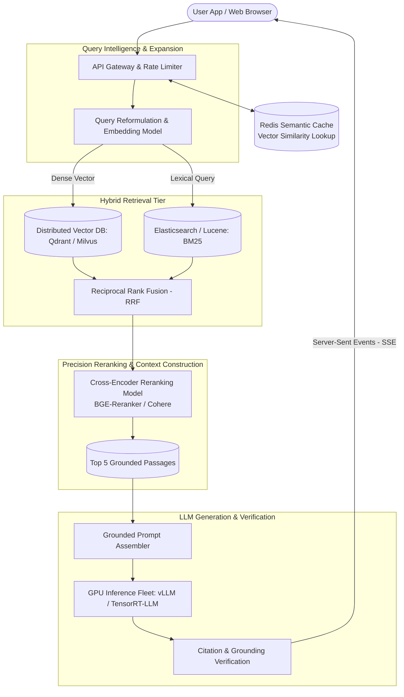

# Design an LLM-Powered Search Engine (Perplexity / Google AI Overviews)

## Step 1: Clarify Requirements

### Functional Requirements
- **Query Understanding**: Classify query intent (factual, conversational, exploratory) and expand queries with relevant synonyms or sub-queries.
- **Hybrid Search Retrieval**: Combine sparse lexical search (BM25 for exact keyword/entity matching) with dense vector search (embeddings for semantic conceptual matching).
- **Reranking**: Re-score and filter candidate document passages using a cross-encoder model to select the top 5 most relevant context snippets.
- **Streaming Generative Synthesis**: Synthesize a comprehensive answer using an LLM, streaming output tokens in real time via Server-Sent Events (SSE).
- **Citation Attribution & Grounding**: Every factual sentence must be attributed with verifiable, clickable inline citations (e.g., `[1]`, `[2]`) linked directly to source passages.

### Non-Functional Requirements
- **Strict Latency Budget**:
  - Time-to-First-Token (TTFT): **<800 ms**.
  - Total response generation: **<2.5 seconds**.
- **Grounding & Safety**: Minimize hallucinations; synthesize answers strictly using retrieved context passages.
- **High Throughput**: Handle peak loads of thousands of concurrent queries without GPU queue saturation.
- **Freshness**: Ingest and index new web documents and news articles within minutes.

---

## Step 2: Capacity Estimation

### Search Traffic & QPS
- **Daily Active Queries**: 50 million searches per day.
- **Average Query QPS**:
  $$\text{Average QPS} = \frac{50\text{M}}{86{,}400} \approx 580\text{ queries/sec}$$
  $$\text{Peak QPS } (\times 2.5) \approx 1{,}500\text{ queries/sec}$$

### Storage & Vector Index Scale
- **Document Chunk Corpus**: 10 billion searchable passages.
- **Embedding Dimensions**: 1,536-dimensional float16 vectors (e.g., OpenAI text-embedding-3 or BGE-large).
- **Vector Storage Footprint**:
  $$10\text{B} \times 1{,}536 \times 2\text{ bytes} \approx 30.7\text{ TB (Raw Vectors)}$$
  With HNSW graph indexing overhead ($\times 1.5$): ~46 TB RAM across a distributed vector database cluster (Milvus / Qdrant).
- **Document Text Store**: 10B chunks $\times$ 500 bytes $\approx$ 5 TB in distributed key-value storage (Cassandra / Bigtable).

### Latency Budget Breakdown (Target: <800 ms TTFT)
```text
┌────────────────────────────────────────┬──────────┐
│ Step                                   │ Budget   │
├────────────────────────────────────────┼──────────┤
│ 1. API Gateway + Auth + Semantic Cache │ 20 ms    │
│ 2. Query Embedding Generation          │ 40 ms    │
│ 3. Parallel Hybrid Retrieval           │ 80 ms    │
│ 4. Cross-Encoder Reranking (Top 50->5) │ 120 ms   │
│ 5. Prompt Assembly & Guardrails        │ 20 ms    │
│ 6. LLM Prefill & First Token (GPU)     │ 400 ms   │
├────────────────────────────────────────┼──────────┤
│ Total Time-to-First-Token (TTFT)       │ 680 ms   │
└────────────────────────────────────────┴──────────┘
```

---

## Step 3: API Design

### Stream Answer Endpoint
- **Endpoint**: `POST /api/v1/search/stream`
- **Request**:
  ```json
  {
    "query": "How does Kafka achieve high write throughput?",
    "search_mode": "BALANCED", // CONCISE | BALANCED | DEEP_RESEARCH
    "freshness": "PAST_YEAR"
  }
  ```
- **Response**: `HTTP 200 OK` (Content-Type: `text/event-stream`)

```text
event: citations
data: [{"id": 1, "title": "Kafka Storage Internals", "url": "https://kafka.apache.org/doc"}]

event: token
data: {"text": "Apache"}

event: token
data: {"text": " Kafka"}

event: token
data: {"text": " achieves high throughput via sequential disk I/O [1]..."}

event: done
data: {"metrics": {"ttft_ms": 640, "total_tokens": 185}}
```

---

## Step 4: Data Model & Schema

```sql
-- Table: document_chunks
CREATE TABLE document_chunks (
    chunk_id UUID PRIMARY KEY,
    document_id UUID NOT NULL,
    url TEXT NOT NULL,
    title VARCHAR(255) NOT NULL,
    chunk_text TEXT NOT NULL,
    token_count INT NOT NULL,
    published_at TIMESTAMP WITH TIME ZONE,
    created_at TIMESTAMP WITH TIME ZONE DEFAULT NOW()
);
CREATE INDEX idx_chunks_url ON document_chunks(url);

-- Vector Index (Milvus / Qdrant Collection Definition)
-- Collection: chunk_embeddings
-- Vector Field: embedding (FLOAT_VECTOR, dim=1536, metric_type=COSINE)
-- Index: HNSW (M=16, efConstruction=200)
```

---

## Step 5: High-Level Architecture



### End-to-End Query Lifecycle:
1. **Semantic Cache Evaluation**:
   - The user query is checked against an in-memory **Redis Semantic Cache**.
   - If cosine similarity to a recently answered identical query is $\ge 0.96$, the cached answer streams immediately (<30 ms).
2. **Parallel Hybrid Retrieval**:
   - Query text is sent to an embedding model (e.g., TEI / TensorRT on GPU) to produce a 1,536-dim vector in <40 ms.
   - Concurrently queries:
     - **BM25 Index**: Exact matches on acronyms, product versions, and quoted terms.
     - **Vector Index**: Semantic nearest neighbors using HNSW.
3. **Reciprocal Rank Fusion (RRF)**:
   - Combines results from both candidate lists:
     $$RRF\_Score(d) = \sum_{m \in \{\text{BM25}, \text{Vector}\}} \frac{1}{k + \text{rank}_m(d)}$$
4. **Cross-Encoder Reranking**:
   - Takes top 50 candidates and runs them through a joint cross-encoder model `CrossEncoder(query, passage)` to compute precise relevance scores, selecting the top 5 passages.
5. **Grounded Synthesis & Streaming**:
   - Context snippets are labeled `[1]`, `[2]`, `[3]` and injected into the LLM system prompt.
   - LLM generates responses with inline bracketed citations, streaming tokens back to the user over SSE.

---

## Step 6: Deep Dive: Grounding, Citations & Latency

### 1. Hybrid Search: Why Vector Search Alone Fails
- **Vector Search Weakness**: Embedding models smooth out exact terms into broad semantic spaces. A search for `"CVE-2024-3094"` or `"RFC 9114"` frequently fails in pure vector search because specific alphanumeric identifiers have no semantic meaning in embedding space.
- **BM25 Weakness**: Cannot answer conceptual or exploratory queries (e.g., *"How do distributed databases guarantee read consistency without locks?"*).
- **The Synergy**: Hybrid search combines BM25 for deterministic precision with dense embeddings for high semantic recall, merged via Reciprocal Rank Fusion ($k=60$).

### 2. Hallucination Mitigation & Citation Verification
To prevent LLM confabulation:
- **System Prompt Constraints**:
  ```text
  You are an expert factual search assistant. Answer the user's question using ONLY the provided sources below.
  For every factual claim, cite the corresponding source number [1], [2].
  If the answer cannot be deduced from the sources, state clearly that you do not know.
  ```
- **Post-Generation Citation Verification (NLI)**:
  - While streaming, an asynchronous worker evaluates whether sentence $S$ entails context passage $C_{[i]}$ using a lightweight Natural Language Inference (NLI) classifier.
  - If a sentence makes a claim not present in its cited source, the client UI flags the citation as unverified.

### 3. GPU Serving Optimizations (vLLM / Continuous Batching)
Under 1,500 QPS, naive LLM serving would require thousands of expensive GPUs.
- **PagedAttention & KV-Cache Management**: vLLM partitions the Key-Value (KV) cache into non-contiguous virtual memory blocks, eliminating 80% of GPU memory waste.
- **Continuous (Iteration-Level) Batching**: Rather than waiting for an entire batch to finish generating, new prefill requests join the batch at each token iteration step, maximizing GPU Tensor Core utilization.
