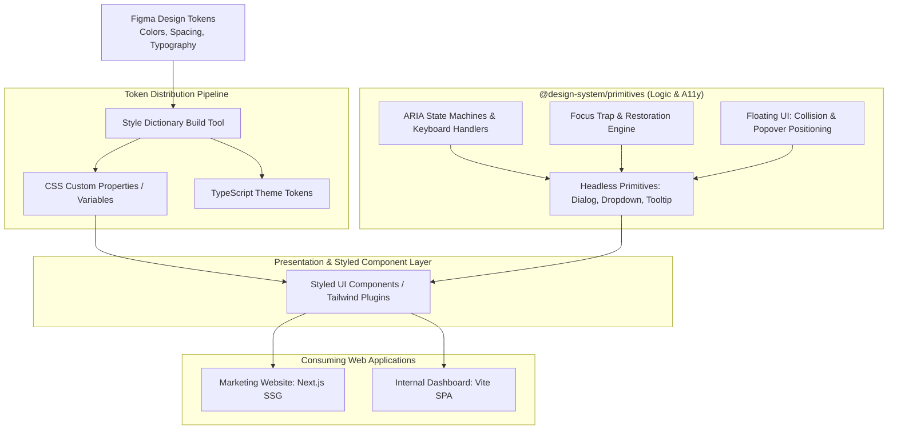

# Design a React Component Library & Design System (Radix UI / Tailwind UI)

## Step 1: Clarify Requirements

### Functional Requirements
- **Design Tokens**: Standardized, themeable tokens for color palettes, spacing scales, typography, radii, and shadows with seamless Dark/Light mode switching.
- **Headless Accessible Primitives**: Unstyled, fully functional interactive UI primitives (Dialog, DropdownMenu, Combobox, Accordion, Tooltip, Tabs).
- **Strict Accessibility (WAI-ARIA & WCAG 2.1 AA)**: Out-of-the-box keyboard navigation (Tab, Shift+Tab, Arrow keys, Esc, Enter, Space), focus trapping, and screen reader announcements.
- **Developer Ergonomics (Compound Components & Polymorphism)**: Clean compositional API (`<Dialog.Root>`, `<Dialog.Trigger>`, `<Dialog.Portal>`, `<Dialog.Content>`) and polymorphic rendering via the `asChild` slot pattern.
- **Distribution & Tree-Shaking**: Lightweight package distribution allowing consuming applications to import only what they use without bundle bloat.

### Non-Functional Requirements
- **Minimal Bundle Size**: Bounded size budget ($\le 3\text{ KB}$ gzipped per interactive primitive; zero heavy third-party dependencies).
- **Zero Runtime Performance Overhead**: 60 fps smooth animations; avoidance of runtime CSS-in-JS style injection recalculations.
- **Cross-Browser & Device Compatibility**: Identical behavior across Chrome, Safari, Firefox, iOS Mobile Safari, and Android touch devices.
- **Type Safety**: 100% TypeScript with discriminated union props and autocomplete for event handlers and HTML attributes.

---

## Step 2: System Metrics & Performance Budgets

### Performance & Quality Budgets
- **Per-Component Gzipped Size Budget**:
  - Simple Components (Button, Badge, Avatar): **<1 KB**.
  - Complex Primitives (Dialog, Tooltip, Popover): **<3.5 KB**.
  - Highly Complex Primitives (Combobox, Data Table): **<8 KB**.
- **Tree-Shaking Efficiency**:
  Consuming `import { Button } from '@design-system/ui'` in a Next.js / Vite project must bundle **only** the Button code and its specific CSS tokens, contributing <2 KB to the client production bundle.
- **Interaction Latency**:
  - Opening a Modal or Dropdown must render within **<16 ms** (1 frame at 60 fps).

---

## Step 3: Developer API Design: Compound Components & `asChild`

### Compositional Compound Pattern
```tsx
import * as Dialog from '@design-system/dialog';

export function DeleteConfirmationModal() {
  return (
    <Dialog.Root>
      <Dialog.Trigger asChild>
        <button className="btn-danger">Delete Account</button>
      </Dialog.Trigger>
      
      <Dialog.Portal>
        <Dialog.Overlay className="dialog-backdrop" />
        <Dialog.Content className="dialog-panel">
          <Dialog.Title>Are you absolutely sure?</Dialog.Title>
          <Dialog.Description>
            This action cannot be undone. All your project data will be permanently wiped.
          </Dialog.Description>
          
          <div className="flex justify-end gap-3 mt-4">
            <Dialog.Close asChild>
              <button className="btn-secondary">Cancel</button>
            </Dialog.Close>
            <button className="btn-danger" onClick={handleDelete}>Confirm Delete</button>
          </div>
        </Dialog.Content>
      </Dialog.Portal>
    </Dialog.Root>
  );
}
```

---

## Step 4: Core Component Architecture & Implementation

### Focus Trap & Keyboard Navigation Hook
A foundational requirement for interactive overlays (Modals, Drawers) is containing keyboard focus inside the active container:

```tsx
import { useEffect, useRef } from 'react';

export function useFocusTrap(isActive: boolean) {
  const containerRef = useRef<HTMLDivElement>(null);

  useEffect(() => {
    if (!isActive || !containerRef.current) return;
    
    const container = containerRef.current;
    const focusableElements = container.querySelectorAll<HTMLElement>(
      'button, [href], input, select, textarea, [tabindex]:not([tabindex="-1"])'
    );
    
    if (focusableElements.length === 0) return;
    
    const firstElement = focusableElements[0];
    const lastElement = focusableElements[focusableElements.length - 1];
    
    firstElement.focus();

    function handleKeyDown(e: KeyboardEvent) {
      if (e.key === 'Tab') {
        if (e.shiftKey && document.activeElement === firstElement) {
          e.preventDefault();
          lastElement.focus();
        } else if (!e.shiftKey && document.activeElement === lastElement) {
          e.preventDefault();
          firstElement.focus();
        }
      }
    }

    container.addEventListener('keydown', handleKeyDown);
    return () => container.removeEventListener('keydown', handleKeyDown);
  }, [isActive]);

  return containerRef;
}
```

---

## Step 5: High-Level Architecture



### End-to-End Design System Lifecycle:
1. **Design Token Pipeline**:
   - Designers update color scales and border radii in Figma.
   - A CI automation exports Figma tokens to JSON and runs **Style Dictionary** to transform tokens into CSS Custom Properties (`--color-primary-500: #3b82f6`) and TypeScript constants.
2. **Headless Primitive Layer (Logic + Accessibility)**:
   - Encapsulates state machines, WAI-ARIA roles (`role="dialog"`, `aria-modal="true"`, `aria-expanded`), and keyboard shortcuts.
   - Completely unstyled, enabling complete visual customization without CSS specificity battles.
3. **Packaging & Tree-Shaking**:
   - Packaged with **subpath exports** (`@org/ui/dialog`, `@org/ui/button`) and marked `"sideEffects": false` in `package.json`.
4. **Visual Regression Testing**:
   - Every component pull request triggers automated **Storybook Playwright test runs** across Chrome and Safari, verifying accessibility and pixel-perfect theme consistency.

---

## Step 6: Deep Dive: Polymorphism, Portals & Tree-Shaking

### 1. The Polymorphic `asChild` Slot Pattern
A common problem in component libraries is wrapper bloat:
```tsx
<!-- Naive wrapper creates redundant DOM nodes -->
<Dialog.Trigger>
  <button className="my-btn">Open</button>
</Dialog.Trigger>
<!-- Renders: <button><button class="my-btn">Open</button></button> (Invalid HTML!) -->
```
#### Solution: The Slot / `asChild` Pattern
When `asChild` is set to `true`, the component does not render its own DOM element. Instead, it merges its event handlers (`onClick`, `onKeyDown`) and accessibility props (`aria-haspopup`, `aria-expanded`) directly onto its immediate child using `React.cloneElement`:

```tsx
import React from 'react';

interface SlotProps extends React.HTMLAttributes<HTMLElement> {
  children?: React.ReactNode;
}

export const Slot = React.forwardRef<HTMLElement, SlotProps>(({ children, ...props }, forwardedRef) => {
  if (React.isValidElement(children)) {
    return React.cloneElement(children, {
      ...props,
      ...children.props,
      // Safely merge refs and chained event handlers
      ref: forwardedRef,
      onClick: (e: React.MouseEvent) => {
        props.onClick?.(e);
        children.props.onClick?.(e);
      }
    });
  }
  return null;
});
```

### 2. Portals & Z-Index Stacking Contexts
Overlays (modals, tooltips, toasts) placed deep inside a React component hierarchy frequently suffer from CSS `overflow: hidden` clipping or `z-index` stacking context traps from parent containers.
- **`React.createPortal`**: Teleports the overlay DOM nodes directly into `document.body` while maintaining normal React event bubbling through the virtual component tree.

### 3. Modern Package Bundling & Subpath Exports
To guarantee zero dead code in consuming applications, `package.json` specifies modern subpath exports:

```json
{
  "name": "@design-system/ui",
  "version": "1.0.0",
  "sideEffects": false,
  "exports": {
    "./button": {
      "import": "./dist/button.mjs",
      "require": "./dist/button.cjs",
      "types": "./dist/button.d.ts"
    },
    "./dialog": {
      "import": "./dist/dialog.mjs",
      "require": "./dist/dialog.cjs",
      "types": "./dist/dialog.d.ts"
    }
  }
}
```
Bundlers like Rollup, Webpack, and Vite completely eliminate unused components from production builds.
