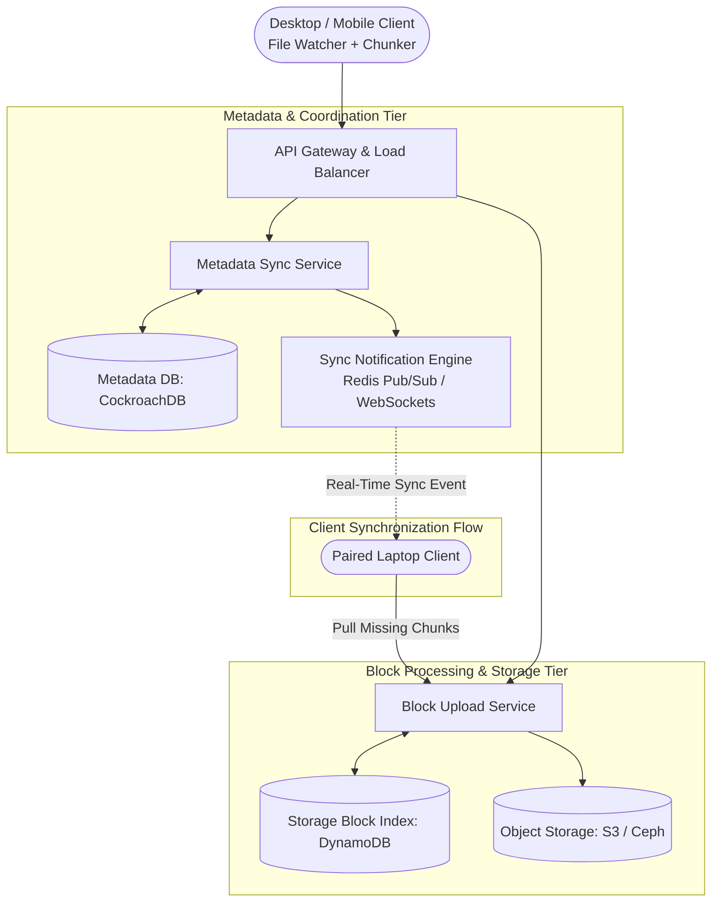

# Design a Distributed Cloud File Storage (Dropbox / Google Drive)

## Step 1: Clarify Requirements

### Functional Requirements
- **File Upload & Download**: Users can upload, download, and view documents, photos, and videos from desktop, web, and mobile devices.
- **Cross-Device Automatic Sync**: When a file is modified on Device A, changes automatically synchronize to Device B, C, and the cloud in near real-time.
- **Delta Sync (Bandwidth Optimization)**: When a large file is slightly edited, only the modified blocks/chunks are uploaded over the network, not the entire file.
- **File Versioning & Revision History**: Retain previous revisions of modified files for up to 30 days, allowing users to restore past snapshots.
- **Offline Editing & Conflict Resolution**: Users can edit files while offline. Upon reconnecting, the system detects conflicts and creates branching conflict copies if concurrent edits occurred.
- **Block-Level Deduplication**: If multiple users upload identical file blocks (e.g., standard OS images or public PDFs), the storage engine stores the block only once globally.

### Non-Functional Requirements
- **Massive Scalability**: Support 50 million Daily Active Users (DAU) and billions of files.
- **High Availability & Durability**: 99.99% service availability; 99.999999999% (11 9s) storage durability. Zero file data loss under server or disk failures.
- **Strong Consistency for Metadata**: Users must never see conflicting directory listings or missing file metadata.
- **Fast Synchronization**: Small file changes (<1 MB) must sync across paired devices in <2 seconds.

---

## Step 2: Capacity Estimation

### Volume & Throughput
- **Daily Active Users (DAU)**: 50 million users.
- **Daily File Uploads / Modifications**: 100 million files per day.
- **Average File Size**: 500 KB (with multi-GB video outliers).
- **Ingestion Bandwidth**:
  $$\text{Daily Upload Volume} = 100\text{M} \times 500\text{ KB} = 50\text{ TB/day}$$
  $$\text{Average Write Throughput} = \frac{50\text{ TB}}{86{,}400} \approx 580\text{ MB/sec } (4.6\text{ Gbps})$$
  $$\text{Peak Ingress Bandwidth } (\times 2.5) \approx 11.5\text{ Gbps}$$

### Storage Estimation (5 Years)
- **Raw Block Storage**:
  $$50\text{ TB/day} \times 365 \times 5 \approx 91.25\text{ PB}$$
  Assuming 40% deduplication and compression savings across enterprise tenants:
  $$\text{Net 5-Year Object Storage} \approx 55\text{ PB (S3 / Ceph)}$$
- **Metadata Storage**:
  - Each file record + chunk map: ~1 KB.
  - 10 billion total active files: $10\text{B} \times 1\text{ KB} \approx 10\text{ TB}$ in distributed relational storage (CockroachDB / PostgreSQL shards).

---

## Step 3: API Design

### 1. Initiate Resumable Chunked Upload
- **Endpoint**: `POST /api/v1/files/upload/init`
- **Request**:
  ```json
  {
    "path": "/Documents/report.docx",
    "total_size_bytes": 12582912,
    "file_hash_sha256": "e3b0c44298fc1c149afbf4c8996fb924...",
    "chunk_hashes": [
      "a1b2c3d4e5f6...",
      "f6e5d4c3b2a1...",
      "123456789abc..."
    ]
  }
  ```
- **Response**: `HTTP 200 OK`
  ```json
  {
    "upload_session_id": "sess_889123",
    "missing_chunk_hashes": [
      "f6e5d4c3b2a1..."
    ]
  }
  ```
  *(Notice: The server checks block hashes against existing storage. If chunks `a1b2...` and `1234...` already exist in S3 due to deduplication, only missing chunk `f6e5...` is uploaded!)*

### 2. Upload Chunk Block
- **Endpoint**: `PUT /api/v1/files/upload/chunk`
- **Headers**:
  - `Upload-Session-Id`: `sess_889123`
  - `Chunk-Hash`: `f6e5d4c3b2a1...`
- **Payload**: Raw binary block (4 MB chunk).

### 3. Sync Changes (Cursor-Based Long Polling)
- **Endpoint**: `GET /api/v1/files/sync?cursor=cur_1092831`
- **Response**: `HTTP 200 OK` with list of changed files, metadata, and new cursor.

---

## Step 4: Data Model & Schema

```sql
-- Table: file_metadata (Relational Store with Strong Consistency: CockroachDB)
CREATE TABLE file_metadata (
    file_id UUID PRIMARY KEY,
    user_id UUID NOT NULL,
    parent_folder_id UUID,
    file_name VARCHAR(255) NOT NULL,
    current_version INT DEFAULT 1,
    is_deleted BOOLEAN DEFAULT FALSE,
    created_at TIMESTAMP WITH TIME ZONE DEFAULT NOW(),
    updated_at TIMESTAMP WITH TIME ZONE DEFAULT NOW(),
    UNIQUE(user_id, parent_folder_id, file_name)
);

-- Table: file_versions
CREATE TABLE file_versions (
    version_id UUID PRIMARY KEY,
    file_id UUID REFERENCES file_metadata(file_id),
    version_number INT NOT NULL,
    file_size_bytes BIGINT NOT NULL,
    file_hash VARCHAR(64) NOT NULL,
    created_at TIMESTAMP WITH TIME ZONE DEFAULT NOW()
);

-- Table: storage_blocks (Content-Addressable Storage Map)
CREATE TABLE storage_blocks (
    block_hash VARCHAR(64) PRIMARY KEY, -- SHA-256
    block_size_bytes INT NOT NULL,
    s3_storage_path TEXT NOT NULL,
    reference_count BIGINT DEFAULT 1
);

-- Table: version_block_mappings (Ordered recipe to reconstruct a file version)
CREATE TABLE version_block_mappings (
    version_id UUID REFERENCES file_versions(version_id),
    block_index INT NOT NULL,
    block_hash VARCHAR(64) REFERENCES storage_blocks(block_hash),
    PRIMARY KEY(version_id, block_index)
);
```

---

## Step 5: High-Level Architecture



### End-to-End File Upload & Synchronization Workflow:
1. **Local Chunking & Hashing**:
   - The desktop client's **File Watcher** detects a modified file on the local filesystem.
   - The client splits the file into 4 MB chunks and computes the SHA-256 hash for each chunk.
2. **Metadata Negotiation & Deduplication Check**:
   - Client sends chunk hashes to `MetaService`.
   - `MetaService` checks `storage_blocks`. Chunks that already exist in S3 are marked as already uploaded (saving bandwidth and disk space).
3. **Resumable Upload**:
   - Client only uploads the modified or new chunks directly to `BlockService`, which writes them to S3.
4. **Commit & Version Promotion**:
   - Client calls `/commit`. `MetaService` increments the version number in `CockroachDB` and records the new ordered list of `block_hashes`.
5. **Real-Time Cross-Device Notification**:
   - `SyncNotification` pushes a change event over an active WebSocket to all other devices linked to that user account.
   - Paired devices query `/sync`, download the modified blocks, and reconstruct the new file locally.

---

## Step 6: Deep Dive: Delta Sync, Chunking & Conflicts

### 1. Chunking Strategies: Fixed vs. Content-Defined Chunking (FastCDC)
- **Fixed-Size Chunking (Naive)**:
  - Splitting a file at exact 4 MB boundaries (0-4 MB, 4-8 MB, 8-12 MB).
  - *The Shift Problem*: If a user inserts 1 sentence at the beginning of a 100 MB file, every subsequent byte boundary shifts. All 25 chunks produce completely different hashes, forcing the entire 100 MB file to re-upload.
- **Content-Defined Chunking (FastCDC / Rabin Fingerprints)**:
  - The chunk boundary is determined by byte patterns in the content itself (e.g., when a rolling hash modulo $N$ equals zero).
  - Inserting a sentence at line 1 only modifies the first chunk. The remaining 24 chunks retain identical boundaries and hashes, reducing network upload by **>96%**.

### 2. Block-Level Global Deduplication
- Because storage blocks are content-addressed by their SHA-256 hash, identical blocks uploaded by different users map to the exact same S3 object:
  $$\text{S3 Key} = \text{"s3://blocks/"} + \text{SHA256(Block)}$$
- `storage_blocks.reference_count` is incremented.
- When a user deletes a file, `reference_count` decrements. A background garbage collector deletes the S3 object only when `reference_count` reaches 0.

### 3. Handling Concurrent Edits & Conflict Resolution
What happens when User Alice and User Bob edit the same document simultaneously while on an airplane (offline)?
- Both users base their edits on Version 3.
- Alice lands first and commits Version 4.
- Bob lands 10 minutes later and attempts to commit with parent version set to Version 3:
  ```sql
  UPDATE file_metadata
  SET current_version = 4
  WHERE file_id = :id AND current_version = 3;
  ```
- **Optimistic Concurrency Control (OCC)** rejects Bob's update because `current_version` is already 4.
- The server does not overwrite Alice's work. Instead, it commits Bob's file as a **"Conflicted Copy"**:
  `/Documents/report (Bob's conflicted copy 2026-09-03).docx`
- Both versions are preserved safely, allowing the users to merge text manually.
