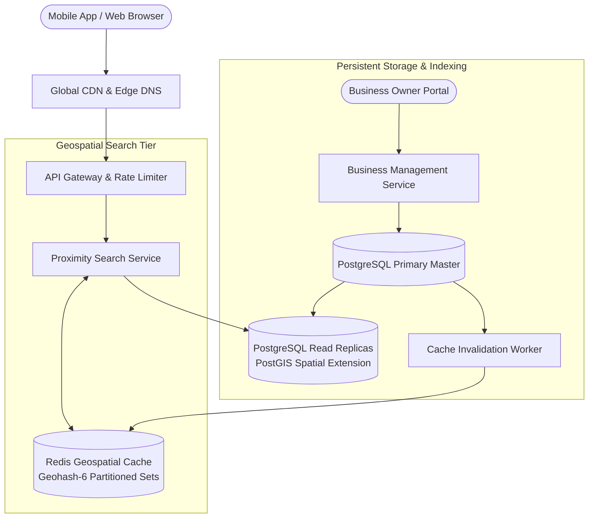

# Design a Proximity Service / Nearby Places (Yelp / Google Maps)

## Step 1: Clarify Requirements

### Functional Requirements
- **Proximity Search**: Given a user's current GPS coordinates (latitude and longitude) and a search radius $R$, return the top $K$ nearby businesses (e.g., restaurants within 3 km).
- **Filtering & Ranking**: Allow users to filter search results by category (e.g., coffee, Italian), price tier (`$$`), and rating ($\ge 4.0\text{ stars}$).
- **Business Management**: Business owners can add, update, and delete business listings, operating hours, photos, and descriptions.
- **Detailed Place View**: Fetch comprehensive business information, customer reviews, and photos.

### Non-Functional Requirements
- **Ultra-Low Latency**: Nearby proximity queries must return in **<20 ms** to ensure snappy map dragging and auto-refresh.
- **High Read Concurrency**: 99% read-heavy workload with hundreds of millions of map searches per day.
- **High Availability**: 99.99% uptime. A partial outage in one city must not impact search in other geographic regions.
- **Data Freshness**: Business updates (e.g., marked "Permanently Closed") must propagate to search results within <5 minutes.

---

## Step 2: Capacity Estimation

### Traffic & Throughput
- **Daily Active Users (DAU)**: 100 million users.
- **Daily Search Requests**: 200 million search queries per day.
- **Query QPS**:
  $$\text{Average Read QPS} = \frac{200\text{M}}{86{,}400} \approx 2{,}315\text{ queries/sec}$$
  $$\text{Peak Burst QPS } (\times 2.5) \approx 6{,}000\text{ queries/sec}$$
- **Write QPS**:
  - 20 million businesses worldwide.
  - Updates occur infrequently (~2,000 updates/day $\approx 0.02\text{ writes/sec}$).
  - **Read-to-Write Ratio**: >10,000:1. The system must be heavily optimized for caching and spatial read performance.

### Storage Estimation (5 Years)
- 20 million businesses worldwide.
- Each business record (name, coordinates, address, tags, photos metadata): ~2 KB.
- Total Database Storage:
  $$20\text{M businesses} \times 2\text{ KB} \approx 40\text{ GB (Fits easily in RAM!)}$$
- Spatial index data (Geohashes / Quadtree nodes): ~5 GB in-memory.

---

## Step 3: API Design

### 1. Search Nearby Places
- **Endpoint**: `GET /api/v1/places/nearby`
- **Query Parameters**:
  - `latitude`: `37.7749`
  - `longitude`: `-122.4194`
  - `radius_meters`: `2500` (Default: 1,500m, Max: 10,000m)
  - `category`: `cafe`
  - `min_rating`: `4.0`
  - `page_size`: `20`
- **Response**: `HTTP 200 OK`
  ```json
  {
    "places": [
      {
        "place_id": "plc_991823",
        "name": "Blue Bottle Coffee",
        "distance_meters": 312,
        "rating": 4.6,
        "review_count": 842,
        "price_tier": 2,
        "latitude": 37.7762,
        "longitude": -122.4211
      }
    ],
    "next_page_token": "tok_page2"
  }
  ```

---

## Step 4: Data Model & Schema

```sql
-- Table: places (Relational PostgreSQL with PostGIS extension)
CREATE TABLE places (
    place_id UUID PRIMARY KEY,
    name VARCHAR(255) NOT NULL,
    latitude DOUBLE PRECISION NOT NULL,
    longitude DOUBLE PRECISION NOT NULL,
    geohash VARCHAR(12) NOT NULL, -- 6-character geohash covers ~1.2 km x 0.6 km
    category VARCHAR(64) NOT NULL,
    rating NUMERIC(2, 1) DEFAULT 0.0,
    review_count INT DEFAULT 0,
    price_tier SMALLINT CHECK (price_tier BETWEEN 1 AND 4),
    address JSONB NOT NULL,
    created_at TIMESTAMP WITH TIME ZONE DEFAULT NOW()
);

-- Compound Index for fast geospatial lookups
CREATE INDEX idx_places_geohash_category ON places (geohash, category, rating DESC);
CREATE INDEX idx_places_spatial_gist ON places USING GIST (ST_MakePoint(longitude, latitude));
```

---

## Step 5: High-Level Architecture



### End-to-End Query Execution:
1. **Coordinate Conversion to Geohash**:
   - Client sends `lat=37.7749, lng=-122.4194, radius=2000m`.
   - `ProximityService` calculates the target **Geohash-6** cell (e.g., `9q8yyk`) and its **8 neighboring adjacent cells**.
2. **Multi-Cell Cache Query**:
   - `ProximityService` queries `GeoCache` (Redis) using `MGET` or `pipeline` for the 9 geohash keys (`geo:cell:9q8yyk`, etc.).
   - If present (cache hit ratio >95%), business IDs and pre-computed summaries return in **<2 ms**.
3. **Database Fallback (Cache Miss)**:
   - If a cell is missing from cache, the service queries PostgreSQL PostGIS using a bounding box ST_DWithin query:
     ```sql
     SELECT place_id, name, latitude, longitude, rating
     FROM places
     WHERE ST_DWithin(ST_MakePoint(longitude, latitude)::geography, ST_MakePoint(-122.4194, 37.7749)::geography, 2000)
     AND category = 'cafe'
     ORDER BY rating DESC LIMIT 20;
     ```
4. **Distance Filtering & Haversine Sorting**:
   - Results from the 9 cells are filtered using the **Haversine formula** to eliminate places in the outer corners of the bounding box that exceed the circular radius $R$.
   - Ranked by rating and distance, then returned to the user in <15 ms total.

---

## Step 6: Deep Dive: Spatial Indexing & The Boundary Problem

### 1. Spatial Indexing Comparison: Geohash vs. QuadTree vs. Google S2
- **2D Bounding Box Search (Naive)**:
  - `WHERE lat BETWEEN y1 AND y2 AND lng BETWEEN x1 AND x2`
  - In a standard B-tree index, databases must perform an expensive 2D intersection scan that degrades severely at scale.
- **Geohash (Base32 String Encoding)**:
  - Divides the world hierarchically into alternating latitude and longitude binary subdivisions.
  - Encoded into base32 strings (e.g., `9q8yy` $\approx 5\text{ km} \times 5\text{ km}$, `9q8yyk` $\approx 1.2\text{ km} \times 0.6\text{ km}$).
  - *Pros*: Simple strings, prefix matching works like a 1D B-Tree index, extremely cache-friendly in Redis keys (`geo:9q8yyk`).
- **QuadTree**:
  - An in-memory hierarchical tree where each node splits into exactly 4 quadrants (NW, NE, SW, SE).
  - *Pros*: Adapts dynamically to density (Manhattan splits deep; the Sahara desert remains 1 large node).
  - *Cons*: Difficult to re-balance and partition across multiple distributed server memories.
- **Google S2 / Uber H3**:
  - Projects the Earth onto a cube (S2) or hexagonal grid (H3).
  - Hexagons have uniform distance to all 6 neighbors, avoiding diagonal distortion.

### 2. The Geohash Boundary Problem (Edge Effects)
A critical flaw of naive geohash matching:
```text
┌──────────────┬──────────────┐
│ Cell A       │ Cell B       │
│              │              │
│       User ● │ ★ Restaurant │
│              │              │
└──────────────┴──────────────┘
```
- The user is located 5 meters from the eastern border of Cell A.
- A restaurant is located 10 meters away inside Cell B.
- If we only query the user's Geohash (Cell A), the restaurant is completely missed even though it is directly across the street!
- **Solution: Query 9 Adjacent Cells**:
  - Always calculate the target cell plus all 8 surrounding neighbor cells (North, South, East, West, NW, NE, SW, SE).
  - Merging the 9 candidate lists guarantees 100% recall for any search radius within the cell size.

### 3. Caching Strategy for Sub-10 ms Response Times
Because 20 million businesses worldwide occupy less than 50 GB of disk space:
- We partition the world into **Geohash-6 cells** (~1.2 km $\times$ 0.6 km).
- Each cell key in Redis stores a serialized list of businesses located inside that cell.
- Because restaurants and shops do not move, cache TTL can be set to **24 hours**.
- When a business edits its profile, an event invalidates only its specific Geohash-6 cell key.
