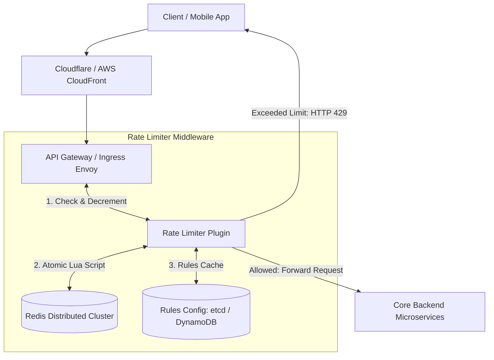

# Design a Rate Limiter

## Step 1: Clarify Requirements

### Functional Requirements
- **Limit Ingress Traffic**: Block or throttle requests that exceed configured rate limits (e.g., 5 requests per second per user/IP).
- **HTTP 429 Status Code**: Return HTTP `429 Too Many Requests` when limit is reached.
- **Informative Response Headers**: Include standard rate-limiting headers in all HTTP responses:
  - `X-RateLimit-Limit`: Maximum requests permitted in the current time window.
  - `X-RateLimit-Remaining`: Remaining request quota allowed in the current window.
  - `Retry-After`: Number of seconds the client must wait before retrying.
- **Configurable Rules**: Support dynamic rule definitions by client IP, authenticated User ID, or API route (e.g., login endpoint vs search endpoint).

### Non-Functional Requirements
- **Minimal Latency Overhead**: Must evaluate rate limits in <2 ms; cannot bottleneck incoming API traffic.
- **Distributed Accuracy**: Must enforce consistent limits across dozens of horizontally scaled API servers.
- **Low Memory Footprint**: Store millions of active user tracking windows in bounded memory.
- **Fault Tolerance**: If the rate-limiting infrastructure fails, decide whether to **fail-open** (allow traffic) or **fail-closed** (block traffic).

---

## Step 2: Capacity Estimation

### Traffic & Scale
- **Daily Active Users (DAU)**: 100 million.
- **Average API Requests per User**: 50 requests/day.
- **Total Requests per Day**: $100\text{M} \times 50 = 5\text{ billion requests/day}$.
- **Average QPS**:
  $$\text{Average QPS} = \frac{5\text{B}}{86{,}400} \approx 58{,}000\text{ requests/sec}$$
  Peak QPS ($\times 2$) $\approx 120{,}000\text{ requests/sec}$.

### Memory Estimation
- Each active tracking record stores:
  - Key: `ratelimit:user_123` or `ratelimit:ip_192.168.1.1` (approx. 32 bytes)
  - Values: Request count, window timestamp / token count (approx. 24 bytes)
  - Redis memory overhead per key: ~50 bytes
  - Total per active tracker $\approx 100\text{ bytes}$.
- Concurrent active tracking keys at peak: ~20 million.
- Total Redis memory footprint:
  $$20\text{M} \times 100\text{ bytes} \approx 2\text{ GB RAM}$$
  Very compact; easily handled by a modest Redis cluster with replication.

---

## Step 3: API Design & Rate Limiter Contract

### HTTP Response Headers
When a client sends a request to any API route:

```http
HTTP/1.1 200 OK
Content-Type: application/json
X-RateLimit-Limit: 100
X-RateLimit-Remaining: 42
X-RateLimit-Reset: 1725364800
```

When the client exceeds their allowed threshold:

```http
HTTP/1.1 429 Too Many Requests
Content-Type: application/json
Retry-After: 18
X-RateLimit-Limit: 100
X-RateLimit-Remaining: 0
X-RateLimit-Reset: 1725364818

{
  "error": "rate_limit_exceeded",
  "message": "Too many requests. Quota will reset in 18 seconds.",
  "retry_after_seconds": 18
}
```

---

## Step 4: Algorithm Comparison

| Algorithm | How It Works | Pros | Cons |
|---|---|---|---|
| **Token Bucket** | Tokens added to bucket at steady rate $r$ up to capacity $C$. Each request consumes 1 token. | Allows short bursts; memory efficient (2 integers). | Bursts can saturate downstream services. |
| **Leaky Bucket** | Requests enter queue; processed by server at fixed FIFO rate. Overflow drops. | Perfectly smooth output rate. | Bursts are delayed; requests stall in queue. |
| **Fixed Window Counter** | Time divided into fixed windows (e.g., 1 min). Counter resets each minute. | Very simple; tiny memory footprint. | **Boundary burst spike**: $2\times$ quota can slip through at window boundaries. |
| **Sliding Window Log** | Stores every request timestamp in a sorted set (ZSET). Discards timestamps older than window. | 100% accurate; no boundary spikes. | **Memory bloat**: Stores a timestamp per request; crashes under high traffic. |
| **Sliding Window Counter** | Combines current window count with weighted percentage of previous window count. | High accuracy; memory efficient (2 numbers); no boundary burst. | Approximation assumes uniform distribution in previous window. |

> **Production Recommendation**: **Token Bucket** (for API services needing burst tolerance) or **Sliding Window Counter** (for strict rate limits).

---

## Step 5: High-Level Architecture



### Request Flow:
1. Client request arrives at the **API Gateway** (e.g., Envoy, Kong, or Nginx).
2. The Rate Limiter middleware extracts client identifiers (`Authorization` header token, API key, or Client IP).
3. Evaluates matching rate rules (e.g., `POST /login` $\rightarrow$ 5 req/min; `GET /feed` $\rightarrow$ 60 req/min).
4. Executes an atomic check-and-decrement operation against the **Redis Cluster**.
5. If allowed: forwards request to backend microservices with updated `X-RateLimit-*` headers.
6. If throttled: drops request immediately and returns `HTTP 429` with `Retry-After`.

---

## Step 6: Deep Dive & Distributed Bottlenecks

### 1. Distributed Race Conditions: Read-Modify-Write
In a high-throughput distributed system, two simultaneous requests hitting different API Gateway nodes can produce a race condition:
1. Thread 1 reads `current_count = 99` from Redis.
2. Thread 2 reads `current_count = 99` from Redis.
3. Both see $99 < 100$, increment to 100, and allow the request.
4. Total requests allowed = 101 (rate limit violated).

#### Solution: Atomic Redis Lua Scripts
Redis executes Lua scripts atomically on a single thread, guaranteeing zero race conditions between reading and updating:

```lua
-- KEYS[1]: Rate limit key (e.g., ratelimit:user_123:window_60)
-- ARGV[1]: Max capacity (e.g., 100)
-- ARGV[2]: Window TTL in seconds (e.g., 60)

local current = redis.call('GET', KEYS[1])
if current and tonumber(current) >= tonumber(ARGV[1]) then
    return 0 -- Throttled
else
    local new_val = redis.call('INCR', KEYS[1])
    if tonumber(new_val) == 1 then
        redis.call('EXPIRE', KEYS[1], ARGV[2])
    end
    return 1 -- Allowed
end
```

### 2. Multi-Tier Rate Limiting
Production architectures enforce rate limits across multiple hierarchical layers:
1. **L3/L4 Network Layer (Cloudflare / AWS Shield)**: Drops volumetric DDoS attacks and IP flooding.
2. **L7 Gateway Layer (Per-IP / Per-Client)**: Protects public endpoints from brute-force login attacks.
3. **Internal Application Layer (Per-User / Per-Tenant)**: Prevents noisy neighbor problems in multi-tenant SaaS.

### 3. Resilience: Fail-Open vs. Fail-Closed
What happens when the Redis rate-limiting cluster experiences a network partition or hardware failure?
- **Fail-Open (Default for user-facing consumer apps)**: Allow requests through to backend services. A brief traffic spike is preferable to taking down the entire website for all users.
- **Fail-Closed (Default for security/financial endpoints)**: Block requests to sensitive endpoints (e.g., `/checkout`, `/transfer`, `/login`) to prevent brute-force attacks during an outage.
