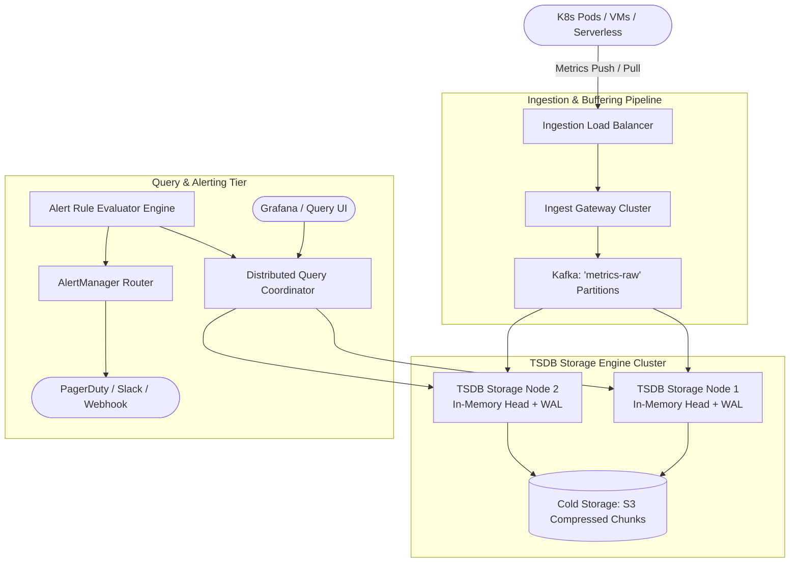

# Design a Metrics Monitoring & Alerting System (Datadog / Prometheus)

## Step 1: Clarify Requirements

### Functional Requirements
- **High-Throughput Metrics Ingestion**: Ingest time-series data points (counters, gauges, histograms) from hundreds of thousands of servers, containers, and serverless functions.
- **Flexible Tagging & Labels**: Metrics can be tagged with multi-dimensional key-value labels (e.g., `host: web-01`, `env: prod`, `status: 500`).
- **Low-Latency Time-Series Querying**: Support PromQL-style aggregation queries (e.g., `rate(http_requests_total[5m])`) returning chart data in <200 ms.
- **Real-Time Alert Evaluation**: Continuously evaluate alerting rules (e.g., *"trigger alert if CPU > 90% for 5 consecutive minutes"*) and dispatch alerts to PagerDuty, Slack, and webhooks.
- **Data Retention & Downsampling**: Store recent metrics at raw resolution while downsampling older historical metrics to conserve disk space.

### Non-Functional Requirements
- **Ultra-High Ingestion Throughput**: Sustain tens of millions of metric points per second during traffic bursts.
- **Extreme Write Efficiency**: Optimize for continuous write-heavy workloads with near-zero disk I/O amplification.
- **High Availability**: 99.99% ingestion uptime. A monitoring system must survive and alert during major infrastructure outages.
- **Zero Loss of Critical Alert Signals**: Alert rules must evaluate on time even if query dashboards experience latency.

---

## Step 2: Capacity Estimation

### Metric Ingestion Throughput
- **Monitored Infrastructure**: 10,000 servers / pods.
- **Metrics per Host**: 100 system and application metrics.
- **Collection Frequency**: Sampled every 10 seconds.
- **Ingress Data Point Rate**:
  $$\text{Data Points per Second} = \frac{10{,}000\text{ hosts} \times 100\text{ metrics}}{10\text{ seconds}} = 100{,}000\text{ points/sec}$$
  For enterprise scale (1 million containers across an organization):
  $$\text{Peak Ingestion QPS} = 10{,}000{,}000\text{ data points/sec}$$

### Storage Estimation (Uncompressed vs. Compressed)
- Each raw sample: `timestamp` (8 bytes) + `value` (float64, 8 bytes) = 16 bytes.
- Daily raw data volume:
  $$10\text{M pts/sec} \times 16\text{ bytes} \approx 160\text{ MB/sec } (13.8\text{ TB/day})$$
- **Gorilla Compression (1.37 bytes/sample)**:
  Applying Facebook's Gorilla delta-of-delta and XOR compression reduces storage by **~90%**:
  $$\text{Compressed Daily Storage} \approx 1.2\text{ TB/day } (438\text{ TB/year})$$

---

## Step 3: API Design

### 1. Ingest Metrics Batch (gRPC / HTTP POST)
- **Endpoint**: `POST /api/v1/metrics/write`
- **Payload**:
  ```json
  {
    "series": [
      {
        "metric": "http_requests_total",
        "labels": {
          "service": "auth_api",
          "env": "production",
          "method": "POST",
          "status": "500"
        },
        "points": [
          [1725364800, 42.0],
          [1725364810, 47.0]
        ]
      }
    ]
  }
  ```

### 2. Time-Series Query
- **Endpoint**: `GET /api/v1/query_range`
- **Query Parameters**:
  - `query`: `sum(rate(http_requests_total{status="500"}[5m])) by (service)`
  - `start`: `1725360000`
  - `end`: `1725364800`
  - `step`: `15s`

---

## Step 4: Data Model & Storage Choice

```text
Time-Series Identifier:
  Metric Name: http_requests_total
  Label Set: {env="prod", service="checkout", status="200"}
  Series Fingerprint: 64-bit MurmurHash3(Metric Name + Sorted Labels)

Compressed Chunk Format (2-Hour Blocks):
┌───────────────────────────┬───────────────────────────────┐
│ Timestamps (Delta-of-Delta│ Values (XOR Floating Point    │
│ Bit-Packed Compression)   │ Floating Bit-Packed)          │
└───────────────────────────┴───────────────────────────────┘
```

A generic relational database (PostgreSQL/MySQL) collapses under 10M writes/sec. We use a dedicated **Time-Series Database (TSDB)** architecture (e.g., Prometheus / VictoriaMetrics / ClickHouse):
- **LSM-Tree Storage Engine**: Writes append sequentially to an in-memory **Head Chunk** and a **Write-Ahead Log (WAL)**.
- Every 2 hours, memory chunks are frozen, compressed, and written as immutable disk segment blocks.

---

## Step 5: High-Level Architecture



### End-to-End Metric Lifecycle:
1. **Scrape or Push**:
   - Host agents collect OS and application metrics and push them to `IngestGateway` in snappy-compressed batches.
2. **Buffering & Sharding**:
   - `IngestGateway` hashes the `(metric_name + labels)` to determine the Kafka partition key. All samples for the same time-series land on the same TSDB storage node.
3. **In-Memory Gorilla Compression**:
   - The TSDB node appends the point to its local WAL (for durability) and updates its active in-memory block using Gorilla compression.
4. **Periodic Chunk Compaction**:
   - Every 2 hours, chunks are sealed into immutable files and indexed by an **Inverted Label Index**.
   - Background workers merge adjacent chunks and write historical archives to S3.
5. **Alert Rule Evaluation**:
   - `AlertEvaluator` executes configured alerting rules every 15–30 seconds.
   - If an alert expression evaluates to `true` for the duration of the `for:` window, it dispatches an incident payload to `AlertManager` with deduplication and throttling.

---

## Step 6: Deep Dive: Compression, Cardinality & Downsampling

### 1. Facebook Gorilla Compression Algorithm
Storing uncompressed 16-byte `(timestamp, float64)` pairs is financially unsustainable at scale. Gorilla compresses samples down to **1.37 bytes (a 12x reduction)**:
- **Timestamp Compression (Delta-of-Delta)**:
  - Metrics are sampled at regular intervals (e.g., every 10 seconds: $t_1=10, t_2=20, t_3=30$).
  - The first delta is $D = 10 - 0 = 10$.
  - The delta-of-delta is $D' = (t_n - t_{n-1}) - (t_{n-1} - t_{n-2}) = 10 - 10 = 0$.
  - If $D' = 0$, store **a single bit: `0`**.
  - If time drifts slightly ($\pm 1$ sec), store a few bits. Over 96% of timestamps compress to 1 single bit!
- **Value Compression (XOR with Previous Value)**:
  - Most metrics change very little between 10-second ticks (e.g., CPU 42.1% $\rightarrow$ 42.2%).
  - The bitwise XOR of two identical float64 numbers is zero:
    $$\text{Val}_n \oplus \text{Val}_{n-1} = 0$$
  - If identical, store **a single bit: `0`**.
  - If different, store only the leading and trailing zero bits and the meaningful bits in between.

### 2. The High-Cardinality Explosion Dilemma
The biggest killer of production monitoring systems is **High Cardinality**:
- What happens if a developer adds `user_id` or `ip_address` as a metric label?
  ```text
  http_requests_total{service="auth", user_id="12345"}
  ```
- If there are 100 million users, this generates **100 million distinct time-series**.
- The TSDB's in-memory inverted index (which maps labels to Series IDs) explodes, exhausting RAM and causing Out-Of-Memory (OOM) crash loops.
- **Defenses**:
  1. **Strict Cardinality Guardrails**: Ingestion gateways reject metrics where any single label key exceeds 10,000 unique values per hour.
  2. **Tracing vs. Metrics**: Educate engineers that ephemeral identifiers (user_ids, order_ids, transaction hashes) belong in distributed tracing (OpenTelemetry / Jaeger), **never** in metrics label sets.

### 3. Multi-Tier Downsampling & Retention
- **Tier 1 (Raw Data - 10s resolution)**: Retained in local NVMe SSDs for **7 days** (used for real-time debugging and active incident triage).
- **Tier 2 (1-Minute Rollups)**: Background workers compute `min`, `max`, `sum`, `count` over 1-minute intervals. Retained for **30 days**.
- **Tier 3 (1-Hour Rollups)**: Rolled up into 1-hour summaries and written to S3 Parquet. Retained for **1 year** for executive capacity planning and YoY dashboards.
