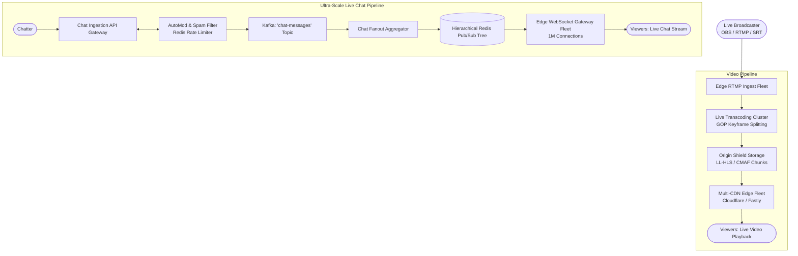

# Design a Live Streaming Platform with Ultra-Scale Live Chat (Twitch / YouTube Live)

## Step 1: Clarify Requirements

### Functional Requirements
- **Low-Latency Video Ingestion**: Ingest live video streams from broadcasters via RTMP or SRT protocols with adaptive bitrate encoding.
- **Ultra-Low-Latency Playback**: Deliver live video to global viewers with sub-2-second "glass-to-glass" latency (Low-Latency HLS / CMAF).
- **Mega-Channel Real-Time Chat**: Support millions of concurrent viewers in a single popular stream channel (e.g., esports tournament or breaking news event) chatting simultaneously.
- **Live Streamer Controls & Moderation**: Real-time message filtering, slow-mode rate limiting, emote rendering, and moderator bans.
- **Live Viewer Counter**: Provide accurate, real-time concurrent viewer metrics.

### Non-Functional Requirements
- **Extreme Concurrency**: 100,000 active broadcasters and 10 million concurrent global viewers.
- **Massive Single-Room Fan-Out**: A single mega-channel can have 1,000,000 simultaneous viewers receiving tens of thousands of chat messages per second.
- **Zero Playback Buffering**: 99.999% video uptime with high CDN cache hit ratios (>99%).
- **Fault Tolerance**: Broadcaster disconnects or regional edge failures must reconnect smoothly without terminating the live session.

---

## Step 2: Capacity Estimation

### Video Egress & Bandwidth
- **Concurrent Live Viewers**: 10 million viewers across the platform.
- **Average Stream Bitrate**: 1080p60 at 4 Mbps.
- **Total Playback Egress Bandwidth**:
  $$\text{Global Playback Egress} = 10\text{M viewers} \times 4\text{ Mbps} = 40\text{ Tbps (Terabits/sec)}$$
  *(Handled via Multi-CDN architecture with origin shielding).*

### Single Mega-Channel Chat Scalability
- **Top Channel Viewers**: 1,000,000 concurrent viewers in one chat room.
- **Chat Ingress Rate**: 50,000 messages/sec submitted by active viewers during peak hype moments.
- **Naive Fan-Out Multiplication**:
  $$50{,}000\text{ msgs/sec} \times 1{,}000{,}000\text{ connected clients} = 50\text{ BILLION messages/sec}$$
  This would require **~5 TB/sec network egress** for chat alone, instantly melting any standard WebSocket server fleet!
- **Target Chat Egress Budget (With Sampling & Rate Limiting)**:
  - Human reading speed is capped at ~15-20 messages/sec.
  - Server aggregates and samples messages down to max 20 msgs/sec per client:
    $$20\text{ msgs/sec} \times 1{,}000{,}000\text{ viewers} \times 100\text{ bytes} \approx 2\text{ GB/sec (Manageable)}$$

---

## Step 3: API & WebSocket Protocol

### 1. Ingest Video Key
- **Protocol**: `rtmp://ingest.twitch.tv/live/{stream_key}`

### 2. Real-Time Chat WebSocket Protocol
- **Client Connect**: `wss://chat.twitch.tv/v1/connect`
- **Join Channel**:
  ```json
  { "action": "JOIN", "channel": "#esports_finals" }
  ```
- **Send Message**:
  ```json
  {
    "action": "SEND_MESSAGE",
    "channel": "#esports_finals",
    "content": "WHAT A PLAY!! PogChamp"
  }
  ```
- **Broadcast Delivery (Batched Array)**:
  ```json
  {
    "event": "CHAT_BATCH",
    "channel": "#esports_finals",
    "messages": [
      { "user": "alice", "text": "LETS GOOO!", "badges": ["sub_3yr"] },
      { "user": "bob", "text": "GGWP", "badges": [] }
    ]
  }
  ```

---

## Step 4: High-Level Architecture



### End-to-End Processing Workflow:
1. **Video Ingestion & Transcoding**:
   - Broadcaster transmits raw H.264/AAC via RTMP to the nearest ingestion point of presence (PoP).
   - Dedicated GPU nodes transcode the video in real-time into an **adaptive bitrate ladder** (1080p, 720p, 480p, 360p) split into **CMAF partial chunks (200 ms)**.
2. **Video Delivery (Low-Latency HLS)**:
   - Partial chunks are cached at the edge CDN and streamed to viewer players via HTTP/2 chunked transfer encoding, achieving **1.5s latency**.
3. **Chat Ingestion & Moderation**:
   - Chatter submits a comment. `ChatIngest` checks per-user rate limits (e.g., 1 msg / 3s) in Redis.
   - Machine learning AutoMod filters slurs, spam, and banned links.
4. **Hierarchical Fan-Out**:
   - For regular channels (<1,000 viewers), messages broadcast directly.
   - For mega-channels (1M viewers), the `FanoutCluster` batches messages into **100 ms micro-batches**, samples popular comments, and broadcasts them down a tree of Redis edge nodes to the WebSocket connection servers.

---

## Step 5: Deep Dive: Mega-Channel Chat Fan-Out & LL-HLS

### 1. The 1-Million Viewer Single-Room Problem
Why standard Pub/Sub architectures collapse during mega-events:
- In a single Redis instance, broadcasting a message to 1,000,000 subscribers saturates CPU and network cards ($1\text{M writes per publish}$).
- **The Solution: 3-Tier Hierarchical Broadcast Tree**:
  ```text
  [Ingested Message]
          │
          ▼
  ┌───────────────┐
  │  Root Broker  │
  └───────┬───────┘
          ├──────────────────────────┐
          ▼                          ▼
  ┌───────────────┐          ┌───────────────┐
  │ Relay Node 1  │          │ Relay Node 2  │  (Branch Tier)
  └───────┬───────┘          └───────┬───────┘
          ├──────────────┐           ├──────────────┐
          ▼              ▼           ▼              ▼
     [WS Server 1]  [WS Server 2]  [WS Server 3]  [WS Server 4] (Edge Tier)
  ```
- **Message Batching & Coalescing**:
  - Instead of delivering 50,000 individual WebSocket frames every second, edge servers bundle messages arriving within a 100 ms window into a single JSON array payload.
  - Reduces socket framing overhead by **90%**.
- **Dynamic Client-Side Sampling**:
  - The human eye cannot read 5,000 messages scrolling per second.
  - When channel ingress exceeds 100 msgs/sec, edge servers sample messages randomly based on subscriber tier and channel VIP badges, dropping the remaining messages before transmission to prevent browser rendering freeze.

### 2. Low-Latency HLS (LL-HLS) vs. Traditional HLS
- **Traditional HLS**:
  - Chunks are 6 seconds long.
  - Players require 3 full chunks in buffer before starting playback:
    $$\text{Buffer Latency} = 3 \times 6\text{s} = 18\text{ seconds delay!}$$
- **LL-HLS with Common Media Application Format (CMAF)**:
  - Chunks are broken into **partial segments (chunks of 200 ms - 500 ms)**.
  - Players can request and begin decoding a chunk *while the transcoder is still encoding the rest of it* via HTTP/2 Chunked Transfer.
  - Latency collapses to **1.0 to 1.8 seconds**, enabling real-time streamer-viewer interactive Q&A.

### 3. Real-Time View Count with HyperLogLog
Counting 10 million active viewers sending heartbeat pings every 30 seconds:
- Storing exact user IDs in a Redis Set consumes hundreds of megabytes of RAM and triggers lock contention.
- **HyperLogLog (HLL)**:
  - Redis `PFADD viewcount:channel_id user_id`.
  - Estimates unique viewers with a 0.81% standard error while using **exactly 12 KB of memory** regardless of whether there are 100 viewers or 10,000,000 viewers!
