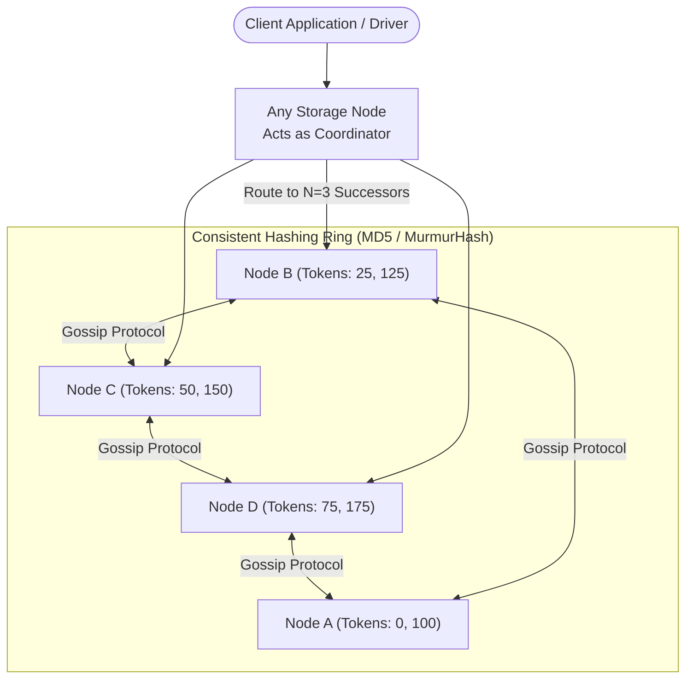

# Design a Distributed Key-Value Store (Amazon Dynamo / Apache Cassandra)

## Step 1: Clarify Requirements

### Functional Requirements
- **Core Operations**: Support fast, primitive key-value operations:
  - `put(key, value)`: Insert or update an arbitrary binary/string value associated with a key.
  - `get(key)`: Retrieve the latest value associated with a key.
- **Configurable Consistency (Tunable CAP)**: Allow clients to select their desired consistency level per query (e.g., strong consistency vs. eventual consistency).
- **High Availability**: The store must remain writable even during network partitions or catastrophic hardware node failures.
- **Automatic Partitioning & Rebalancing**: Automatically distribute data across a cluster of commodity nodes without manual resharding.

### Non-Functional Requirements
- **Massive Scalability**: Store billions of keys and tens of terabytes of data across hundreds of storage nodes.
- **Low Latency**: Sub-10 ms p99 latency for both `get` and `put` operations.
- **Symmetric Architecture (Zero Master Bottleneck)**: Every node possesses identical responsibilities. No single Master or Coordinator node whose failure can bring down the cluster.

---

## Step 2: Capacity Estimation

### Scale & Throughput
- **Total Keys**: 100 billion keys.
- **Average Key-Value Size**:
  - Key: 64 bytes.
  - Value: 1 KB.
- **Total Storage Footprint**:
  $$100\text{B} \times (64\text{ B} + 1\text{ KB}) \approx 106\text{ TB}$$
  With Replication Factor $N = 3$:
  $$\text{Total Cluster Storage} \approx 318\text{ TB}$$
- **Throughput**:
  - Write QPS: 100,000 writes/sec.
  - Read QPS: 500,000 reads/sec.
  - Total Peak QPS: 600,000 requests/sec.

---

## Step 3: Node-to-Node Storage Engine Architecture

At the individual node level, each server uses a **Log-Structured Merge-Tree (LSM-Tree)**:
```text
Write Path:
[Client Write] ──> [Write-Ahead Log (WAL) on NVMe] (Durability)
             └──> [In-Memory MemTable (SkipList)] (Fast Insert)
                         │ (Flushed when full)
                         ▼
                  [Immutable SSTable Files on Disk]
                  ┌───────────────┬────────────────┐
                  │ Bloom Filter  │ Index + Chunks │
                  └───────────────┴────────────────┘
```
- **Writes are append-only**: No in-place disk overwrites, yielding massive write throughput.
- **Reads use Bloom Filters**: An in-memory Bloom filter per SSTable skips files that do not contain the target key in $O(1)$ time.

---

## Step 4: High-Level Architecture



### End-to-End Query Routing Workflow:
1. **Coordinator Assignment**:
   - The client driver hashes the key (or connects to any random node in the cluster, which acts as the **Coordinator** for that request).
2. **Preference List Determination**:
   - The key is mapped onto the **Consistent Hash Ring**.
   - The coordinator walks clockwise around the ring to identify the first $N$ unique physical nodes (the **Preference List**).
3. **Quorum Execution**:
   - The coordinator dispatches requests to all $N$ replicas in parallel.
   - For a write with $W = 2$, once any 2 replicas confirm write success to their local WAL and MemTable, the coordinator returns `HTTP 200 OK` to the client.

---

## Step 5: Deep Dive: Quorum, Gossip & Anti-Entropy

### 1. Consistent Hashing with Virtual Nodes
- **The Problem**: Naive hashing `hash(key) % N` causes 99% of keys to remap whenever a node is added or removed.
- **The Solution**: Map both keys and nodes onto a circular $2^{64}$ token ring. A key belongs to the first node encountered moving clockwise.
- **Virtual Nodes (VNodes)**:
  - Instead of assigning a physical node 1 position on the ring, assign it **128 to 256 virtual token positions**.
  - *Benefits*:
    1. Eliminates hotspotting and uneven data distribution.
    2. Heterogeneous hardware: powerful nodes can be allocated more VNodes.
    3. Faster rebalancing: when a node dies, its 256 VNodes are distributed evenly among *all* surviving nodes rather than overloading a single neighbor.

### 2. Tunable Quorum Consistency ($W + R > N$)
Clients configure consistency on a per-request basis:
$$\text{Replication Factor } N = 3$$
- **Strong Consistency (Linearizable Read)**:
  $$\text{Configure: } W = 2, R = 2 \implies W + R = 4 > 3$$
  Because the write set and read set overlap by at least 1 node, the reader is mathematically guaranteed to see the latest write.
- **High-Speed Availability (Eventual Consistency)**:
  $$\text{Configure: } W = 1, R = 1 \implies W + R = 2 \le 3$$
  Lowest latency, but reads may return stale data if a replica hasn't received the write yet.

### 3. Handling Network Partitions & Node Downtime

#### A. Hinted Handoff (Temporary Outages)
If Node C is unreachable during a write:
- The coordinator writes the data to Node D with a special metadata tag: *"This is a hint for Node C"*.
- Node D stores the hint locally in its `hints` table.
- A background worker on Node D monitors Node C via gossip. Once Node C recovers, Node D replays the stored hints to Node C and purges them.

#### B. Merkle Trees (Anti-Entropy Synchronization)
What if a node was offline for days and hints expired?
- Replicas compare data using **Merkle Trees** (hierarchical binary hash trees of their key ranges).
- Nodes compare root hashes:
  - If roots match $\implies$ the entire key range is identical (zero network transfer).
  - If roots differ $\implies$ traverse child hashes down the tree to isolate the exact small key range that differs.
  - Only out-of-sync keys are exchanged across the network.

#### C. Cluster Membership via Gossip Protocol
- There is no central ZooKeeper master tracking node health.
- Every node pings a few random peers every 1 second, exchanging state summaries (**Gossip Protocol**).
- Node status (`ALIVE`, `SUSPECT`, `DEAD`) propagates epidemically across a 1,000-node cluster within $\sim 3\text{ seconds}$ with minimal network overhead ($O(\log N)$).
