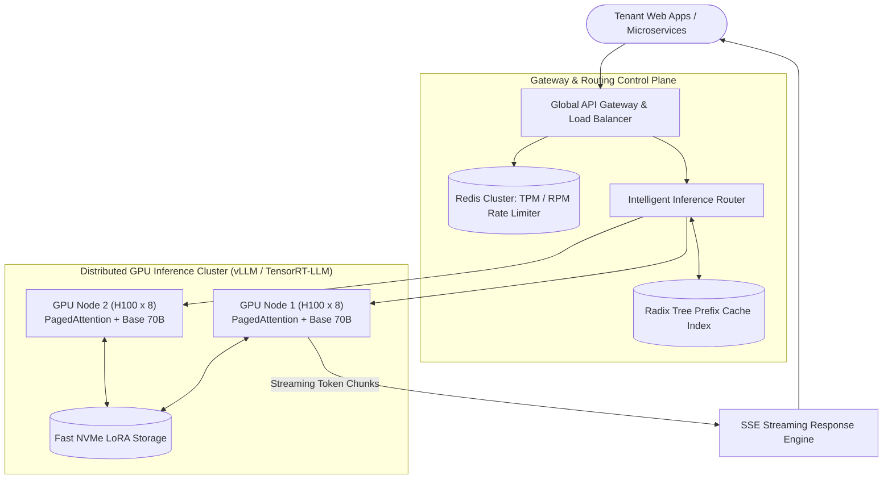

# Design a Multi-Tenant LLM Serving & Gateway Platform (vLLM / Triton / Cloudflare AI)

## Step 1: Clarify Requirements

### Functional Requirements
- **Unified OpenAI-Compatible API Gateway**: Expose standardized endpoints (`POST /v1/chat/completions`) supporting both streaming Server-Sent Events (SSE) and synchronous responses.
- **Multi-Tenant Token Rate Limiting & Quotas**: Enforce strict Requests-Per-Minute (RPM) and Tokens-Per-Minute (TPM) limits across multiple tenant tiers.
- **Dynamic LoRA Adapter Routing**: Route requests to hundreds of customer-specific fine-tuned LoRA adapters loaded on-the-fly over a single shared base model.
- **Prefix Caching (Prompt Caching)**: Cache the Key-Value (KV) cache of repeated system prompts and multi-shot examples to eliminate redundant prefill compute.
- **Continuous (Iteration-Level) Batching**: Dynamically batch incoming requests at the token-generation iteration step to maximize GPU Tensor Core utilization.

### Non-Functional Requirements
- **Ultra-Low Time-to-First-Token (TTFT)**: Sub-300 ms TTFT for cached prompts; sub-800 ms for uncached prompts.
- **High Decode Generation Throughput**: Sustain >60 tokens/sec per stream under heavy load.
- **GPU Memory Optimization**: Eliminate KV-cache memory waste and out-of-memory (OOM) eviction crashes.
- **Multi-Cloud GPU Auto-Scaling**: Auto-scale worker pods across heterogeneous GPU clusters (NVIDIA H100, A100, L40S) based on token queue depth.

---

## Step 2: Capacity Estimation

### Traffic & Token Compute
- **Aggregate Request Throughput**: 1,000 queries/sec (QPS).
- **Average Token Lengths**:
  - Prompt: 2,000 tokens (system instructions + context).
  - Generation: 500 tokens.
- **Token Processing Throughput**:
  $$\text{Prefill Throughput} = 1{,}000\text{ QPS} \times 2{,}000\text{ tokens} = 2{,}000{,}000\text{ prompt tokens/sec}$$
  $$\text{Decode Throughput} = 1{,}000\text{ QPS} \times 500\text{ tokens} = 500{,}000\text{ generated tokens/sec}$$

### GPU Memory & KV-Cache Estimation
For a 70B parameter model (e.g., Llama 3 70B in FP16/BF16):
- Model weights: $70\text{B} \times 2\text{ bytes} \approx 140\text{ GB}$ (Spanned across 2 $\times$ 80 GB H100s via Tensor Parallelism $TP=2$).
- **KV-Cache Size per Token**:
  $$\text{KV per Token} = 2 \times (\text{layers}) \times (\text{heads}) \times (\text{head\_dim}) \times (\text{bytes})$$
  $$= 2 \times 80 \times 8 \times 128 \times 2\text{ bytes} \approx 320\text{ KB per token}$$
- A 2,500-token sequence consumes:
  $$2{,}500 \times 320\text{ KB} \approx 800\text{ MB of High Bandwidth Memory (HBM)}$$
- With 1,000 concurrent active sequences, KV-cache requires **~800 GB of GPU RAM**, proving why virtualized KV-cache memory management is the single most critical architectural bottleneck!

---

## Step 3: API Design

### Stream Chat Completion
- **Endpoint**: `POST /v1/chat/completions`
- **Headers**: `Authorization: Bearer sk_live_tenant123`
- **Request**:
  ```json
  {
    "model": "llama-3-70b-instruct",
    "lora_adapter": "legal_contract_v2",
    "messages": [
      { "role": "system", "content": "You are a senior corporate attorney..." },
      { "role": "user", "content": "Analyze section 4.2 of this NDA..." }
    ],
    "temperature": 0.2,
    "max_tokens": 512,
    "stream": true
  }
  ```
- **Response**: Server-Sent Events stream with TTFT and token usage metrics.

---

## Step 4: High-Level Architecture



### End-to-End Inference Lifecycle:
1. **Authentication & Token Bucket Check**:
   - Gateway verifies tenant API key and queries Redis to decrement tenant Token-Per-Minute (TPM) budget.
2. **Prefix Cache Routing**:
   - Gateway extracts the system prompt and hashes its tokens.
   - Queries the **Radix Tree Prefix Index**. If GPU Node 1 already has this exact prefix cached in its HBM memory, the router steers the request to Node 1.
3. **Execution with Continuous Batching**:
   - GPU Node 1 loads the lightweight LoRA weights (`legal_contract_v2`, ~50 MB) into GPU SRAM in <5 ms.
   - Skips the prompt prefill phase for cached tokens ($O(1)$ lookup instead of $O(N^2)$ matrix multiplication).
   - Injects the new sequence into the active **continuous batch**.
4. **Token Generation & SSE Streaming**:
   - Each iteration generates 1 token per active sequence.
   - Tokens stream back over HTTP/2 Server-Sent Events with sub-20 ms inter-token latency.

---

## Step 5: Deep Dive: PagedAttention, Prefix Caching & LoRA

### 1. PagedAttention: Virtual Memory for KV-Cache
In traditional LLM serving, GPU memory must be allocated contiguously for the worst-case maximum length (e.g., 4,096 tokens):
```text
Naive Contiguous Allocation:
┌─────────────────────────────┬───────────────────────────────┐
│ Actual Tokens Used (500)    │ Wasted Reserved Memory (3,596)│  <-- 80% Memory Waste!
└─────────────────────────────┴───────────────────────────────┘
```
- This massive memory fragmentation causes servers to run out of memory with only a few concurrent users.
- **PagedAttention (vLLM Architecture)**:
  - Inspired by virtual memory paging in OS kernels.
  - Divides the KV-cache into fixed-size **Physical Blocks** (e.g., 16 tokens per block).
  - Maintains a **Block Table** mapping logical token sequence indices to physical GPU memory pages.
  - Memory is allocated dynamically one 16-token page at a time.
  - **Result**: Reduces GPU memory waste from **>70% to <4%**, enabling a **3x to 5x increase in concurrent batch size**.

### 2. Prefix Caching via Radix Trees
Most enterprise LLM applications use long, repetitive prompts (e.g., 3,000-token system instructions or few-shot examples):
- **Traditional Serving**: Every request recalculates the attention Key and Value matrices for all 3,000 prompt tokens from scratch.
- **Radix Tree Prefix Caching**:
  - The server stores cached KV-blocks in a Radix Tree:
    ```text
    Root ──> ["System: You are an attorney..."] (Cached Block A)
               └──> ["Context: NDA Document..."] (Cached Block B)
                         └──> ["User Query 1..."]
                         └──> ["User Query 2..."]
    ```
  - When Query 2 arrives sharing the same prefix, Blocks A and B are reused immediately without GPU compute.
  - **Result**: Slashes Time-to-First-Token (TTFT) from **1,200 ms to <35 ms**.

### 3. Dynamic Multi-LoRA Serving
Deploying separate 70B models for 100 enterprise customers requires hundreds of expensive GPU servers ($100 \times \$300{,}000$).
- **Low-Rank Adaptation (LoRA)**:
  - Freezes base model weights $W$ and trains small rank-decomposition matrices $\Delta W = A \times B$.
  - Adapter size is tiny (~50 MB compared to 140 GB for the base model).
- **Multi-LoRA Batching (S-LoRA / Punica)**:
  - A single 8-GPU cluster hosts the base 70B model.
  - Adapters reside in host RAM / NVMe and are swapped into GPU SRAM on-the-fly.
  - Within the same matrix multiplication step, different requests in the batch apply their respective LoRA adapters concurrently via segmented batched matrix multiplication (`BMM`).
  - **Result**: A single cluster serves **thousands of fine-tuned tenant models** simultaneously with near-zero latency penalty.
