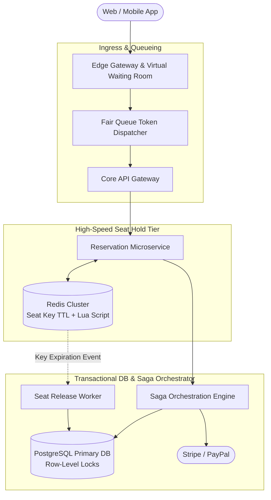

# Design a Ticket Booking & Reservation System (Ticketmaster / Airbnb)

## Step 1: Clarify Requirements

### Functional Requirements
- **Interactive Seat / Room Selection**: Users can view an interactive venue seat map or hotel room calendar showing real-time availability.
- **Temporary Seat Reservation (Hold)**: When a user selects seats and proceeds to checkout, those seats are placed on a **10-minute temporary hold**. No other user can reserve or purchase them during this window.
- **Payment & Booking Confirmation**: If the user completes payment within 10 minutes, the booking is permanently confirmed, the seats become `BOOKED`, and digital tickets are generated.
- **Automatic Expiration & Seat Release**: If the 10-minute countdown timer expires without successful payment, the hold is immediately released and the seats revert to `AVAILABLE`.
- **Fair Virtual Waiting Room**: For mega-demand events (e.g., stadium concerts), manage traffic surges via a fair FIFO virtual queue to protect backend databases.

### Non-Functional Requirements
- **Strict Zero Double-Booking**: Under no circumstances may the same seat or room be sold to two different customers.
- **High Concurrency & Low Latency**: Handle sudden traffic spikes of up to 100,000 users attempting to reserve seats in the exact same second.
- **High Availability & Durability**: 99.99% availability for browsing; financial and reservation transactions must guarantee ACID compliance.

---

## Step 2: Capacity Estimation

### Flash Sale Traffic Burst (Stadium Concert)
- **Venue Capacity**: 50,000 seats.
- **Concurrent Users at Ticket Drop**: 1,000,000 concurrent active fans at 10:00 AM.
- **Peak Ingress QPS**:
  - Browse seat map: 50,000 reads/sec.
  - Reserve seat attempts: 25,000 writes/sec hitting the exact same venue inventory concurrently.
- **Read-to-Write Ratio**: 10:1 during general browsing; 1:1 during initial ticket drop frenzy.

### Storage Estimation (5 Years)
- **Events Hosted**: 10,000 events/year × 5 years = **50,000 events**.
- **Seat Inventory Records**: 50,000 events × 10,000 seats = **500 million seat records**.
- **Record Size**: ~100 bytes (`event_id`, `section`, `row`, `seat_num`, `status`, `version`).
- **Total Storage**: 500M × 100 B ≈ **50 GB** (fits comfortably in database disk and memory).

---

## Step 3: API Design

### 1. Temporary Seat Hold (Reservation)
- **Endpoint**: `POST /api/v1/events/{event_id}/hold-seats`
- **Headers**: `Idempotency-Key: 7b89d4c2-9e21`
- **Request**:
  ```json
  {
    "seat_ids": ["sec_101_row_a_seat_1", "sec_101_row_a_seat_2"],
    "hold_duration_seconds": 600
  }
  ```
- **Response**: `HTTP 200 OK`
  ```json
  {
    "reservation_id": "res_881923",
    "status": "HELD",
    "expires_at": 1725367800,
    "total_price_cents": 25000
  }
  ```

### 2. Confirm Payment & Finalize Booking
- **Endpoint**: `POST /api/v1/reservations/{reservation_id}/confirm`
- **Request**:
  ```json
  { "payment_intent_id": "pi_live_994124" }
  ```
- **Response**: `HTTP 201 Created` with barcode ticket tokens.

---

## Step 4: Data Model & State Machine

```text
Seat Lifecycle State Machine:
┌──────────────┐     Select & Hold (10-min TTL)     ┌──────────────┐
│  AVAILABLE   │ ─────────────────────────────────> │     HELD     │
└──────────────┘                                    └──────┬───────┘
       ▲                                                   │
       │                   Payment Confirmed               │
       │                   (Final Transaction)             ▼
       │ 10-Min Timer Expired                       ┌──────────────┐
       └─────────────────────────────────────────── │    BOOKED    │
                                                    └──────────────┘
```

```sql
-- Relational Schema (PostgreSQL with ACID Guarantees)
CREATE TABLE seats (
    seat_id VARCHAR(64) PRIMARY KEY,
    event_id UUID NOT NULL,
    section VARCHAR(32) NOT NULL,
    row_num VARCHAR(16) NOT NULL,
    seat_num VARCHAR(16) NOT NULL,
    status VARCHAR(16) NOT NULL DEFAULT 'AVAILABLE', -- 'AVAILABLE', 'HELD', 'BOOKED'
    price_cents INT NOT NULL,
    version INT NOT NULL DEFAULT 1, -- Optimistic Concurrency Control
    updated_at TIMESTAMP WITH TIME ZONE DEFAULT NOW()
);

CREATE TABLE reservations (
    reservation_id UUID PRIMARY KEY,
    user_id UUID NOT NULL,
    event_id UUID NOT NULL,
    status VARCHAR(16) NOT NULL, -- 'HELD', 'CONFIRMED', 'EXPIRED'
    expires_at TIMESTAMP WITH TIME ZONE NOT NULL,
    created_at TIMESTAMP WITH TIME ZONE DEFAULT NOW()
);

CREATE TABLE reservation_items (
    reservation_id UUID REFERENCES reservations(reservation_id),
    seat_id VARCHAR(64) REFERENCES seats(seat_id),
    PRIMARY KEY (reservation_id, seat_id)
);
```

---

## Step 5: High-Level Architecture



### End-to-End Hold & Booking Flow:
1. **Virtual Waiting Room**:
   - During flash events, millions of fans enter a queue. Edge proxies assign each user an encrypted queue token with a scheduled entry timestamp.
2. **Atomic In-Memory Reservation (Lua Script)**:
   - When the user selects seats, `ReservationService` executes an atomic Redis Lua script that checks if keys `seat:{event_id}:{seat_id}` exist.
   - If unreserved, it sets the key with a 10-minute TTL: `SET seat:{event_id}:{seat_id} {user_id} NX EX 600`.
   - If already set, the reservation immediately fails in <2 ms without touching the database.
3. **Database Hold Update**:
   - With the Redis lock secured, PostgreSQL marks the rows as `HELD` inside an ACID transaction.
4. **Checkout & Payment Saga**:
   - The user submits payment. Upon payment authorization, the Saga coordinator updates PostgreSQL status to `BOOKED` and deletes the temporary Redis TTL lock.
5. **Automatic Expiry (If Abandoned)**:
   - If the user closes their browser, Redis expires the key after 600 seconds. A Redis Keyspace listener notifies `ExpirationWorker` to revert the PostgreSQL seats back to `AVAILABLE`.

---

## Step 6: Deep Dive: Concurrency, Locking & Sagas

### 1. Concurrency Strategies: Preventing Double-Booking
When 10,000 fans click "Reserve Seat 1A" in the same millisecond, how do we guarantee zero double-booking?
- **Strategy A: Pessimistic Locking (`SELECT FOR UPDATE`)**:
  ```sql
  BEGIN;
  SELECT * FROM seats WHERE seat_id = '1A' AND status = 'AVAILABLE' FOR UPDATE;
  UPDATE seats SET status = 'HELD' WHERE seat_id = '1A';
  COMMIT;
  ```
  *Verdict*: Guaranteed consistency, but causes catastrophic database row lock contention under 50,000 QPS.
- **Strategy B: Optimistic Concurrency Control (OCC)**:
  ```sql
  UPDATE seats 
  SET status = 'HELD', version = version + 1 
  WHERE seat_id = '1A' AND status = 'AVAILABLE' AND version = 5;
  ```
  *Verdict*: High throughput for distributed browsing, but under flash-sale bursts, 9,999 out of 10,000 queries fail and trigger retries.
- **Strategy C: Multi-Tier In-Memory Lua Locking (Production Standard)**:
  - Offload the concurrency bottleneck entirely to Redis:
    ```lua
    -- Atomic Lua Script executed on Redis
    for i, seat in ipairs(KEYS) do
        if redis.call('EXISTS', seat) == 1 then
            return 0 -- Failed: at least one seat is already held
        end
    end
    for i, seat in ipairs(KEYS) do
        redis.call('SET', seat, ARGV[1], 'EX', ARGV[2])
    end
    return 1 -- Success: all seats locked atomically
    ```
  - Eliminates 99.9% of database lock contention. Only the single winning request is forwarded to PostgreSQL!

### 2. Reliable 10-Minute Expiration Without Polling
Querying the database every second (`WHERE status = 'HELD' AND expires_at < NOW()`) creates immense query load:
- **Redisson / RabbitMQ Delayed Message Queues**:
  - When a seat is held, publish a message to a delayed exchange with a 600,000 ms (10-min) delay.
  - Exactly 10 minutes later, the message appears in the consumer queue:
    `SeatReleaseWorker` checks if the reservation is still `HELD`. If not confirmed, it atomically marks the seat `AVAILABLE`.
- **Redis TTL Keyspace Notifications**:
  - Enable Redis expired event notifications (`notify-keyspace-events Ex`).
  - When the 600s TTL fires, Redis automatically emits an event that triggers instant seat release.

### 3. Saga Pattern for Distributed Booking
Booking spans multiple independent systems (Inventory Service, Payment Gateway, Ticket Minting Service):
```text
Saga Execution Pipeline:
[Hold Seat] ──> [Charge Payment] ──> [Mint Digital Ticket] (Success)
     │                  │
     ▼ (If Payment Fails)
[Compensating Tx: Release Seat Lock in Redis + DB]
```
- If the credit card payment declines or network times out, the coordinator executes a **compensating transaction** that releases the seat hold immediately, allowing other fans to purchase it without waiting for the full 10-minute timer.
