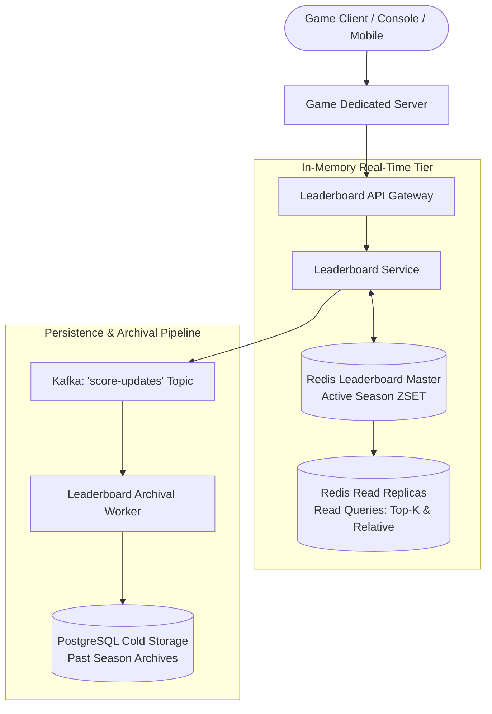

# Design a Real-Time Gaming Leaderboard (Fortnite / Steam / Chess.com)

## Step 1: Clarify Requirements

### Functional Requirements
- **Score Updates**: Players submit their match scores or rating adjustments in real-time upon match completion.
- **Top-$K$ Global Leaderboard**: Retrieve the top 100 global players with usernames, avatars, scores, and exact ranks in sub-50 ms.
- **Relative Ranking (Player Surroundings)**: Retrieve a player's current rank and the 5 players immediately above and below them (e.g., rank 1,420 to 1,430).
- **Seasonal & Weekly Leaderboards**: Support periodic leaderboard resets (e.g., Season 4) while archiving historical past-season winners.

### Non-Functional Requirements
- **Ultra-Low Latency**: Top-$K$ and relative rank queries must return in **<10 ms** to render smoothly in game lobby menus.
- **High Concurrency**: Sustain tens of thousands of score updates per second during peak tournament weekends.
- **Real-Time Accuracy**: Ranks must reflect updates within <1 second without lag or stale ordering.
- **High Availability & Fault Tolerance**: 99.99% uptime. Score updates must not be lost if an in-memory node restarts.

---

## Step 2: Capacity Estimation

### Traffic & Scale
- **Daily Active Players (DAU)**: 25 million players.
- **Concurrent Online Players**: 5 million players.
- **Score Updates Throughput**:
  - 50 million completed matches per day.
  - Average Write QPS: 50M / 86,400 ≈ 580 writes/sec.
  - Peak Tournament Burst QPS (5×): **~3,000 writes/sec**.
- **Leaderboard Read QPS**:
  - Players view leaderboards in lobbies and post-match screens (~200 million reads/day).
  - Average Read QPS: ≈ 2,300 reads/sec.
  - Peak Read QPS: **~10,000 reads/sec**.

### Storage & Memory Estimation
- 25 million players on the active seasonal leaderboard.
- Each entry in Redis Sorted Set:
  - Member (User ID): 8 bytes (64-bit integer) or UUID string (36 bytes).
  - Score (IEEE 754 float64): 8 bytes.
  - Pointer overhead: ~32 bytes.
  - Total per entry: ~80 bytes.
- **Total Active Memory Footprint**: 25M players × 80 bytes ≈ **2 GB** (easily fits in a single Redis instance RAM).
- Even with 10 regional and game-mode leaderboards, total memory is **<30 GB RAM**.

---

## Step 3: API Design

### 1. Update Player Score
- **Endpoint**: `POST /api/v1/leaderboards/{season_id}/score`
- **Request**:
  ```json
  {
    "user_id": "usr_991823",
    "score_delta": 45,
    "match_id": "mch_88124"
  }
  ```
- **Response**: `HTTP 200 OK` with updated `new_score` and `new_rank`.

### 2. Get Top-$K$ Leaderboard
- **Endpoint**: `GET /api/v1/leaderboards/{season_id}/top?limit=100`
- **Response**: `HTTP 200 OK`
  ```json
  {
    "season_id": "season_12",
    "leaderboard": [
      { "rank": 1, "user_id": "usr_7712", "username": "Ninja", "score": 9850 },
      { "rank": 2, "user_id": "usr_3319", "username": "Shroud", "score": 9810 }
    ]
  }
  ```

### 3. Get Player Surroundings (Relative Rank)
- **Endpoint**: `GET /api/v1/leaderboards/{season_id}/users/{user_id}/surroundings?radius=5`
- **Response**: Returns the player and the 5 players above and below them.

---

## Step 4: Data Model & Storage Choice

```text
Redis Sorted Set (ZSET) Architecture:
┌────────────────────────────────────────────────────────┐
│ Hash Table: user_id ──> Pointer to SkipList Node (O(1))│
├────────────────────────────────────────────────────────┤
│ SkipList: Nodes ordered by Score (O(log N))            │
│ Level 3: [Head] ──────────────────────────> [Score: 9850]
│ Level 2: [Head] ──────────> [Score: 5400] ─> [Score: 9850]
│ Level 1: [Head] ─> [1200] ─> [Score: 5400] ─> [Score: 9850]
└────────────────────────────────────────────────────────┘
```

A relational database table with 25 million rows running:
```sql
SELECT user_id, score, RANK() OVER (ORDER BY score DESC) 
FROM player_scores WHERE season_id = 's12' LIMIT 100;
```
requires a massive, CPU-saturating sort that takes **>3,000 ms** under continuous writes.
Instead, we use **Redis Sorted Sets (ZSET)**:
- Maintains dual data structures: an in-memory **Hash Table** ($O(1)$ lookups) and a **SkipList** ($O(\log N)$ updates and range queries).

---

## Step 5: High-Level Architecture



### End-to-End Operation Flow:
1. **Score Submission**:
   - Dedicated game server validates the match result to prevent client cheating and posts `score_delta` to `LeaderboardService`.
2. **In-Memory Update (`ZINCRBY`)**:
   - `LeaderboardService` calls Redis: `ZINCRBY leaderboard:season_12 45 "usr_991823"`.
   - Redis updates the player's score and adjusts their SkipList position in **$O(\log N) \approx 0.1\text{ ms}$**.
3. **Retrieving Top 100 (`ZREVRANGE`)**:
   - Client requests top 100.
   - Gateway queries a Redis Read Replica: `ZREVRANGE leaderboard:season_12 0 99 WITHSCORES`.
   - Returns sorted player list in **<2 ms**.
4. **Retrieving Relative Surroundings (`ZREVRANK`)**:
   - To find players around user `X`:
     1. `ZREVRANK leaderboard:season_12 "usr_X"` $\rightarrow$ returns player rank index $R$ (e.g., 1,425).
     2. `ZREVRANGE leaderboard:season_12 (R - 5) (R + 5) WITHSCORES`.
   - Sub-millisecond execution regardless of whether the player is rank 10 or rank 20,000,000!

---

## Step 6: Deep Dive: SkipLists, Tie-Breaking & Sharding

### 1. Why SkipLists Outperform Balanced Trees in Redis
Why does Redis use a SkipList instead of an AVL Tree or Red-Black Tree for Sorted Sets?
- **Lock-Free Range Scans**: A SkipList's bottom level is a standard doubly-linked list. Traversing ranges (`ZREVRANGE`) is a simple pointer walk without tree rotation re-balancing.
- **Memory Efficiency**: SkipList nodes allocate an average of only 1.33 pointers per node (using probabilistic geometric level distribution $p = 0.25$), consuming less memory than strict balanced trees.
- **Simpler Implementation**: Mutating SkipLists under high write concurrency requires far fewer pointer updates than tree rotations.

### 2. The Score Tie-Breaking Problem
In competitive gaming, what happens when two players have the exact same score (e.g., both have 2,500 points)?
- By default, Redis sorts identical scores **lexicographically by user_id**, which is unfair to the player who reached the score first!
- **Production Solution: Timestamp Fractional Encoding**:
  - Encode the match timestamp into the fractional decimal places of the float64 score:
    $$\text{Composite Score} = \text{Points} + \left(1 - \frac{\text{Epoch Timestamp}}{10^{13}}\right)$$
  - *Example*:
    - Player A reaches 2,500 points at $T_1 = 1725360000$:
      $$\text{Score}_A = 2500 + (1 - 0.000172536) = 2500.999827464$$
    - Player B reaches 2,500 points later at $T_2 = 1725363600$:
      $$\text{Score}_B = 2500 + (1 - 0.000172539) = 2500.999827461$$
  - Because $\text{Score}_A > \text{Score}_B$, Player A automatically ranks higher than Player B without any database secondary sort!

### 3. Sharding Very Large Leaderboards (>100M Players)
If a global game exceeds 100 million players across dozens of game modes:
- **Approach A: Score-Range Partitioning**:
  - Shard 1: Scores 0 to 999.
  - Shard 2: Scores 1,000 to 2,499.
  - Shard 3: Scores 2,500+.
  - *Challenge*: The top shard handles 90% of read traffic.
- **Approach B: Scatter-Gather Sharding (Recommended)**:
  - Shard players across $M$ Redis nodes using `hash(user_id) % M`.
  - For Top-$K$ queries: query the top $K$ from all $M$ shards in parallel and merge them in application memory (takes <5 ms for small $M \le 8$).
  - For relative rank queries: maintain a lightweight **Score Histogram** (bucket counts: 0-100, 101-200...) across the cluster to calculate global rank offsets.
