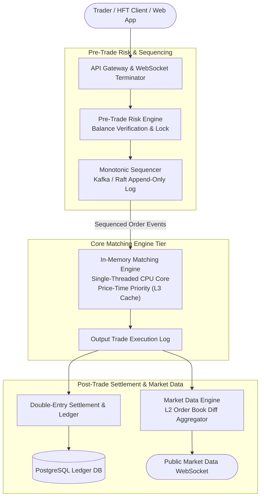

# Design a Central Limit Order Book & Matching Engine (Robinhood / NASDAQ / Coinbase)

## Step 1: Clarify Requirements

### Functional Requirements
- **Order Placement**: Traders submit Limit Orders (buy/sell $N$ shares at price $P$) and Market Orders (buy/sell $N$ shares immediately at best available price).
- **Order Cancellation**: Cancel active, unfilled orders in sub-millisecond time.
- **Deterministic Price-Time Priority Matching**: Execute trades matching buy (Bid) and sell (Ask) orders based strictly on **Best Price first**, then **Earliest Timestamp (FIFO) second**.
- **Real-Time Market Data Stream (Level 2 Book)**: Broadcast aggregated order book depth (top 20 bid/ask price levels and quantities) to traders over low-latency WebSockets.
- **Atomic Balance & Position Settlement**: Guarantee that funds are locked before order placement and settled accurately without financial slippage or negative balances.

### Non-Functional Requirements
- **Ultra-Low Latency**: Matching engine core execution latency must be **<100 microseconds ($\mu s$)** at p99.
- **Extreme Throughput**: Sustain bursts of **100,000 orders/sec** per trading pair during market volatility spikes.
- **Strict Determinism**: Processing order events must be 100% reproducible. Replaying the input log must recreate the exact same state and executed trades.
- **Zero Loss (Durability & Auditability)**: Financial transactions must never lose an order or trade. Complete double-entry accounting integrity.

---

## Step 2: Capacity Estimation

### Throughput & Scale
- **Trading Pairs / Symbols**: 500 active currency/stock pairs (e.g., BTC-USD, AAPL).
- **Order Ingress Rate**:
  - Normal conditions: 10,000 orders/sec across all symbols.
  - Volatility Spikes: **100,000 orders/sec peak burst**.
  - Daily Orders: ~500 million order operations (new orders, cancels, modifications).
- **Fill Ratio**: ~10% of orders result in trades; 90% are cancelled or replaced (high-frequency trading bots).
- **Execution Budget**: Engine processing budget per order: **<10 microseconds** in CPU memory.

---

## Step 3: Order Book Data Structure

At the core of an exchange is the **Central Limit Order Book (CLOB)**:
```text
Order Book In-Memory Structure:
Bids (Buy Orders - Descending Price)      Asks (Sell Orders - Ascending Price)
┌─────────────────────────────────┐       ┌──────────────────────────────────┐
│ Price $100.50 ──> [Ord1]─>[Ord2]│       │ Price $100.55 ──> [Ord5]─>[Ord6] │
│ Price $100.45 ──> [Ord3]        │       │ Price $100.60 ──> [Ord7]         │
│ Price $100.40 ──> [Ord4]        │       │ Price $100.65 ──> [Ord8]─>[Ord9] │
└─────────────────────────────────┘       └──────────────────────────────────┘
                 ▲                                         ▲
                 └────────────── SPREAD ($0.05) ───────────┘
```

To achieve sub-microsecond matching:
1. **Price Levels**: Stored in a **Red-Black Tree or Radix Tree** ordered by price.
   - Bids ordered descending (highest bid at root).
   - Asks ordered ascending (lowest ask at root).
2. **Orders at a Price Level**: Stored in a **Doubly-Linked List (FIFO Queue)** to enforce time priority:
   - Insert new limit order: $O(1)$ append to tail.
   - Cancel order: $O(1)$ node removal via internal pointer.
3. **Lookup Hash Map**: `Map<OrderId, OrderNodePointer>` provides $O(1)$ instant lookup for cancellations.

---

## Step 4: High-Level Architecture



### End-to-End Trade Lifecycle:
1. **Pre-Trade Risk Check**:
   - Trader submits: `BUY 2 BTC @ $60,000`.
   - `RiskEngine` checks in-memory user balances (must have at least $\$120{,}000$ available USD) and places a hold.
2. **Deterministic Sequencing**:
   - `Sequencer` stamps the order with a strictly increasing **monotonic Sequence Number** (e.g., `seq_1002931`) and writes it to an append-only log.
3. **Single-Threaded In-Memory Matching**:
   - The matching engine processes events one-by-one in sequence order.
   - It checks the opposite side of the book (Asks):
     - If lowest Ask $\le \$60{,}000$, a trade is generated immediately!
     - Any remaining unfilled volume is inserted as a Limit Order on the Bid side.
4. **Trade Output Event**:
   - The engine emits a `TradeExecuted` event (`seq_1002931`, `matched_with=ord_4412`, `price=60000`, `qty=2`).
5. **Settlement & Broadcast**:
   - `SettlementService` asynchronously records double-entry debits/credits in PostgreSQL.
   - `MarketDataBroadcaster` computes Level 2 order book deltas and streams them to thousands of connected market participants.

---

## Step 5: Deep Dive: Latency, Determinism & Risk

### 1. Why Single-Threaded Matching Beats Multi-Threading
In typical web architectures, developers scale with multi-threading and distributed databases. In financial exchanges, this causes severe latency degradation:
- **The Problem with Locks**: Locking the order book with mutexes creates lock contention, CPU cache line bouncing, and OS thread context switching delays ($>50\text{ }\mu s$ per switch).
- **The LMAX Disruptor Pattern (Single-Threaded Pinned Core)**:
  - The matching engine for a symbol runs on a **single CPU thread pinned to a dedicated core** (using CPU affinity `pthread_setaffinity_np`).
  - Memory is pre-allocated in ring buffers (zero garbage collection pauses).
  - The entire active order book fits comfortably inside the CPU's **L3 cache (16–64 MB)**.
  - Processing speed exceeds **1,000,000 orders per second per CPU core** with execution times measured in **nanoseconds**!

### 2. Strict Determinism & Instant Recovery
What happens if the matching engine server crashes?
```text
Disaster Recovery Workflow:
┌───────────────────────────┐     Replay at 2M events/sec     ┌────────────────────────┐
│ Sequenced Input Event Log │ ──────────────────────────────> │ New Engine Instance    │
│ (Kafka / Raft Journal)    │                                 │ Reconstructs State     │
└───────────────────────────┘                                 └────────────────────────┘
```
- Because the matching engine is a pure, deterministic state machine:
  $$\text{State}_{N} = f(\text{State}_{N-1}, \text{Event}_N)$$
- On reboot, the engine loads the latest periodic memory snapshot and replays the subsequent sequenced input log.
- Because orders are sequentially ordered, replaying the log reconstructs the exact same order book state down to the last penny within a few seconds!

### 3. Double-Entry Accounting Invariant
In crypto and financial systems, account balances must never drift due to software bugs or race conditions:
- Every balance mutation records two equal and opposite entries (debit and credit):
  $$\sum \text{Debits} - \sum \text{Credits} = 0$$
- In the database:
  ```sql
  -- Table: ledger_entries
  CREATE TABLE ledger_entries (
      entry_id BIGSERIAL PRIMARY KEY,
      trade_id UUID NOT NULL,
      account_id UUID NOT NULL,
      asset_type VARCHAR(16) NOT NULL, -- 'USD', 'BTC'
      amount NUMERIC(24, 8) NOT NULL,  -- Positive for credit, negative for debit
      created_at TIMESTAMP WITH TIME ZONE DEFAULT NOW()
  );
  ```
- An automated invariant reconciliation worker continuously verifies that the sum of all customer ledger entries matches the total assets held by the exchange.
