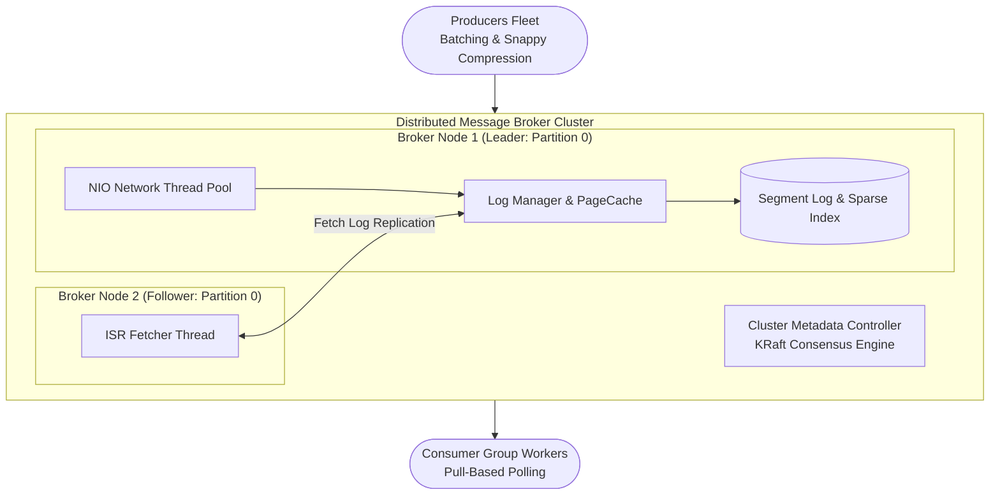

# Design a Distributed Message Broker (Apache Kafka / RabbitMQ)

## Step 1: Clarify Requirements

### Functional Requirements
- **High-Throughput Publishing**: Producers publish messages to named **Topics** partitioned into ordered log segments.
- **Consumer Groups & Pull Delivery**: Multiple consumer instances join a **Consumer Group** to divide partition processing dynamically via pull-based polling.
- **Strict Partition Ordering**: Messages within the same partition are guaranteed to be consumed in the exact sequential order they were produced.
- **Configurable Message Retention**: Messages persist on disk for a configurable retention window (e.g., 7 days) regardless of whether they have been consumed.
- **Consumer Offset Management**: The broker tracks committed offsets per consumer group to enable seamless resumption after restarts.

### Non-Functional Requirements
- **Massive Ingestion Throughput**: Ingest **millions of messages per second** with sub-10 ms p99 publish latency.
- **Extreme High Durability**: Zero message loss ($RPO = 0$). Writes must replicate across multiple distinct hardware failure domains.
- **Horizontal Scalability**: Scale topic throughput linearly by adding broker nodes and increasing partition counts.
- **High Availability**: Automatic partition leader failover within <3 seconds if a broker crashes.

---

## Step 2: Capacity Estimation

### Ingress & Storage Scale
- **Ingestion Rate**: 1,000,000 messages/second.
- **Average Message Size**: 1 KB (payload + metadata).
- **Network Ingress Bandwidth**: 1,000,000 msgs/sec × 1 KB = **1 GB/sec** (8 Gbps).
- **Daily Raw Data Volume**: 1 GB/sec × 86,400 sec ≈ **86.4 TB/day**.
- **7-Day Retention (N = 3 Replicas)**: 86.4 TB × 7 days × 3 ≈ **1.81 Petabytes (PB)**.
- **Consumer Read Egress Bandwidth**: 4 consumer groups × 1 GB/sec = **4 GB/sec** (32 Gbps).

---

## Step 3: Storage Engine: The Partition Log & Sparse Index

A partition is not a database table; it is an **immutable, append-only disk log** split into 1 GB segment files:
```text
Disk Directory: /data/kafka/orders-0/
├── 00000000000000000000.log    <-- Raw messages sequentially appended
├── 00000000000000000000.index  <-- Sparse index: maps Logical Offset to Physical Byte
└── 00000000000000000000.timeindex
```

### The Sparse Index Mechanism
Storing an index entry for every message wastes huge amounts of RAM. Instead, a **Sparse Index** records one entry every 4 KB:
```text
Logical Offset:    [0]       [4]       [8]       [12]
Physical Byte Pos: [0]      [4096]    [8192]    [12288]
```
1. Consumer requests: `Fetch offset 6`.
2. Broker performs a binary search on the memory-mapped `.index` file to find the largest offset $\le 6$ (Offset 4 at Byte 4096).
3. The broker seeks directly to Byte 4096 in `.log` and scans sequentially until finding Offset 6 in **<0.1 ms**!

---

## Step 4: High-Level Architecture



### End-to-End Publish & Consume Workflow:
1. **Producer Batching & Routing**:
   - Producer hashes the message key (`hash(key) % num_partitions`) to assign a partition.
   - Buffers messages into a 64 KB micro-batch with LZ4/Snappy compression to minimize socket syscall overhead.
2. **Sequential Append to PageCache**:
   - The partition leader broker receives the batch.
   - Appends the bytes to the active `.log` file in the OS **PageCache** (not issuing synchronous `fsync` to disk).
3. **In-Sync Replication (ISR)**:
   - Follower brokers fetch the latest log segment from the leader.
   - Once all replicas in the **ISR** acknowledge write to their PageCache, the broker advances the **High Watermark (HW)**.
   - The leader sends an acknowledgment back to the producer.
4. **Zero-Copy Consumer Fetch**:
   - Consumer issues `fetch(partition_0, offset_100)`.
   - The broker transfers data directly from PageCache to the network socket using `sendfile()`, achieving wire-speed delivery!

---

## Step 5: Deep Dive: Zero-Copy, PageCache & Rebalancing

### 1. Zero-Copy Architecture (`sendfile` Syscall)
Traditional file serving over network sockets is plagued by unnecessary data copying:
```text
Traditional File Serving (4 Data Copies, 4 Context Switches):
[Disk] ─(DMA)─> [Kernel PageCache] ─(CPU)─> [User Application Buffer]
                     │ (Syscall Switch)             │
                     ▼                              ▼
[Network NIC] <─(DMA)─ [Socket Buffer] <─(CPU)──────┘
```
- In Kafka, messages are transmitted in the exact same binary format on disk as on the wire.
- **Linux Zero-Copy (`sendfile()` Syscall)**:
  ```text
  Zero-Copy Serving (2 Data Copies, 2 Context Switches):
  [Disk] ─(DMA)─> [Kernel PageCache] ───────────────(DMA)───────────────> [Network NIC]
  ```
  - Data never enters user-space RAM! The CPU is completely bypassed, allowing a single broker to saturate a 40 Gbps network card at near-zero CPU utilization.

### 2. Sequential I/O vs. Random I/O
Why does a disk-backed broker outperform memory-based brokers during heavy load?
- **Rotational Disks & SSDs**:
  - Random disk I/O: ~100 to 500 KB/s.
  - Sequential disk I/O: **500 to 600 MB/s** (saturating SATA/NVMe buses).
- Because partition logs are strictly append-only, disk write performance closely approaches raw RAM throughput while costing a fraction of DDR5 RAM per terabyte.

### 3. In-Sync Replicas (ISR) & Data Durability
How does the broker guarantee zero data loss during node crashes?
- **High Watermark (HW) vs. Log End Offset (LEO)**:
  - `LEO`: The highest offset written on the leader broker.
  - `HW`: The highest offset replicated across **all In-Sync Replicas (ISR)**.
  - Consumers are only allowed to read up to the `HW`.
  - If the leader dies, any broker in the ISR can become the new leader without losing a single confirmed message!
- **Producer `acks` Modes**:
  - `acks=0`: Fire-and-forget (lowest latency, zero durability).
  - `acks=1`: Leader writes to local PageCache before acknowledging (survives follower crashes, loses data if leader crashes before replication).
  - `acks=all (-1)`: Leader waits for full ISR quorum replication (strict financial-grade durability).

### 4. Consumer Group Rebalancing: Eager vs. Cooperative Sticky
When a new consumer node joins or crashes:
- **Legacy Eager Rebalance**:
  - Every consumer stops consuming, revokes all partition assignments, and waits for a global reassignment.
  - *Result*: Causes a 5 to 30-second "stop-the-world" data processing freeze across the entire consumer fleet!
- **Modern Cooperative Sticky Rebalance**:
  - Consumers continue reading unaffected partitions without pausing.
  - Only the specific partitions being migrated are reassigned in a non-blocking, multi-phase handover.
