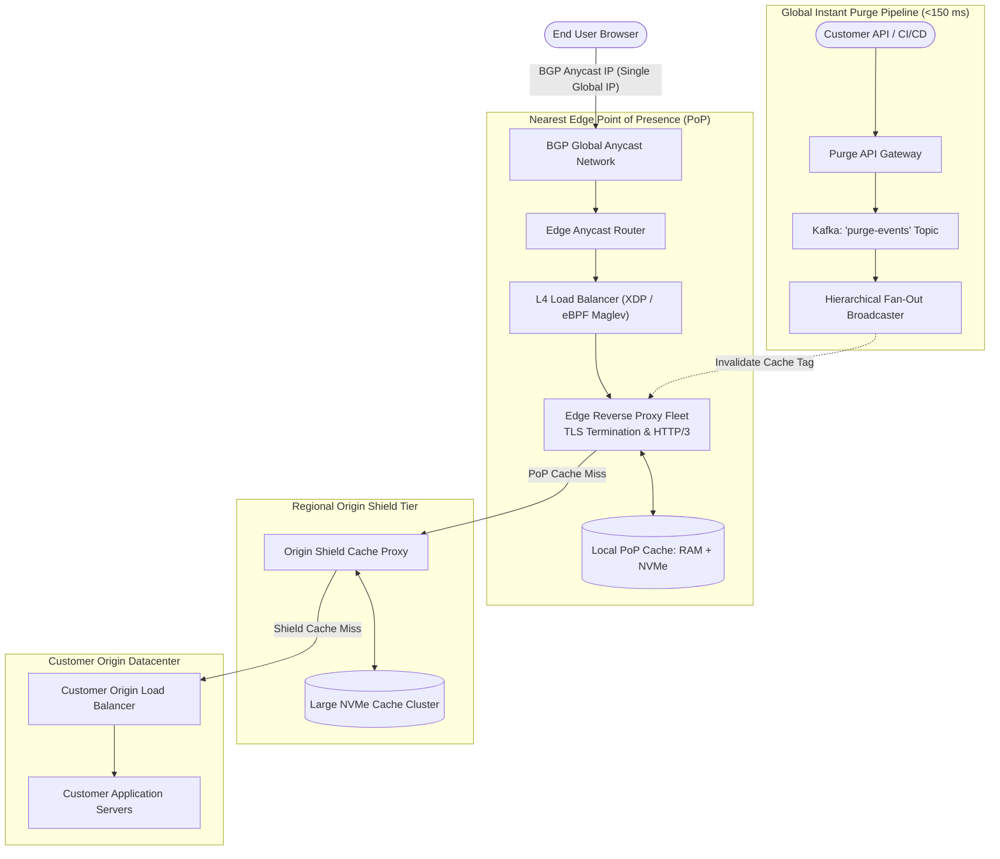

# Design a Global Content Delivery Network (CDN) & Edge Reverse Proxy (Cloudflare / Fastly)

## Step 1: Clarify Requirements

### Functional Requirements
- **Global Edge Caching**: Cache static web assets (images, stylesheets, JavaScript, video segments) at hundreds of worldwide Points of Presence (PoPs) close to end users.
- **Dynamic Content Reverse Proxy**: Proxy non-cacheable API traffic to customer origin servers with edge TLS/SSL termination and connection multiplexing (HTTP/2 and HTTP/3).
- **Sub-150 ms Global Cache Invalidation (Purge)**: Support instant programmatic cache purge (by URL, tag, or wildcard) propagating to all global edge servers within <150 ms.
- **Edge Security & DDoS Mitigation**: Filter malicious traffic (SYN floods, Layer 7 HTTP floods, credential stuffing) at the edge before it reaches origin servers.
- **Modern Cache-Control Support**: Comply with RFC HTTP caching headers (`Cache-Control`, `ETag`, `stale-while-revalidate`, `stale-if-error`).

### Non-Functional Requirements
- **Ultra-Low Latency**: Sub-10 ms response time for cached edge hits; sub-30 ms connection setup via TLS session resumption.
- **Massive Global Throughput**: Handle tens of millions of requests per second and hundreds of Terabits per second (Tbps) egress bandwidth.
- **High Availability**: 99.999% uptime. If an entire regional datacenter loses power or fiber connectivity, traffic must automatically re-route in zero seconds.

---

## Step 2: Capacity Estimation

### Global Network Scale
- **Global Edge Datacenters (PoPs)**: 300 locations across 100+ countries.
- **Aggregate Request Rate**: 50,000,000 requests/sec across all customer domains.
- **Average Response Size**: 40 KB (weighted between small API JSONs and media images).
- **Total Egress Bandwidth**: 50,000,000 req/sec × 40 KB ≈ **2 TB/sec** (16 Tbps). Peak platform spikes reach >100 Tbps during major releases.
- **Target Edge Cache Hit Ratio**:
  - Static media: **>95%**.
  - Origin offload: The CDN absorbs 95% of traffic, shielding the customer's origin server from crashing.

---

## Step 3: Cache-Control Protocol & Headers

### Key HTTP Cache Headers
- **`Cache-Control: public, max-age=86400, stale-while-revalidate=300`**:
  - `max-age=86400`: Fresh for 24 hours.
  - `stale-while-revalidate=300`: For 5 minutes after expiration, serve the stale cached object instantly while triggering an asynchronous background fetch to the origin to refresh the cache.
- **Edge Debug Response Headers**:
  - `CF-Cache-Status: HIT`: Served from local edge RAM/SSD.
  - `CF-Cache-Status: MISS`: Fetched from origin and stored at edge.
  - `CF-Cache-Status: REVALIDATED`: Verified with origin using `If-None-Match: "etag_hash"` (HTTP 304 Not Modified).

---

## Step 4: Multi-Tier Storage & Caching Hierarchy

```text
Edge Multi-Tier Cache Hierarchy:
[Client Request]
       │
       ▼
┌────────────────────────────────────────┐
│ Tier 1: Local Edge RAM Cache (PoP)     │  <-- Sub-1 ms latency (100 GB RAM / node)
└──────────────────┬─────────────────────┘
                   │ (Cache Miss)
                   ▼
┌────────────────────────────────────────┐
│ Tier 2: Local Edge NVMe SSD Disk (PoP) │  <-- 2-5 ms latency (10 TB NVMe / node)
└──────────────────┬─────────────────────┘
                   │ (Cache Miss)
                   ▼
┌────────────────────────────────────────┐
│ Tier 3: Regional Origin Shield Datacenter│ <-- 20-50 ms (Protects Origin from Stampede)
└──────────────────┬─────────────────────┘
                   │ (Cache Miss)
                   ▼
┌────────────────────────────────────────┐
│ Customer Origin Datacenter (AWS / GCP) │  <-- 100-200 ms RTT
└────────────────────────────────────────┘
```

---

## Step 5: High-Level Architecture



### End-to-End Edge Request Lifecycle:
1. **BGP Anycast Routing**:
   - The user resolves `example.com` to Anycast IP `198.41.128.1`.
   - Internet BGP routing tables automatically route the IP packets to the topologically closest edge datacenter.
2. **Layer 4 eBPF/XDP Load Balancing**:
   - Packets hit an ultra-fast kernel eBPF load balancer that distributes TCP flows evenly across proxy worker servers without connection state tables.
3. **TLS Termination & Cache Evaluation**:
   - The edge proxy terminates TLS 1.3 in 1 RTT (or 0-RTT with TLS session tickets).
   - Hashes the request URL: `CacheKey = hash(Host + Path + QueryParams)`.
   - Checks local RAM/NVMe cache. If hit, returns the asset in **<5 ms**.
4. **Origin Shielding (Cache Miss Protection)**:
   - If missing from the edge PoP, the request routes to a central **Regional Origin Shield**.
   - If 50 edge PoPs simultaneously experience a cache miss for the same asset, only **one single request** reaches the customer origin server via Origin Request Coalescing!

---

## Step 6: Deep Dive: Anycast, Instant Purge & Thundering Herd

### 1. BGP Anycast Routing vs. DNS Geolocation
How does a CDN direct a user in Tokyo to the Tokyo PoP and a user in London to the London PoP using the **exact same IP address**?
- **DNS-Based Routing (Legacy)**:
  - DNS server returns different IPs based on the client's resolver IP.
  - *Flaws*: DNS resolvers cache responses for hours (ignoring TTLs). If a datacenter fails, users are sent to dead IPs for hours!
- **BGP Anycast (Modern Standard)**:
  - All 300 datacenters announce the **identical IP subnet** via BGP to tier-1 transit telecom providers.
  - Internet routers inherently deliver packets along the shortest autonomous system (AS) hop path.
  - **Instant Zero-Downtime Failover**: If the Tokyo datacenter loses power, its routers withdraw the BGP route. Global transit routers immediately reroute Tokyo packets to Osaka in **0 milliseconds** without touching DNS!

### 2. Sub-150 ms Global Cache Purge
How do you invalidate a cached image across 300 datacenters worldwide in <150 ms?
- **The Challenge**: Sending 300 individual HTTP requests from a central server is too slow ($O(N)$ network latency).
- **Hierarchical Tree Fan-Out**:
  - The Purge API publishes a `PurgeTag` event to a global Kafka cluster.
  - Master broker broadcasts to 12 Continental Hub PoPs (North America, Europe, Asia-Pacific).
  - Each Hub PoP fans out to its 25 regional leaf PoPs in parallel.
  - Total network depth is only 2 hops ($O(\log N)$), completing global broadcast in **<120 ms**!
- **Tag-Based Invalidation via Generation Counters**:
  - Instead of searching millions of cached disk files to delete a file:
    Store a generation counter map in shared memory: `cache_tag: "product_123" -> version 4`.
  - To purge `product_123`, increment the counter to `version 5`.
  - All requests for `product_123` with version 4 are instantly treated as expired without touching disk!

### 3. Origin Shield & Request Coalescing (Thundering Herd)
When a breaking news article is published on a high-traffic site, thousands of users request it in the exact same second:
```text
Thundering Herd Stampede (Without Coalescing):
10,000 Concurrent Requests ──> [Edge Proxy] ──(10,000 Requests)──> [Origin DB Dies!]

Request Coalescing (Singleflight Mutex):
10,000 Concurrent Requests ──> [Edge Proxy] ──(1 Single Request)──> [Origin Server]
                                    │
                                    ▼ (Broadcast response to all 10,000 waiters)
```
- The edge proxy acquires an in-memory lock for that specific URL.
- Exactly **one request** goes to the origin server.
- The remaining 9,999 requests wait on an in-memory promise/condition variable.
- When the origin responds, the proxy caches the result and broadcasts it to all 9,999 waiting client sockets simultaneously, completely eliminating origin stampedes.
