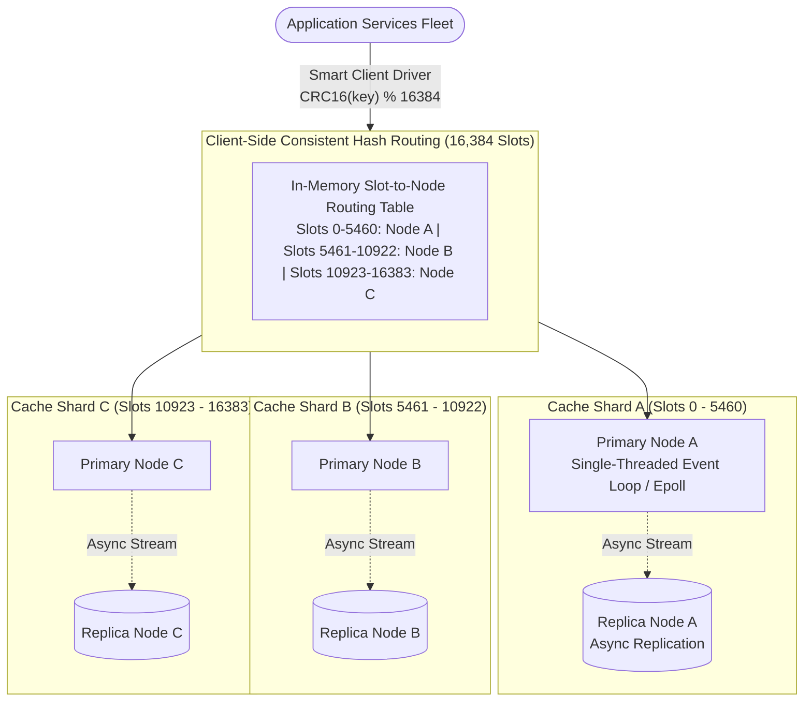

# Design an In-Memory Distributed Caching Service (Redis Cluster / Memcached)

## Step 1: Clarify Requirements

### Functional Requirements
- **Key-Value In-Memory Storage**: Support ultra-fast `GET(key)`, `SET(key, value, ttl)`, `DEL(key)`, and batch operations (`MGET`).
- **Configurable TTL & Expiration**: Automatically evict expired keys using active random sampling and passive on-access expiration.
- **Memory-Bounded Eviction Policies**: When maximum memory is reached, evict keys according to policies: **LRU** (Least Recently Used), **LFU** (Least Frequently Used), or **TTL-first**.
- **Horizontal Scalability (Sharding)**: Distribute keys across an elastic cluster of cache nodes using consistent hashing with zero single points of failure.
- **High Availability & Failover**: Support primary-replica replication with automatic failover within <5 seconds if a master cache node crashes.

### Non-Functional Requirements
- **Ultra-Low Latency**: **Sub-millisecond (<1 ms)** execution time for p99 `GET` operations under heavy load.
- **Extreme Throughput**: A 50-node cluster must sustain **10,000,000+ reads/second**.
- **Zero Memory Fragmentation**: Prevent OS heap fragmentation that leads to premature out-of-memory (OOM) crashes.
- **High Availability**: 99.99% service uptime; transient cache misses during node failures must not bring down the backing database.

---

## Step 2: Capacity Estimation

### Cluster Throughput & Scale
- **Read Throughput**: 10,000,000 reads/second.
- **Write Throughput**: 500,000 writes/second.
- **Read-to-Write Ratio**: 20:1.
- **Data Volume**:
  - Total cached keys: 200,000,000 active keys.
  - Average key size: 32 bytes.
  - Average value size: 1 KB.
  - Raw payload memory: 200M × 1.032 KB ≈ **206 GB**.
  - Metadata & pointer overhead factor (× 1.5): **~310 GB RAM**.
- **Cluster Node Sizing**:
  - Running a single massive 512 GB instance creates massive blast radius during crashes and stalls on CPU garbage collection/forking.
  - Deploy **32 shards** with 16 GB RAM each (plus 32 read replicas) = 64 total nodes, providing massive parallel network I/O capacity.

---

## Step 3: Memory Engine: The Slab Allocator

Standard C `malloc()` and `free()` allocate variable-sized blocks. Over time, memory becomes fragmented with small unusable holes, causing the OS to kill the process with an Out-of-Memory (OOM) error even when 30% of memory appears free!
```text
Slab Allocator Architecture:
┌────────────────────────────────────────────────────────────────┐
│ 1 MB Page 1 (Slab Class 1: 64-byte Chunks)                     │
│ [Chunk: 64B] [Chunk: 64B] [Chunk: 64B] [Chunk: 64B] ...        │
├────────────────────────────────────────────────────────────────┤
│ 1 MB Page 2 (Slab Class 2: 128-byte Chunks)                    │
│ [Chunk: 128B] [Chunk: 128B] [Chunk: 128B] ...                  │
├────────────────────────────────────────────────────────────────┤
│ 1 MB Page 3 (Slab Class 3: 256-byte Chunks)                    │
│ [Chunk: 256B] [Chunk: 256B] ...                                │
└────────────────────────────────────────────────────────────────┘
```
- **Pre-Allocated Slab Classes**: Memory is carved into fixed 1 MB pages. Each page contains uniform fixed-size chunks (e.g. 64B, 128B, 256B, 512B... up to 1MB).
- **Zero Fragmentation**: When an item is stored, the allocator picks the smallest slab class that fits. When freed, the chunk is returned to a pre-allocated free list without returning memory to the OS.

---

## Step 4: High-Level Architecture



### End-to-End Operation Flow:
1. **Zero-Hop Client Routing**:
   - The smart application client driver maintains an in-memory map of all 16,384 hash slots.
   - For `GET user:1001`:
     $$\text{Slot} = \text{CRC16}(\text{"user:1001"}) \pmod{16384} = 3421$$
   - The client routes the TCP packet **directly to Primary Node A** in a single network hop (<0.5 ms).
2. **Event Loop & Hash Table Execution**:
   - The node's non-blocking I/O multiplexer (`epoll`/`kqueue`) reads the query.
   - Looks up the key in the primary hash table in $O(1)$ time.
   - Returns the value immediately over the socket.
3. **Cluster Resharding (`MOVED` Redirection)**:
   - If a slot moves to Shard B during a cluster expansion, Shard A returns `MOVED 3421 10.0.1.25:6379`.
   - The smart client driver updates its local slot table and retries transparently.

---

## Step 5: Deep Dive: Eviction, Stampedes & Cluster Gossip

### 1. Eviction Algorithms: Exact LRU vs. Approximated LRU
When RAM fills up, which items do we evict?
- **Exact LRU (Doubly-Linked List + Hash Map)**:
  - Every `GET` or `SET` moves the item node to the head of a linked list.
  - Eviction removes the tail node in $O(1)$.
  - *The Downside*: Every key node requires two 64-bit pointers (prev and next = 16 bytes). For 200 million keys, pointer bookkeeping alone consumes **3.2 GB of pure RAM waste**!
- **Redis Approximated LRU (Sampled LRU)**:
  - Eliminates pointers entirely! Each key stores a compact 24-bit idle timestamp.
  - When memory is full, the engine randomly samples K keys (typically K = 5) and evicts the one with the oldest timestamp.
  - *Verdict*: With K = 10, sampled LRU matches the statistical eviction efficiency of true LRU while saving gigabytes of memory.

### 2. Cache Stampede (Dog-Piling / Thundering Herd)
When a hot cache key expires, thousands of concurrent threads simultaneously experience a cache miss and query the primary database, causing catastrophic database failure:
```text
The Probabilistic Early Expiration Defense (XFetch Algorithm):
Instead of waiting for the key to expire at T_expire:
As time approaches expiration, reader threads probabilistically recompute the key early!
```
- **The XFetch Formula**:
  $$\text{Recompute If: } -\beta \times \delta \times \ln(\text{random}()) > (\text{TTL} - (\text{currentTime} - \text{writtenTime}))$$
  - $\delta$: Time taken to compute the asset from the database.
  - $\beta$: Greediness multiplier ($\beta > 0$).
  - $\text{random}()$: Uniform random value between 0 and 1.
- *How It Works*:
  - If a key has 10 seconds left, there is a small probability that a single reader will recompute it in the background.
  - The heavier the read traffic, the higher the mathematical certainty that **exactly one worker** refreshes the key before it ever expires, guaranteeing that no caller ever experiences a cache miss!

### 3. Asynchronous vs. Synchronous Key Expiration
How does the cache delete expired keys without stalling the CPU?
- **Passive Expiration**: When a client calls `GET key`, the engine checks its TTL. If expired, it deletes the key on the spot and returns `nil`.
- **Active Periodic Background Sweeper**:
  - Every 100 ms, an active background task tests 20 random keys with active TTLs:
    1. Delete all expired keys found.
    2. If more than 25% of the sampled keys were expired, immediately repeat the loop to purge expired keys aggressively before memory limits are reached.
