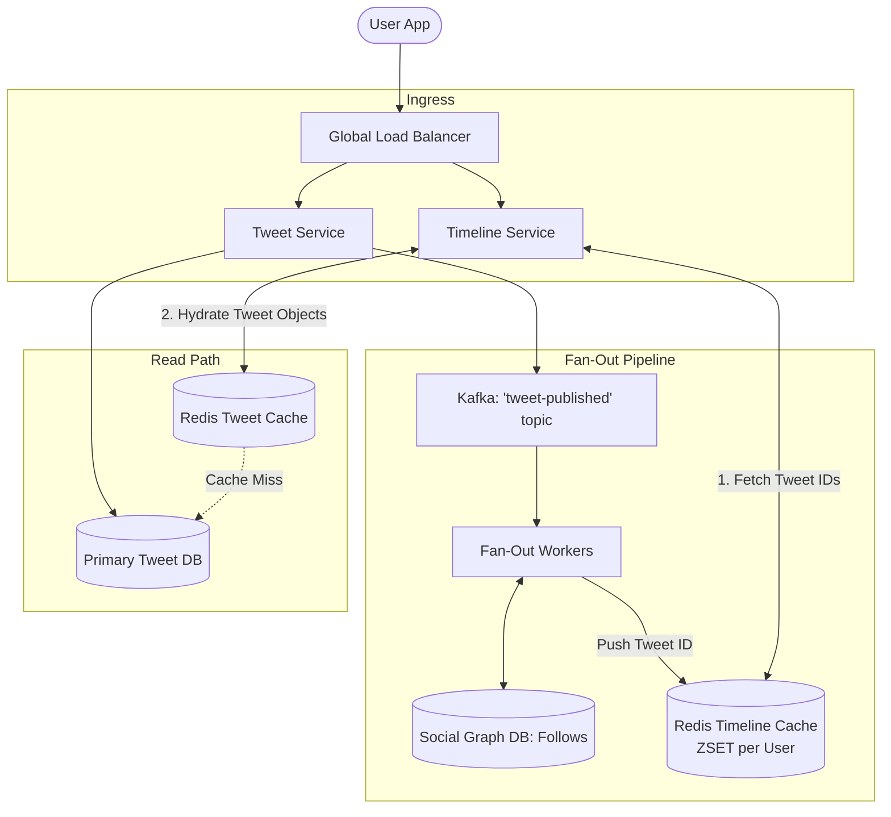
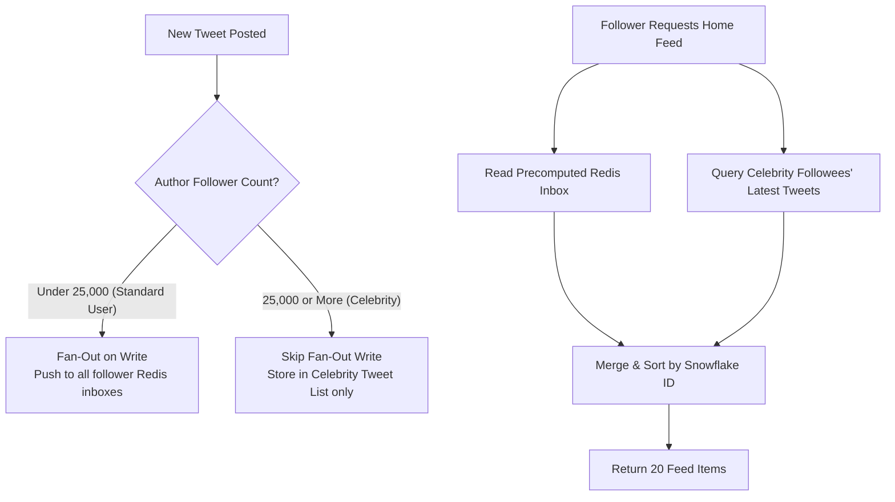

# Design Twitter / X Timeline Feed

## Step 1: Clarify Requirements

### Functional Requirements
- **Post Tweet**: Users can publish text tweets (up to 280 characters), optionally with media attachments.
- **Follow System**: Users can follow/unfollow other users (asymmetric directed graph).
- **Home Timeline**: Users can view a paginated reverse-chronological feed containing tweets posted by all users they follow.
- **User Timeline**: Users can view all tweets published by a specific user profile.

### Non-Functional Requirements
- **Ultra-Fast Timeline Rendering**: Fetching the home timeline must take <200 ms.
- **High Availability & Eventual Consistency**: System must prioritize 99.99% availability over strong consistency. A tweet appearing on a follower's timeline 2-5 seconds late is completely acceptable.
- **Massive Read/Write Imbalance**: Highly read-dominant (~100:1 to 500:1 read-to-write ratio).

---

## Step 2: Capacity Estimation

### Traffic & Throughput
- **Daily Active Users (DAU)**: 300 million users.
- **Write Path (Tweets)**:
  - 100 million new tweets per day.
  - Average Write QPS:
    $$\frac{100\text{M}}{86{,}400} \approx 1{,}160\text{ tweets/sec (Peak: } 3{,}000\text{ QPS)}$$
- **Read Path (Home Timeline Views)**:
  - Each user visits their home feed 4 times/day $\rightarrow$ $1.2\text{ billion timeline requests/day}$.
  - Average Read QPS:
    $$\frac{1.2\text{B}}{86{,}400} \approx 14{,}000\text{ QPS (Peak: } 30{,}000\text{ QPS)}$$

### Storage Estimation (5 Years)
- Tweet text + metadata $\approx$ 300 bytes.
- Media attachments (images/videos) stored on Object Storage (S3); metadata in DB $\approx$ 100 bytes.
- Total storage per tweet: ~400 bytes.
- Daily tweet text storage:
  $$100\text{M} \times 400\text{ bytes} \approx 40\text{ GB/day}$$
  5-Year Storage: $40\text{ GB} \times 365 \times 5 \approx 73\text{ TB}$.

### Memory Cache Estimation
- Cache the latest 800 tweet IDs for all active users in Redis.
- 300M active users $\times$ 800 tweet IDs $\times$ 8 bytes (64-bit ID) $\approx 1.92\text{ TB RAM}$ across a distributed Redis cluster.

---

## Step 3: API Design

### 1. Post Tweet
- **Endpoint**: `POST /api/v1/tweets`
- **Request**:
  ```json
  {
    "content": "Hello distributed systems world!",
    "media_ids": ["media_uuid_1"]
  }
  ```
- **Response**: `HTTP 201 Created` with tweet payload and generated `tweet_id`.

### 2. Get Home Timeline
- **Endpoint**: `GET /api/v1/timelines/home`
- **Query Parameters**:
  - `limit`: Integer (default 20, max 100)
  - `cursor`: Opaque cursor string (tweet snowflake ID for keyset pagination)
- **Response**: `HTTP 200 OK`
  ```json
  {
    "tweets": [
      { "id": "1830492819201928", "user_id": "u_456", "content": "...", "created_at": "..." }
    ],
    "next_cursor": "1830492819201850"
  }
  ```

---

## Step 4: Data Model & Schema

### Primary Database: Distributed Relational / Wide-Column Store (Postgres / CockroachDB / Cassandra)

```sql
-- Table: users
CREATE TABLE users (
    user_id BIGINT PRIMARY KEY, -- 64-bit Snowflake ID
    username VARCHAR(64) UNIQUE NOT NULL,
    follower_count INT DEFAULT 0,
    created_at TIMESTAMP WITH TIME ZONE DEFAULT NOW()
);

-- Table: tweets
CREATE TABLE tweets (
    tweet_id BIGINT PRIMARY KEY, -- Snowflake ID ordered by time
    author_id BIGINT NOT NULL REFERENCES users(user_id),
    content VARCHAR(280) NOT NULL,
    media_urls TEXT[],
    created_at TIMESTAMP WITH TIME ZONE NOT NULL
);
CREATE INDEX idx_author_tweets ON tweets(author_id, created_at DESC);

-- Table: follows (Asymmetric Graph)
CREATE TABLE follows (
    follower_id BIGINT NOT NULL,
    followee_id BIGINT NOT NULL,
    created_at TIMESTAMP WITH TIME ZONE DEFAULT NOW(),
    PRIMARY KEY (follower_id, followee_id)
);
CREATE INDEX idx_followee ON follows(followee_id);
```

---

## Step 5: High-Level Architecture



### End-to-End Flow:
1. **Posting a Tweet**:
   - `Tweet Service` stores the tweet in `TweetDB`.
   - Emits an asynchronous event `{tweet_id, author_id, created_at}` to Kafka.
   - Responds `HTTP 201` to the client immediately (<50ms).
2. **Asynchronous Fan-Out**:
   - `Fan-Out Workers` consume the Kafka event.
   - Query `Social Graph DB` to retrieve all follower IDs of the author.
   - Inserts `tweet_id` into each follower's Redis timeline cache (Sorted Set).
3. **Reading Home Feed**:
   - Client calls `GET /api/v1/timelines/home`.
   - `Timeline Service` reads the user's pre-computed list of tweet IDs from Redis (`ZREVRANGEBYSCORE`).
   - Hydrates tweet objects (author name, avatar, text) via multi-key lookup in Redis Tweet Cache (`MGET`).
   - Returns timeline in <30ms.

---

## Step 6: Deep Dive: The Fan-Out Dilemma & Hybrid Model

### 1. Fan-Out on Read (Pull Model)
- When a user requests their home feed, query the DB:
  `SELECT * FROM tweets WHERE author_id IN (SELECT followee_id FROM follows WHERE follower_id = :my_id) ORDER BY created_at DESC LIMIT 20;`
- **Pros**: Writes are instant and cheap (1 write to DB).
- **Cons**: Reads are catastrophic. Joining thousands of followees across millions of rows on 30,000 read QPS will bring any database to its knees.

### 2. Fan-Out on Write (Push Model)
- When author posts a tweet, immediately push the `tweet_id` into every follower's pre-computed Redis inbox.
- **Pros**: Reads are blindingly fast (<10ms single `ZREVRANGE` call to Redis).
- **Cons**: **The Celebrity / Hotkey Problem**:
  - If a celebrity with 80 million followers (e.g., Barack Obama, Elon Musk) tweets, the fan-out service must execute **80,000,000 writes to Redis**.
  - This single tweet causes severe message queue lag, memory exhaustion, and multi-minute delivery delays.

### 3. The Production Solution: The Hybrid Model
Modern timeline engines (Twitter/X, Instagram) use an adaptive hybrid approach based on follower thresholds:



- **Normal Users (<25,000 followers)**: Use **Fan-Out on Write**. Fast and efficient.
- **Celebrities (>25,000 followers)**: **Bypass fan-out completely**. When a user requests their home feed, the Timeline Service pulls from their standard pre-computed inbox *and* pulls the latest tweets from any celebrities they follow, merging the two lists in application memory before returning.

### 4. Pagination: Keyset Cursors vs. SQL Offset
- **Never use `OFFSET`**: `OFFSET 5000 LIMIT 20` forces the database to read and discard 5,000 rows. Furthermore, if a new tweet is posted while the user is scrolling, offset pagination causes duplicated tweets on page boundaries.
- **Use Snowflake ID Cursors**:
  - Snowflake IDs are strictly monotonically increasing 64-bit integers with a time component embedded in the highest bits.
  - Pagination query:
    `ZREVRANGEBYSCORE timeline:user_123 (cursor -inf LIMIT 0 20`
  - Completely immune to duplicate items and executes in $O(\log N + M)$ time.
